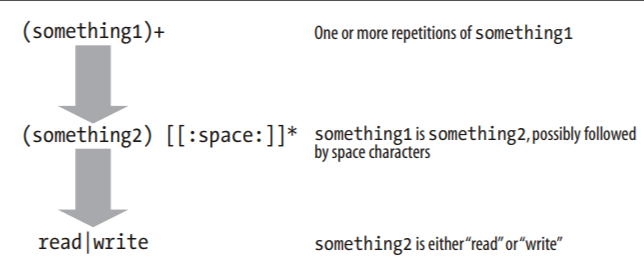
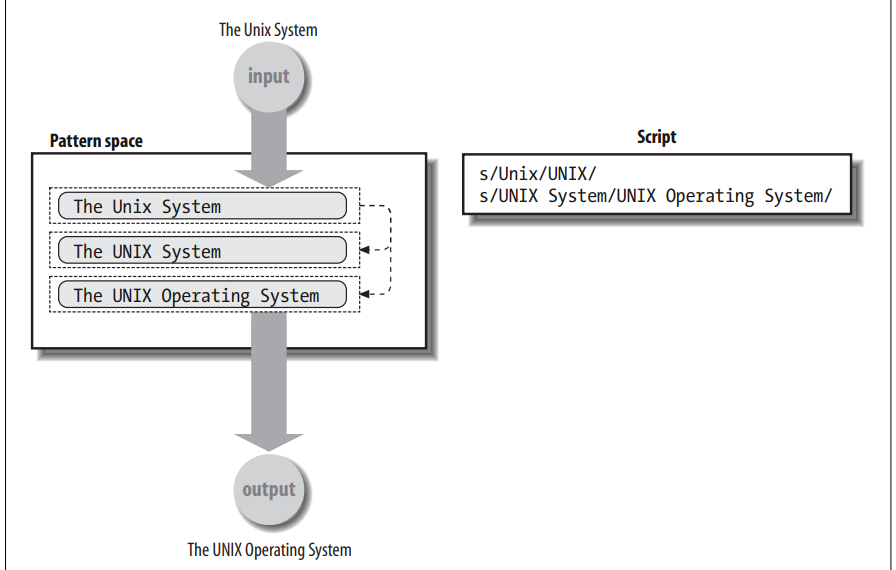

# Глава 3. Поиск и подстановки

Как мы обсуждали в разделе “Принципы использования программных средств” \[1.2], Unix-программисты предпочитают работать со линиями текста. Текстовые данные более гибки, чем двоичные, и Unix-системы предоставляют ряд инструментов, которые упрощают нарезку текста.

В этой главе мы рассмотрим две основные операции, которые часто встречаются в сценариях командной строки: поиск по тексту — поиск определенных линий текста — и подстановка текста — изменение найденного текста.

Хотя вы можете многое сделать, используя простые текстовые строк с постоянными значениями, регулярные выражения предоставляют гораздо более мощную нотацию для сопоставления множества различных фактических фрагментов текста с помощью одного выражения. В этой главе представлены два варианта регулярных выражений, предоставляемых различными программами Unix, а затем рассматриваются наиболее важные инструменты для извлечения и перестановки текста.

## 3.1 Поиск текста

Лучшей программой для поиска текста (или “соответствующего текста”, на жаргоне Unix) является grep. В системах POSIX grep может использовать любой из двух вариантов регулярных выражений или сопоставлять простые строки. Традиционно для поиска в текстовых файлах использовались три отдельные программы:

_**grep**_&#x20;

Оригинальная программа для сопоставления текста. Она использует базовые регулярные выражения (BREs), определенные в POSIX, и которые мы опишем далее в этой главе.

_**egrep**_

&#x20;“Расширенный grep”. В этой программе используются расширенные регулярные выражения (ERE), которые представляют собой более мощную нотацию регулярных выражений. Ценность ERE заключается в том, что их использование может быть более дорогостоящим с точки зрения вычислений. В оригинальных PDP- 11 это было важно; в современных системах разница невелика.

_**fgrep**_

&#x20;“Быстрый grep”. Этот вариант сопоставляет фиксированные строки вместо регулярных выражений , используя алгоритм, оптимизированный для сопоставления фиксированных строк. Исходная версия также была единственным вариантом, который мог сопоставлять несколько строк параллельно. Другими словами, grep и egrep могли сопоставлять только одно регулярное выражение, в то время как fgrep использовал другой алгоритм, который мог сопоставлять несколько строк, эффективно проверяя каждую строку ввода на соответствие всем запрошенным строкам поиска.

Стандарт POSIX 1992 года объединил все три варианта в одну grep-программу, поведение которой контролируется различными параметрами. Версия POSIX может соответствовать нескольким шаблонам, даже для BREs и EREs. Также были доступны grep и egrep, но они были помечены как “устаревшие”, что означало, что они будут удалены из следующего стандарта. И действительно, стандарт POSIX 2001 года включает только объединенную команду grep. Однако на практике как egrep, так и fgrep по-прежнему доступны во всех Unix и Unix-подобных системах.

### 3.1.1 Простой grep

Проще всего использовать grep с постоянными строками:

```
 who                                                 Who is logged on
tolstoy tty1 Feb 26 10:53
tolstoy pts/0 Feb 29 10:59
tolstoy pts/1 Feb 29 10:59
tolstoy pts/2 Feb 29 11:00
tolstoy pts/3 Feb 29 11:00
tolstoy pts/4 Feb 29 11:00
austen pts/5 Feb 29 15:39 (mansfield-park.example.com)
austen pts/6 Feb 29 15:39 (mansfield-park.example.com)
$ who | grep -F austen                                     Where is austen logged on?
austen pts/5 Feb 29 15:39 (mansfield-park.example.com)
austen pts/6 Feb 29 15:39 (mansfield-park.example.com)
```

В этом примере используется параметр –F для поиска фиксированной строки austen. И на самом деле, пока ваш шаблон не содержит метасимволов регулярных выражений, поведение grep по умолчанию практически такое же, как если бы вы использовали параметр –F:

```
$ who | grep austen                                 No -F, same result
austen pts/5 Feb 29 15:39 (mansfield-park.example.com)
austen pts/6 Feb 29 15:39 (mansfield-park.example.com)
```

**grep**

_Использование_

ge grep \[ options … ] pattern-spec \[ files … ]


_Цель_

Для печати строк текста, соответствующих одному или нескольким шаблонам. Часто это первый этап конвейера, на котором выполняется дальнейшая обработка сопоставленных данных.


_Основные опции_

-E Сопоставление с использованием расширенных регулярных выражений. grep -E заменяет традиционную команду egrep.&#x20;

-F Сопоставление с использованием фиксированных строк. grep -F заменяет традиционную команду fgrep.&#x20;

-e pat-list Обычно в первом аргументе nonoption указывается шаблон(ы), которому(им) нужно соответствовать. Можно указать несколько шаблонов, заключив их в кавычки и разделив новыми строками. В случае, если шаблон начинается со знака минус, grep может запутаться и рассматривать его как вариант. Параметр –e указывает, что его аргументом является шаблон, даже если он начинается со знака минус.&#x20;

-f pat-file Считывайте шаблоны из файла pat-file.&#x20;

-i игнорировать регистр при сопоставлении с шаблоном.&#x20;

-l Выводить имена файлов, которые соответствуют шаблону, вместо того, чтобы печатать соответствующие строки.&#x20;

-q Быть тихим. Вместо ввода строк в стандартный вывод, grep завершает работу успешно, если она соответствует шаблону, в противном случае - безуспешно. (Мы еще не обсуждали успешный/неуспешный результат, смотрите “Статусы завершения” \[6.2].)&#x20;

-s Подавляет сообщения об ошибках. Часто используется вместе с –q.&#x20;

-v Выводит линии, которые не соответствуют шаблону.

## 3.2 Регулярные выражения

В этом разделе представлен краткий обзор построения и сопоставления регулярных выражений. В частности, в нем описаны конструкции POSIX BRE и ERE, которые предназначены для формализации двух основных “разновидностей” регулярных выражений, используемых в большинстве утилит Unix.

Мы надеемся, что вы уже имели некоторое представление о регулярных выражениях и сопоставлении текста до прочтения этой книги. В этом случае в этих подразделах кратко описывается, как вы можете использовать регулярные выражения для создания сценариев переносимой оболочки.

Если вы совсем не знакомы с регулярными выражениями, приведенный здесь материал может показаться вам слишком сжатым, и вам следует обратиться к более вводным источникам, таким как "Learning the Unix Operating System" (O'Reilly) или "sed & awk" (O'Reilly). Поскольку регулярные выражения являются фундаментальной частью парадигм использования и создания инструментов Unix , любые инвестиции, которые вы делаете в изучение того, как их использовать, и использовать их хорошо, будут многократно вознаграждены.

С другой стороны, если вы годами обрабатывали текст с помощью регулярных выражений, то наш обзор может показаться вам поверхностным. Если это так, мы рекомендуем вам ознакомиться с первой частью, в которой обобщены POSIX-файлы и ERE-файлы в табличной форме, пропустить остальную часть раздела и перейти к более подробному источнику, такому как "Mastering Regular Expressions" (O'Reilly).

### 3.2.1 Что такое регулярное выражение?

Регулярные выражения - это обозначение, позволяющее выполнять поиск текста, соответствующего определенному критерию, например, “начинается с буквы a”. Обозначение позволяет написать одно выражение, которое может выбирать или сопоставлять несколько строк данных.

Помимо традиционной нотации регулярных выражений Unix, регулярные выражения POSIX позволяют вам:

* Писать регулярные выражения, которые выражают порядок следования символов и эквивалентности, зависящие от конкретной локали.
* Писать свои регулярные выражения таким образом, чтобы они не зависели от базового набора символов системы

Большое количество утилит Unix в той или иной форме используют регулярные выражения. Неполный список включает в себя следующее:

* Семейство инструментов grep для поиска совпадающих строк текста: grep и egrep, которые всегда доступны, а также нестандартная, но полезная утилита agrep\*
* Редактор потоков sed для внесения изменений во входной поток, описанный далее в этой главе&#x20;
* Языки обработки строк, такие как awk, Icon, Perl, Python, Ruby, Tcl и другие
* Средства просмотра файлов (иногда называемые пейджерами), такие как more, page и pg, которые широко распространены в коммерческих системах Unix, и популярный пейджер less\*
* Текстовые редакторы, такие как почтенный линейный редактор ed, стандартный экранный редактор vi и популярные дополнительные редакторы, такие как emacs, jed, jove, vile, vim и другие.

Поскольку регулярные выражения занимают центральное место в использовании Unix, стоит освоить их, и чем раньше вы это сделаете, тем лучше будет для вас.

С точки зрения логики, регулярные выражения состоят из двух основных компонентов: обычных символов и специальных символов. Обычный символ - это любой символ, который не является специальным, как определено в следующей таблице. В некоторых контекстах даже специальные символы рассматриваются как обычные символы. Специальные символы часто называют метасимволами, и этот термин мы будем использовать далее в этой главе. В таблице 3.1 приведены метасимволы POSIX BRE и ERE.


```
Expression                                     Matches
tolstoy                         The seven letters tolstoy, anywhere on a line
^tolstoy                        The seven letters tolstoy, at the beginning of a line
tolstoy$                        The seven letters tolstoy, at the end of a line
^tolstoy$                       A line containing exactly the seven letters tolstoy, and nothing else
[Tt]olstoy                      Either the seven letters Tolstoy, or the seven letters tolstoy, anywhere on a line
tol.toy                         The three letters tol, any character, and the three letters toy, anywhere on a line
tol.*toy                        The three letters tol, any sequence of zero or more characters, and the three letters toy, anywhere
on a line (e.g., toltoy, tolstoy, tolWHOtoy, and so on)
```

#### 3.2.1.1 Выражения в скобках POSIX

Чтобы адаптироваться к неанглоязычным средам, стандарт POSIX расширил возможности диапазонов наборов символов (например, \[a-z]) для соответствия символам, не содержащимся в английском алфавите. Например, французский "è" - это алфавитный знак, но обычный класс символов \[a-z] ему не соответствует. Кроме того, стандарт предусматривает последовательности символов, которые должны рассматриваться как единое целое при сопоставлении и сортировке строковых данных. (Например, существуют языки, в которых два символа ch рассматриваются как единое целое и должны быть сопоставлены и отсортированы таким образом.) Растущяя популярность стандарта набора символов Unicode еще больше усложняет использование простых диапазонов, делая их еще менее подходящими для современных приложений.

POSIX также изменила общепринятую терминологию. То, что мы ранее рассматривали как выражение диапазона, в литературе по Unix часто называют “символьным классом”. В стандарте POSIX это выражение теперь называется выражением в скобках. В “выражениях в скобках”, помимо буквенных символов, таких как z, ;, и так далее, вы можете содержать дополнительные компоненты. Это:

**Классы символов**

&#x20;Класс символов POSIX состоит из ключевых слов, заключенных в квадратные скобки \[: и :]. Ключевые слова описывают различные классы символов, такие как алфавитные символы, управляющие символы и т.д. Смотрите таблицу 3-3.&#x20;

_**Сопоставление символов**_&#x20;

Сопоставляющий символ - это последовательность из нескольких символов, которую следует рассматривать как единое целое. Он состоит из символов, заключенных в квадратные скобки \[. и .]. Сопоставляющие символы зависят от языка, в котором они используются.&#x20;

_**Классы эквивалентности**_&#x20;

Класс эквивалентности содержит список символов, которые следует считать эквивалентными, например, e и è. Он состоит из элемента name из языкового стандарта, заключенного в квадратные скобки \[= и =].

Все три эти конструкции должны быть заключены в квадратные скобки выражения, заключенного в квадратные скобки. Например, \[\[:alpha:]!] соответствует любому буквенному символу или восклицательному знаку, а \[\[.ch.]] соответствует элементу сопоставления ch, но не соответствует только букве c или букве h. Во французском языке \[\[=e=]] может совпадать с любым из букв е, э, э, э или é. Вскоре мы предоставим более подробную информацию о классах символов, сопоставлении символов и классах эквивалентности.

<table><thead><tr><th width="180">Класс</th><th>Подходящие символы</th><th width="114">Класс</th><th>Подходящие символы</th></tr></thead><tbody><tr><td>[:alnum:]</td><td>AlphanБуквенно-цифровые символы</td><td>[:lower:]</td><td>Символы нижнего регистра</td></tr><tr><td>[:alpha:]</td><td>Алфавитные символы</td><td>[:print:]</td><td>Печатаемые символы</td></tr><tr><td>[:blank:]</td><td>Символы пробела и табуляции</td><td>[:punct:]</td><td>Знаки препинания</td></tr><tr><td>[:cntrl:]</td><td>Управляющие символы</td><td>[:space:]</td><td>Пробельные символы</td></tr><tr><td>[:digit:]</td><td>Числовые символы</td><td>[:upper:]</td><td>Символы верхнего регистра</td></tr><tr><td>[:graph:]</td><td>Символы, не содержащие пробелов</td><td>[:xdigit:]</td><td>Шестнадцатеричные цифры</td></tr></tbody></table>

BREs и EREs имеют некоторые общие характеристики, но также и некоторые важные различия. Мы начнем с описания BREs, а затем расскажем о дополнительных метасимволах в EREs, а также о случаях, когда используются одни и те же (или похожие) метасимволы, но имеют разную семантику (значение).

### 3.2.2 Основные регулярные выражения&#x20;

BREs состоят из нескольких компонентов, начиная с нескольких способов сопоставления отдельных символов, а затем комбинируя их с дополнительными метасимволами для сопоставления нескольких символов.

#### 3.2.2.1 Сопоставление отдельных символов

Первая операция заключается в сопоставлении одного символа. Это можно сделать несколькими способами: с помощью обычных символов; с помощью экранированного метасимвола; с помощью метасимвола . (точка); или с помощью выражения, заключенного в квадратные скобки:

* &#x20;Обычные символы - это те, которые не указаны в таблице 3-1. К ним относятся все буквенно-цифровые символы, большинство пробельных символов и большинство знаков препинания. Таким образом, регулярное выражение a соответствует символу a. Мы говорим, что обычные символы самостоятельны, и это использование должно быть довольно простым и очевидным. Таким образом, shell соответствует shell, WoRd соответствует WoRd, но не word и так далее.&#x20;
* &#x20;Если метасимволы имеют специально значение, то как нам их найти в шаблоне? Ответ заключается в том, чтобы экранировать их. Для этого перед ним ставится обратная косая черта. Таким образом, \*\ соответствует литералу \*, \ \соответствует одиночной обратной косой черте литерала, а \\\[ соответствует левой скобке. (Если вы ставите обратную косую черту перед обычным символом, стандарт POSIX оставляет это поведение явно неопределенным. Обычно обратная косая черта игнорируется, но это плохая практика - делать что-то подобное.)&#x20;
* Символ . (точка) означает “любой отдельный символ”. Таким образом, a.c соответствует всем буквам abc, aac, aqc и т.д. Одна точка сама по себе полезна лишь иногда. Это гораздо проще. чаще всего используется вместе с другими метасимволами, которые позволяют сочетать несколько символов, как описано ниже.&#x20;
* Последний способ сопоставления одного символа - это выражение в квадратных скобках. Простейшая форма выражения в квадратных скобках - это заключение списка символов в квадратные скобки, например, \[aeiouy], который соответствует любой английской гласной в нижнем регистре. Например, c\[aeiouy]t соответствует cat, cot и cut (а также cet, cit и cyt cyt), но не будет соответствовать cbt. Указание символа курсора (^) в качестве первого символа в выражении, заключенном в квадратные скобки, дополняет набор сопоставляемых символов; такой дополненный набор соответствует любому символу, отсутствующему в списке, заключенном в квадратные скобки. Таким образом, \[^aeiouy] соответствует всему, что не является гласной в нижнем регистре, включая гласные в верхнем регистре, все согласные, цифры, знаки препинания и так далее.

Сопоставление большого количества символов путем их перечисления становится утомительным — например, \[0123456789] для соответствия цифре или \[0123456789abcdefABCDEF] для соответствия шестнадцатеричной цифре. По этой причине выражения, заключенные в квадратные скобки, могут содержать диапазоны символов. Предыдущие два выражения можно сократить до \[0-9] и \[0-9a-fA-F] соответственно.


Первоначально обозначения диапазонов соответствовали символам на основе их числовых значений в наборе машинных символов . Из -за различий в наборах символов (ASCII и EBCDIC) эта нотация никогда не была переносимой на 100%, хотя на практике она была “достаточно хороша”, поскольку почти все системы Unix использовали ASCII. С языками POSIX ситуация ухудшилась.&#x20;

Диапазоны теперь работают на основе определенной позиции каждого символа в последовательности сопоставления языковых стандартов, которая не связана с числовыми значениями машинного набора символов. Таким образом, обозначение диапазона переносимо только для программ, работающих в языковой стандарт "POSIX". Обозначение класса символов POSIX, упомянутое ранее в этой главе, предоставляет способ переносимого выражения таких понятий, как “все цифры” или “все алфавитные символы”. Таким образом, использование диапазонов в выражениях в квадратных скобках в новых программах не рекомендуется


Ранее, в разделе “Что такое регулярное выражение?” \[3.2.1], мы кратко упоминали символы сопоставления POSIX, классы эквивалентности и символьные классы. Это конечные компоненты, которые могут отображаться внутри квадратных скобок выражения в квадратных скобках. В следующих параграфах объясняется каждая из этих конструкций.

В некоторых языках, отличных от английского, определенные пары символов для целей сравнения должны обрабатываться так, как если бы они были одним символом. Такие пары имеют определенный способ сортировки по сравнению с отдельными буквами в языке. Например, в  чешском и испанском языках два символа ch используются вместе и рассматриваются как единое целое для целей сравнения.

Сопоставление - это процесс упорядочивания некоторой группы или набора элементов. Элемент сопоставления в POSIX состоит из названия элемента в текущем языковом стандарте, заключенного в \[. и .]. Для только что рассмотренного ch в языковом стандарте может использоваться \[.ch.]. (Мы говорим “может” потому что каждый языковой стандарт определяет свои собственные элементы сопоставления.) Предполагая существование \[.ch.], регулярное выражение \[ab\[.ch.]de] соответствует любому из символов a, b, d или e или паре ch. Оно не соответствует отдельному символу c или h.

Класс эквивалентности используется для представления разных символов, которые при сопоставлении должны обрабатываться одинаково. Классы эквивалентности заключают название класса между \[= и =]. Например, во французском языке может существовать класс эквивалентности \[=e=]. Если оно существует, то регулярное выражение \[a\[=e=]you] будет соответствовать всем строчным английским гласным, а также буквам è, é и так далее.

Как последний специальный компонент, классы символов представляют собой классы символов, таких как цифры, строчные и прописные буквы, знаки препинания, пробелы и т.д. Они записываются, заключая название класса в \[: и :]. Полный список был приведен ранее, в таблице 3-3. Выражения диапазона до POSIX для десятичных и шестнадцатеричных цифр могут (и должны) быть выражены переносимыми с помощью классов символов: \[\[:digit:]] и \[\[:\[\[\[:цифра:]].


Элементы сопоставления, классы эквивалентности и классы символов распознаются только внутри квадратных скобок выражения, заключенного в квадратные скобки. Написание отдельного регулярного выражения, такого как \[:alpha:], соответствует символам a, l, p, h и :. Правильный способ записать это - \[\[:альфа:]].


В выражениях, заключенных в квадратные скобки, все остальные метасимволы теряют свои специальные значения. Таким образом, \[\*\\_.] соответствует буквальному символу звездочки, буквальному обратному слешу или буквальной точке. Чтобы добавить ] в набор, поместите его первым в списке: \[ \*]\\_.] добавляет ] в список. Чтобы ввести в набор символ минус, поместите его первым в списке: \[-\*\\_.]. Если вам нужны и правая скобка , и минус, сделайте правую скобку первым символом, а минус - последним в списке: \[ ]\*_.-\\].

Наконец, в POSIX явно указано, что символ NUL (числовое значение, равное нулю) не обязательно должен совпадать. Этот символ используется в языке Си для обозначения конца строки, и стандарт POSIX хотел упростить реализацию своих функций с помощью обычных строк C. Кроме того, отдельные утилиты могут запрещать сопоставление символа новой строки с помощью метасимвола . (точка) или выражений в квадратных скобках.

#### 3.2.2.2 Обратные ссылки

BREs предоставляют механизм, известный как обратные ссылки, для указания “сопоставить все , что соответствует предыдущей части регулярного выражения”. Использование обратных ссылок состоит из двух этапов. Первый шаг - заключить подвыражение в \\( и\ ). В одном шаблоне может быть до девяти вложенных подвыражений, и они могут быть вложенными. Следующим шагом будет использование \digit, где digit - это число от 1 до 9, в более поздней части того же шаблона. Это означает “сопоставлять все, что было сопоставлено с помощью n-го предыдущего подвыражения, заключенного в круглые скобки”. Вот несколько примеров:

| Шаблон                                         | Совпадения                               |
| ---------------------------------------------- | ---------------------------------------- |
| \\(ab\\)\\(cd\\)\[def]\*\2\1                   | abcdcdab, abcdeeecdab, abcdddeeffcdab, … |
| \\(why\\).\*\1                                 | Строка с двумя  why                      |
| \\(\[\[:alpha:]\__]\[\[:alnum:]\__]\*\\) = \1; | Простой оператор присваивания C/C++      |
|                                                |                                          |

Обратные ссылки особенно полезны для поиска повторяющихся слов и совпадающих цитат:

```
\(["']\).*\1 Match single- or double-quoted words, like 'foo' or "bar"
```

#### 3.2.2.3 Сопоставление нескольких символов с одним выражением

Самый простой способ сопоставить несколько символов - это перечислить их один за другим (конкатенация). Таким образом, регулярное выражение ab соответствует символам ab, .. (точка -точка) соответствует любым двум символам, а \[\[:upper:]]\[\[:lower:]] соответствует любому символу верхнего регистра, за которым следует любой символ нижнего регистра. Однако перечисление символов таким образом подходит только для коротких регулярных выражений.

Хотя выражения с метасимволом . (точка) и квадратными скобками обеспечивают удобный способ сопоставления по одному символу за раз, реальная сила регулярных выражений проявляется при использовании дополнительных метасимволов-модификаторов. Эти метасимволы следуют за односимвольным регулярным выражением и изменяют его значение .

Наиболее часто используемым модификатором является звездочка (_), значение которой означает “совпадать с нулем или более одиночных символов”. Таким образом, a&#x62;_&#x63; означает “сопоставлять a, ноль или более символов b и c”. Это регулярное выражение соответствует ac, abc, abbc, abbbc-коду и так далее.


Важно понимать, что “совпадение с нулем или более из чего-то одного” не означает “совпадение с чем-то другим”. Таким образом, учитывая регулярное выражение ab\*_c, текст aQc не совпадает, даже если в aQc нет символов b. Вместо этого, в случае с текстом ac, b_ в ab\*c, как говорят , соответствует нулевой строке (строка нулевой ширины) между a и c. (К идее строки нулевой ширины нужно привыкнуть, если вы никогда не видели ее раньше. Тем не менее, как будет показано далее в этой главе, это действительно полезно.)


Модификатор \* полезен, но его количество не ограничено. Вы не можете использовать \*, чтобы сказать “сопоставить три символа, но не четыре”, и это утомительно - вводить сложное выражение в квадратных скобках несколько раз, когда вам нужно точное количество совпадений. Интервальные выражения решают эту проблему. Как и \*, они следуют после односимвольного регулярного выражения и позволяют вам контролировать, сколько повторений этого символа будет совпадать. Интервальные выражения состоят из одного или двух чисел, заключенных между { и }. Существует три варианта, а именно:

```bash
\{n\}                 Ровно n вхождений предыдущего регулярного выражения
\{n,\}                По крайней мере, n вхождений предыдущего регулярного выражения
\{n,m\}               Между n и m вхождениями предыдущего регулярного выражения
```

Учитывая интервальные выражения, становится легко выразить такие вещи, как “ровно пять вхождений a” или “от 10 до 42 вхождений q”. А именно: a \\{5\\} и q \\{10,42\\}.

Значения для n и m должны быть в диапазоне от 0 до RE\_DUP\_MAX включительно. RE\_UP\_MAX - это символическая константа, определенная в POSIX и доступная с помощью команды getconf. Минимальное значение для параметра RE\_DUP\_MAX равно 255; некоторые системы допускают большие значения. В одной из наших систем GNU/Linux оно довольно велико:

```bash
$ getconf RE_DUP_MAX
32767
```

#### 3.2.2.4 Привязка текстовых совпадений

Два дополнительных метасимвола дополняют наше обсуждение BREs. Это знак  (^) и знак доллара ($). Эти символы называются привязками, потому что они ограничивают соответствие регулярного выражения в начале или конце сопоставляемой строки соответственно . (Это использование ^ полностью отличается от использования ^ для дополнения списка символов внутри выражения, заключенного в квадратные скобки.) Предполагая, что текст, который нужно сопоставить, является abcABC defDEF, в таблице 3-4 приведены некоторые примеры:

| Pattern               | Совпадение |                                           |
| --------------------- | ---------- | ----------------------------------------- |
| ABC                   | Yes        | Символы 4, 5 и 6 в середине: abcABCdefDEF |
| ^ABC                  | No         | Совпадение ограничено началом строки      |
| def                   | Yes        | символы 7, 8 и 9 в середине: abcABCdefDEF |
| def$                  | No         | Совпадение ограничено концом строки       |
| \[:upper:]]\\{\3}     | Yes        | Символы 4, 5 и 6 в середине: abcABCdefDEF |
| \[\[upper:]]\\{3\\}$  | Yes        | Символы 10, 11 и 12 в конце: abcDEFdefDEF |
| ^\[\[:alpha:]]\\{3\\} | Yes        | Символы 1, 2 и 3 в начале: abcABCdefDEF   |

^ и $ могут использоваться вместе, и в этом случае заключенное в них регулярное выражение должно соответствовать всей строке. Иногда также полезно использовать простое регулярное выражение ^$, которое соответствует пустым строкам. Вместе с параметром –v в grep, который выводит все строки, не соответствующие шаблону, их можно использовать для фильтрации пустых строк из файла.

Например, иногда полезно просмотреть исходный код на C после того, как он был обработан для #include файлов и #define макросов, чтобы вы могли точно видеть, что видит компилятор C. (Это низкоуровневая отладка, но иногда это то, что вам нужно делать.) Расширенные файлы часто содержат гораздо больше пустых строк, чем в исходном тексте, поэтому полезно исключить пустые строки:

```
$ cc -E foo.c | grep -v '^$' > foo.out   
Предварительно обработайте, удалите пустые строки
```

и $ являются особыми только в начале или конце BREs, соответственно. В таком волокне , как ab^cd, символ ^ обозначает сам себя. То же самое и в ef$gh, в данном случае $ обозначает сам себя. И, как и в случае с любым другим метасимволом, могут использоваться ^ и $, а также \[$].\*


Соответствующий символ \[^] не является допустимым регулярным выражением. Убедитесь, что вы понимаете, почему


#### 3.2.2.5 Приоритет оператора BRE

Как и в математических выражениях, операторы регулярных выражений имеют определенный приоритет. Это означает, что некоторые операторы применяются перед другими операторами (имеют более высокий приоритет). В таблице 3-5 приведен приоритет для операторов BAR , от самого высокого до самого низкого.

| Оператор          | Значение                                                     |
| ----------------- | ------------------------------------------------------------ |
| \[..] \[==] \[::] | Символы в квадратных скобках для сортировки символов         |
| \metacharacter    | Экранированные метасимволы                                   |
| \[]               | Выражения в квадратных скобках                               |
| \\(\\) \digit     | Подвыражения и обратные ссылки                               |
| \*\\{\\}          | Повторение предыдущего односимвольного регулярного выражения |
| no symbol         | Конкатинация                                                 |
| ^ $               | Якоря                                                        |

### 3.2.3 Расширенные регулярные выражения&#x20;

EREs, как следует из названия, обладают большими возможностями, чем обычные регулярные выражения. Многие метасимволы и возможности идентичны. Однако некоторые из метасимволов, которые выглядят похожими на свои обычные аналоги, имеют другое значение.

#### 3.2.3.1 Сопоставление отдельных символов

Когда дело доходит до сопоставления отдельных символов, они, по сути, такие же, как и простые буквы. В частности, обычные символы, символ обратной косой черты для экранирования метасимволов и выражения в квадратных скобках ведут себя так, как описано ранее для BREs.

Одним из примечательных исключений является то, что в awk \ - это специальные выражения внутри скобок. Таким образом, для сопоставления левой скобки, тире, правой скобки или обратной косой черты можно использовать \[\\\[\\-\\]\\\\]. Опять же, это отражает историческую практику.

#### 3.2.3.2 Обратных ссылок не существует

Обратных ссылок в EREs не существует.\* Круглые скобки в EREs существуют, но служат для другой цели, чем в BREs (о чем будет рассказано ниже). В EREs ( и ) соответствуют буквальным левым и правым скобкам.

#### 3.2.3.3 Сопоставление нескольких регулярных выражений с одним выражением

EREs имеют наиболее заметные отличия от BREs в области сопоставления нескольких символов. Символ \* работает так же, как и в BREs.


Исключением является то, что значение a \* как первого символа ERE является “неопределенным”, тогда как в BRE это означает “соответствовать литералу \*”.


Выражения с интервалами также доступны в EREs, однако они записываются с использованием обычных фигурных скобок, а не фигурных скобок с обратной косой чертой. Таким образом, в наших предыдущих примерах “ровно пять вхождений a” и “от 10 до 42 вхождений q" записываются как {5} и q{10,42} соответственно. Используйте { и } для сопоставления буквенных фигурных скобок. POSIX намеренно оставляет значение { без соответствия } в ERE как “неопределенное”. У ERE есть два дополнительных метасимвола для более детального контроля соответствия, а именно:

```
? Соответствует нулю или одному из предыдущих регулярных выражений
+ Соответствует одному или нескольким предыдущим регулярным выражениям
```

Вы можете считать, что символ ? означает ”необязательный". Другими словами, текст, соответствующий предыдущему регулярному выражению, либо присутствует, либо его нет. Например, ab?c соответствует как ac, так и abc, но никак иначе. (Сравните это с ab\*c, которое может соответствовать любому количеству промежуточных символов b.)

Символ + концептуально аналогичен метасимволу \*_, за исключением того, что должен присутствовать хотя бы один текст, соответствующий предыдущему регулярному выражению. Таким образом, ab+c соответствует abc, abbc, abbbc-bbc и так далее, но не соответствует ac. Вы всегда можете заменить регулярное выражение вида ab+c на ab&#x62;_&#x63;; однако + может сэкономить много времени на ввод текста (и снизить вероятность опечаток!), если предыдущее регулярное выражение является сложным.

#### 3.2.3.4 Выбор

Выражения, заключенные в квадратные скобки, позволяют легко указать “соответствует этому символу, или тому символу, или ....” Однако они не позволяют указать “соответствует этой последовательности, или той последовательности, или ....” Вы можете сделать это с помощью альтернативного оператора, которым является вертикальная черта или символ трубы (|). Просто напишите две последовательности символов, разделенные линией. Например, read|write соответствует как  read, так и write, fast|slow соответствует как fast, так и slow, и так далее. Вы можете использовать несколько выражений: sleep|doze|dream|nodle off|slumber соответствует всем пяти выражениям.

Символ | имеет наименьший приоритет среди всех операторов ERE. Таким образом, левая часть распространяется полностью влево от оператора, либо на предшествующий символ |, либо на начало регулярного выражения. Аналогично, правая часть символа | простирается полностью вправо от оператора, либо до следующего символа |, либо до конца всего регулярного выражения. Последствия этого обсуждаются в следующем разделе.

#### 3.2.3.5 Группирование

Возможно, вы заметили, что для EREs мы указали, что операторы применяются к “предыдущему регулярному выражению”. Причина в том, что круглые скобки ((...)) обеспечивают группировку, к которой затем могут быть применены операторы. Например, (why)+ соответствует одному или нескольким вхождениям why.

Группировка особенно ценна (и необходима) при использовании чередования. Это позволяет создавать сложные и гибкие регулярные выражения. Например, \[Tt]he (CPU|computer) is соответствует предложениям, в которых между (или) и  используется либо CPU, либо computer . Обратите внимание, что здесь круглые скобки являются метасимволами, а не вводимым текстом для сопоставления.

Группировка также часто необходима при использовании оператора повторения вместе с чередованием. read|write+ соответствует ровно одному вхождению слова read или вхождению слова write, за которым следует любое количество символов e (writee, writeee и так далее). Более полезным шаблоном (и, вероятно, тем, что имелось бы в виду) является (read|write)+, который соответствует одному или нескольким вхождениям любого из слов read или write.

Конечно, (read|write)+ не допускает пробелов между словами. ((read|write)\[\[:space:]]\*)+ является более сложным, но более реалистичным регулярным выражением. На первый взгляд, это выглядит довольно непрозрачно. Однако, если вы разберете его на составные части, то разобраться в нем не составит особого труда. Это показано на рисунке 3.1.

<figure><figcaption></figcaption></figure>

В результате это единственное регулярное выражение соответствует нескольким последовательным случаям read или write, возможно, разделенным пробелами.

Использование \* после \[\[:space:]] является своего рода оценочным суждением. При использовании \*, а не +, в результате совпадения получаются слова в конце строки. Однако это открывает возможность сопоставления слов вообще без пробелов. Для создания регулярных выражений часто требуются такие оценки. То, как вы создаете свои регулярные выражения, будет зависеть как от ваших входных данных, так и от того, что вам нужно с этими данными делать.

Наконец, группировка полезна при использовании чередования вместе с символами привязки ^ и $ . Поскольку | имеет наименьший приоритет из всех операторов, регулярное выражение ^abcd|efgh$ означает “соответствовать abcd в начале строки или соответствовать efgh в конце строки”. Это отличается от ^(abcd|efgh)$, что означает “сопоставить строку, содержащую точно abcd или точно efgh”.

#### 3.2.3.6 Привязка текстовых совпадений&#x20;

Символы ^ и $ имеют то же значение, что и в BREs: привязывают регулярное выражение к началу или концу текстовой строки (или отрезка). Однако есть одно существенное отличие . В EREs ^ и $ всегда являются метасимволами. Таким образом, регулярные выражения, такие как ab^cd и ef$gh, допустимы, но не могут соответствовать чему-либо, поскольку текст, предшествующий ^, и текст, следующий за $, не позволяют им соответствовать “началу строки” и “концу строки” соответственно. Как и в случае с другими метасимволами, они теряют свое особое значение в выражениях, заключенных в квадратные скобки.

3.2.3.7 Приоритет оператора ERE&#x20;

Приоритет операторов в EREs такой же как и в BREs.&#x20;

В таблице 3-6 представлен приоритет операторов ERE, от самого высокого до самого низкого.

| Оператор          | Значение                                                     |
| ----------------- | ------------------------------------------------------------ |
| \[..] \[==] \[::] | Символы в квадратных скобках для сортировки символов         |
| \metacharacter    | Экранированные метасимволы                                   |
| \[]               | Выражения в квадратных скобках                               |
| \\(\\) \digit     | Подвыражения и обратные ссылки                               |
| \*\\{\\}          | Повторение предыдущего односимвольного регулярного выражения |
| no symbol         | Конкатинация                                                 |
| ^ $               | Якоря                                                        |

### 3.2.4 Расширения регулярных выражений

Многие программы предоставляют расширения для синтаксиса регулярных выражений. Как правило, такие расширения имеют форму обратной косой черты, за которой следует дополнительный символ, для создания новых операторов. Это аналогично использованию обратной косой черты в \\(...\\) и \\{...\\} в POSIX-файлах.

Наиболее распространенными расширениями являются операторы \\< и \\>, которые соответствуют началу и концу “слова” соответственно. Слова состоят из букв, цифр и знаков подчеркивания. Мы называем такие символы составляющими слова.

Начало слова указывается либо в начале строки, либо в первом символе, составляющем слово, после символа, не входящего в состав слова. Аналогично, конец слова указывается в конце строки или после последнего символа, входящего в состав слова , перед символом, не входящим в состав слова.

На практике подбор слов интуитивно понятен и прост. Регулярное выражение \\\<chop соответствует chopsticks, но не соответствует eat a lamb chop. Аналогично, регулярное выражение chop\\> соответствует второй строке, но не соответствует первой. Обратите внимание, что \\\<chop\\> не соответствует ни одной из строк.

Несмотря на то, что POSIX стандартизирован только для редактора ex, сопоставление слов повсеместно поддерживается редакторами ed, ex и vi, которые входят в стандартную комплектацию всех коммерческих Unix-систем. Сопоставление слов также поддерживается в “клонированных” версиях этих программ, которые поставляются с системами GNU/Linux и BSD, а также в emacs, vim и vile. Большинство утилит GNU также поддерживают это. Дополнительные программы Unix, поддерживающие сопоставление слов, часто включают grep и sed, но вам следует перепроверить справочные страницы на предмет наличия команд в вашей системе.

Версии стандартных утилит GNU, которые работают с регулярными выражениями, обычно поддерживают ряд дополнительных операторов. Эти операторы приведены в таблице 3-7.

| Оператор | Значение                                                                                                                                                                                                                            |
| -------- | ----------------------------------------------------------------------------------------------------------------------------------------------------------------------------------------------------------------------------------- |
| \w       | Соответствует любом буквенному символу. Эквивалентно \[\[:alnum:]\_].                                                                                                                                                               |
| \W       | Соответствует любому символу, не буквенному символу. Эквивалентно \[^\[:alnum:]\_].                                                                                                                                                 |
| \\< \\>  | Соответствует началу и концу слова, как описано ранее                                                                                                                                                                               |
| \b       | Соответствует пустой строке, находящейся либо в начале, либо в конце слова. Это обобщение операторов \\< и \\>. Примечание: Поскольку awk использует \b для обозначения символа обратного пробела, GNU awk (gawk) использует \your. |
| \B       | Соответствует пустой строке между двумя буквенными символами.                                                                                                                                                                       |
| \\' \\\` | Соответствует началу и концу буфера emacs соответственно. Программы GNU (кроме emacs) обычно рассматривают их как эквиваленты ^ и $.                                                                                                |

Наконец, хотя в POSIX явно указано, что символ NUL необязательно должен быть сопоставимым, в программах GNU такого ограничения нет. Если во входных данных встречается символ NUL , он может быть сопоставлен с помощью . метасимвола или выражения в квадратных скобках.

### 3.2.5 Какие Программы Используют Какие регулярные Выражения?

Исторически сложилось так, что существуют два разных варианта регулярных выражений. Хотя о существовании расширенных регулярных выражений в стиле egrep было известно в ранний период разработки Unix, Кен Томпсон не считал необходимым реализовывать такие полноценные регулярные выражения для редактора ed. (Учитывая небольшое адресное пространство PDP-11, сложность расширенных регулярных выражений и тот факт, что для большинства задач редактирования достаточно базовых регулярных выражений, это решение имело смысл.)

Код для ed затем послужил основой для grep. (grep - это сокращение от команды ed g/re/p: глобально сопоставьте re и распечатайте его.) Код ed также послужил исходной базой для forced.

Где-то до выхода версии 7 egrep был создан Элом Ахо, исследователем из Bell Labs, который провел новаторскую работу в области сопоставления регулярных выражений и синтаксического анализа языка. Основной код для сопоставления из egrep позже был повторно использован для регулярных выражений в awk.

Операторы \\< и \\> были созданы в версии ed, которая была модифицирована в Университете Ватерлоо Робом Пайком, Томом Даффом, Хью Редельмайером и Дэвидом Тилбруком. (Роб Пайк был тем, кто изобрел эти операторы). Билл Джой из UCB адаптировал его для редакторов ex и vi, откуда оно получило широкое распространение. Интервальные выражения появились в Programmer’s Workbench Unix\* и просочились в коммерческую среду. Мир Unix через System III, а затем и System V. В таблице 3-8 перечислены различные Unix-программы и типы регулярных выражений, которые они используют.

<table><thead><tr><th width="87">Тип</th><th>grep</th><th>sed</th><th>ed</th><th>ex/vi</th><th>more</th><th>egrep</th><th>awl</th><th>lex</th></tr></thead><tbody><tr><td>BRE</td><td><ul><li></li></ul></td><td><ul><li></li></ul></td><td><ul><li></li></ul></td><td><ul><li></li></ul></td><td><ul><li></li></ul></td><td></td><td></td><td></td></tr><tr><td>ERE</td><td></td><td></td><td></td><td></td><td></td><td><ul><li></li></ul></td><td><ul><li></li></ul></td><td><ul><li></li></ul></td></tr><tr><td>\&#x3C; и \></td><td><ul><li></li></ul></td><td><ul><li></li></ul></td><td><ul><li></li></ul></td><td><ul><li></li></ul></td><td><ul><li></li></ul></td><td></td><td></td><td></td></tr></tbody></table>

lex - это специализированный инструмент, обычно используемый для создания лексических анализаторов для языковых процессоров. Несмотря на то, что он включен в POSIX, мы не будем обсуждать его далее, поскольку он не имеет отношения к написанию сценариев оболочки. Пейджеры less и pg, хотя и не являются частью POSIX, также поддерживают регулярные выражения. В некоторых системах есть программа page, которая по сути является такой же, как и more, но очищает экран между выводами на каждом экране.

Как мы упоминали в начале главы, чтобы (попытаться) устранить проблему множественных групп, POSIX требует использования одной программы grep. По умолчанию POSIX grep использует BREs. С параметром –E он использует EREs, а с параметром –F алгоритм сопоставления фиксированных строк fgrep. Таким образом, программы, действительно совместимые с POSIX, используют grep -E... вместо egrep.... Однако, поскольку он есть во всех Unix-системах и, вероятно , будет еще много лет, мы продолжаем использовать его в наших скриптах.

`*Программа Programmer's Workbench (PWB) Unix была вариантом, используемым в AT&T для поддержки разработки программного обеспечения для телефонных коммутаторов. Она также была доступна для коммерческого использования.`

И последнее замечание: традиционно awk не поддерживал интервальные выражения в рамках своего набора расширенных регулярных выражений. Даже в 2005 году поддержка интервальных выражений не была универсальной в версиях awk от разных производителей. Для максимальной переносимости, если вам нужно сопоставить фигурные скобки из awk-программы, вы должны экранировать их обратной косой чертой или заключить в выражение, заключенное в квадратные скобки.

### 3.2.6 Выполнение замен в текстовых файлах

Многие задачи, связанные со сценариями оболочки, начинаются с извлечения интересующего текста с помощью grep или egrep. Первоначальные результаты поиска по регулярным выражениям затем становятся “исходными данными” для дальнейшей обработки. Часто, по крайней мере, один шаг состоит из подстановки текста, то есть замены одного фрагмента текста чем—то другим или удаления какой-то части совпадающей строки.

В большинстве случаев отсутствует подходящая программа для замены текста, поток Редактор. sed предназначен для редактирования файлов в пакетном режиме, а не в интерактивном режиме. Когда вы знаете, что вам нужно внести несколько изменений, будь то в один файл или во множество файлов, гораздо проще записать изменения в скрипт редактирования и применить его ко всем файлам, которые необходимо изменить. Для этой цели служит sed. (Хотя можно написать сценарии редактирования для использования в линейных редакторах ed или ex, это более громоздкий процесс, и гораздо сложнее \[не забыть] сохранить исходный файл.)

Мы обнаружили, что для написания сценариев оболочки sed в основном используется для выполнения простых текстовых замен, поэтому сначала рассмотрим это. Затем мы предоставим дополнительную информацию и объясним возможности sed, но намеренно не будем вдаваться в подробности. sed во всей своей красе описан в книге sed & awk (O’Reilly), которая цитируется в библиографии.

GNU sed доступен по адресу: [ftp://ftp.gnu.org/gnu/sed/](ftp://ftp.gnu.org/gnu/sed/). В нем есть ряд интересных расширений, которые описаны в прилагаемом руководстве. Руководство по GNU sed также содержит несколько интересных примеров, а в дистрибутив входит набор тестов с некоторыми необычными программами. Пожалуй, самой удивительной является реализация калькулятора произвольной точности Unix dc, написанного в виде sed-скрипта!

### 3.2.7 Базовое использование

В большинстве случаев вы будете использовать sed в середине конвейера для выполнения подстановки. Это делается с помощью команды s, которая использует регулярное выражение для поиска, заменяющий текст для замены совпадающего текста и необязательные флаги:

```
sed 's/:.*//' /etc/passwd |                 Удалите все после первого двоеточия
 sort -u                                    Сортировка списка и удаление дубликатов
```

**sed**


_Использование_

sed \[ -n ] 'editing command' \[ file … ]&#x20;

sed \[ -n ] –e 'editing command' … \[ file … ]&#x20;

sed \[ -n ] –f script-file … \[ file … ]


_Цель_

Редактировать свой входной поток, выдавая результаты на основе стандартного вывода, вместо того, чтобы изменять файлы на месте, как это делает интерактивный редактор. Хотя у нее много команд и она может выполнять сложные действия, она чаще всего используется для выполнения текстовых замен во входном потоке, обычно как часть конвейера.


_Основные опции_

–e 'editing command'

Используйте команду редактирования входных данных. При наличии нескольких команд необходимо использовать –e

–f script-file

Считывайте команды редактирования из файла сценария. Это полезно, когда требуется выполнить много команд.

–n

Отключите обычную печать каждой последней измененной строки. Вместо этого строки должны быть напечатаны явно с помощью команды p


_Поведение_

При этом считывается каждая строка каждого входного файла или стандартный ввод, если файлов нет. Для каждой строки sed выполняет все команды редактирования, которые применяются к строке ввода. Результат записывается в стандартный вывод (по умолчанию или явно с помощью команды p и параметра –n ). При отсутствии опций –e или –f sed обрабатывает первый аргумент как команду редактирования , которую нужно использовать.


Здесь символ / выступает в качестве разделителя, отделяющего регулярное выражение от заменяющего текста. В данном случае заменяющий текст является пустым (печально известная строка null), что фактически удаляет соответствующий текст. Хотя чаще всего используется разделитель /, вместо него можно использовать любой печатаемый символ. При работе с именами файлов в качестве разделителя обычно используются знаки препинания (такие как точка с запятой, двоеточие или запятая).:

```
find /home/tolstoy -type d -print |               Найти все каталоги
 sed 's;/home/tolstoy/;/home/lt/;' |              Измените имя, обратите внимание на использование разделителя в виде точки с запятой
 sed 's/^/mkdir /' |                              Вставить команду mkdir
 sh -x                                            Выполнить с помощью трассировки оболочки
```

Этот скрипт создает копию структуры каталогов /home/tolstoy в /home/lt (возможно, для подготовки к созданию резервных копий). (Команда find описана в Главе 10. Его результатом в данном случае является список имен каталогов, по одному в строке, для каждого каталога под /home/tolstoy.) Скрипт использует интересный прием генерации команд, а затем передает поток команд в качестве входных данных в командную оболочку. Это мощная и универсальная техника, которая используется не так часто, как следовало бы.\*


У этого скрипта есть недостаток: он не может обрабатывать каталоги, имена которых содержат пробелы. Эту проблему можно решить, используя методы, которые мы еще не&#x20;


#### 3.2.7.1 Детали замены

Мы уже упоминали, что можно использовать любой разделитель, кроме косой черты. Также можно избежать использования разделителя в регулярном выражении или заменяющем тексте, но это может усложнить чтение:

```bash
sed 's/\/home\/tolstoy\//\/home\/lt\//'
```

Ранее, в разделе “Обратные ссылки” \[3.2.2.2], при описании POSIX-файлов, мы упоминали об использовании обратных ссылок в регулярных выражениях. sed понимает обратные ссылки. Более того, они могут использоваться в заменяющем тексте для обозначения “заменить в этом месте текст, соответствующий n-му подвыражению, заключенному в круглые скобки”. Это звучит хуже , чем есть на самом деле:

```bash
$ echo /home/tolstoy/ | sed 's;\(/home\)/tolstoy/;\1/lt/;'
/home/lt/
```


sed заменяет \1 на текст, соответствующий части регулярного выражения /home. В этом случае все символы являются буквальными, но любое регулярное выражение может быть заключено между \\( и \\). Допускается до девяти обратных ссылок.

В заменяющем тексте также есть несколько других специальных символов. Мы уже упоминали о необходимости экранировать символ-разделитель обратной косой чертой. Неудивительно, что это также необходимо для самого символа обратной косой черты. Наконец, символ & в заменяющем тексте означает “замените в этом месте весь текст, соответствующий регулярному выражению”. Например, предположим, что мы работаем в Торговой палате Атланты, и нам нужно изменить описание города повсюду в нашей брошюре:

```
mv atlga.xml atlga.xml.old
sed 's/Atlanta/&, the capital of the South/' < atlga.xml.old > atlga.xml
```

(Будучи современным магазином, мы используем XML для использования всех возможностей, которые он нам предоставляет, вместо дорогостоящего фирменного текстового редактора.) Этот скрипт сохраняет исходный файл брошюры в качестве резервной копии. Делать что-то подобное - всегда хорошая идея, особенно если вы все еще учитесь работать с регулярными выражениями и заменами. Затем это изменение применяется с помощью sed.

Чтобы получить буквальный символ & в заменяющем тексте, экранируйте его обратной косой чертой. Например, следующий небольшой скрипт можно использовать для преобразования буквальных обратных косых черт в файлах DocBook/XML в соответствующую сущность g DocBook \&bsol.:

```
sed 's/\\/\&bsol;/g'
```

Суффикс g в предыдущей команде s означает global. Это означает “заменять каждое вхождение регулярного выражения заменяющим текстом”. Без него sed заменяет только первое вхождение. Сравните результаты этих двух вызовов, с использованием g и без него.:

```
$ echo Tolstoy reads well. Tolstoy writes well. > example.txt         Sample input
$ sed 's/Tolstoy/Camus/' < example.txt                                No "g"
Camus reads well. Tolstoy writes well.
$ sed 's/Tolstoy/Camus/g' < example.txt                              With "g"
Camus reads well. Camus writes well.
```

Малоизвестный факт (удивите своих друзей!) заключается в том, что вы можете указать конечное число , указывающее на то, что n-е вхождение должно быть заменено:

```
$ sed 's/Tolstoy/Camus/2' < example.txt                     Second occurrence only
Tolstoy reads well. Camus writes well.
```

До сих пор мы выполняли только одну замену за раз. Хотя вы можете объединить несколько экземпляров sed в конвейере, проще давать sed несколько команд. В командной строке это делается с помощью параметра –e. Каждая команда предоставляется с использованием одного параметра –e для каждой команды редактирования:

```
sed -e 's/foo/bar/g' -e 's/chicken/cow/g' myfile.xml > myfile2.xml
```

Однако, когда у вас больше нескольких правок, эта форма становится утомительной. В какой–то момент лучше поместить все свои правки в файл сценария, а затем запустить sed, используя опцию -f:

```bash
$ cat fixup.sed
s/foo/bar/g
s/chicken/cow/g
s/draft animal/horse/g
...
$ sed -f fixup.sed myfile.xml > myfile2.xml
```

Вы можете создать скрипт, объединив опции –e и –f; скрипт представляет собой объединение всех команд редактирования, предоставляемых всеми опциями, в указанном порядке. Кроме того, POSIX позволяет разделять команды в одной строке точкой с запятой:

```bash
sed 's/foo/bar/g ; s/chicken/cow/g' myfile.xml > myfile2.xml
```

Однако многие коммерческие версии sed (пока) не позволяют этого, поэтому лучше избегать этого для обеспечения абсолютной переносимости.

Подобно своему предшественнику ed и родственникам ex и vi, sed запоминает последнее регулярное выражение, использованное в любой точке скрипта. Это же регулярное выражение можно использовать повторно, указав пустое регулярное выражение:

```
s/foo/bar/3 Change third foo
s//quux/ Now change first one
```

Рассмотрим простой скрипт html2xhtml.sed, который поможет начать преобразование HTML в XHTML. Этот скрипт преобразует теги в нижний регистр и преобразует тег\
в самозакрывающуюся форму,\
:

```
s/<H1>/<h1>/g Slash delimiter
s/<H2>/<h2>/g
s/<H3>/<h3>/g
s/<H4>/<h4>/g
s/<H5>/<h5>/g
s/<H6>/<h6>/g
s:</H1>:</h1>:g Colon delimiter, slash in data
s:</H2>:</h2>:g
s:</H3>:</h3>:g
s:</H4>:</h4>:g
s:</H5>:</h5>:g
s:</H6>:</h6>:g
s:</[Hh][Tt][Mm][LL]>:</html>:g
s:</[Hh][Tt][Mm][Ll]>:</html>:g
s:<[Bb]
```

Такой скрипт может автоматизировать значительную часть задачи преобразования из HTML в XHTML, стандартизированную версию HTML на основе XML.

### 3.2.8 Работа **sed**

Работа sed проста. Каждый файл, указанный в командной строке, открывается и считывается по очереди. Если файлов нет, используется стандартный ввод, а имя файла “-” (с одним тире) служит псевдонимом для стандартного ввода.

sed считывает каждый файл по одной строке за раз. Строка помещается в область памяти, называемую пространством шаблонов. Это похоже на переменную в языке программирования: область памяти, которую можно изменять по желанию под руководством команд редактирования . Все операции редактирования применяются к содержимому области шаблонов. Когда все операции завершены, sed выводит окончательное содержимое области шаблонов на стандартный вывод, а затем возвращается к началу, считывая другую строку ввода.

Эта операция показана на рисунке 3-2. Скрипт использует две команды чтобы преобразовать The Unix System в  The UNIX Operating System

<figure><figcaption></figcaption></figure>


#### 3.2.8.1 Печатать или не печатать

Параметр –n изменяет поведение sed по умолчанию. Если он указан, sed не выводит окончательное содержимое пространства шаблонов по завершении работы. Вместо этого команды p в скрипте явно выводят строку. Например, можно имитировать grep таким образом:

```bash
sed -n '/<HTML>/p' *.html                       Only print <HTML> lines
```

Хотя этот пример кажется тривиальным, эта функция полезна в более сложных сценариях. Если вы используете файл сценария, вы можете включить эту функцию, используя специальную первую строку:

```bash
#n Turn off automatic printing
/<HTML>/p Only print <HTML> lines
```

Как и в shell и многих других скриптовых языках Unix, # - это комментарий. комментарии к отправке должны отображаться в отдельной строке, поскольку синтаксически они являются командами; это просто команды, которые ничего не делают. В то время как POSIX указывает, что комментарии могут появляться в любом месте скрипта, многие старые версии sed допускают их только в первой строке. В GNU sed этого ограничения нет.

### 3.2.9 Сопоставление определенных строк

Как уже упоминалось, по умолчанию sed применяет каждую команду редактирования к каждой строке ввода. Можно ограничить количество строк, к которым применяется команда, указав перед командой адрес. Таким образом, полная форма команды sed выглядит следующим образом:

```
address command
```

Существуют разные типы адресов:&#x20;

_**Регулярные выражения**_&#x20;

Добавление к команде префикса с шаблоном ограничивает команду строками, соответствующими шаблону. Это можно использовать с командой s:

```
/oldfunc/ s/$/# XXX: migrate to newfunc/     Прокомментируйте какой-нибудь исходный кодe
```

Пустой шаблон в команде s означает “использовать предыдущее регулярное выражение”.:

```
/Tolstoy/ s//& and Camus/g                     Talk about both authors
```

_**Последняя строка**_&#x20;

Символ $ (как в ed и ex) означает “последняя строка”.&#x20;

Например, этот скрипт - быстрый способ распечатать последнюю строку файла:

```
sed -n '$p' "$1"                                          Quoting as shown required!
```

В sed “последняя строка” означает последнюю строку входных данных. Даже при обработке нескольких файлов sed рассматривает их как один длинный входной поток, а $ применяется только к последней строке последнего файла. (В GNU sed есть возможность настроить применение адресов отдельно к каждому файлу; смотрите документацию к нему.)

_**Номера строк**_&#x20;

В качестве адреса можно использовать абсолютный номер строки. Ниже приводится пример .

_**Диапазоны**_&#x20;

Вы можете указать диапазон строк, разделив адреса запятой:

```
sed -n '10,42p' foo.xml                         Print only lines 10–42
sed '/foo/,/bar/ s/baz/quux/g'                 Make substitution only on range of lines
```

Вторая команда гласит: “начиная со строк, соответствующих foo, и продолжая строками, соответствующими bar, замените все вхождения baz на quux”. (Читатели , знакомые с командной строкой ed, ex или двоеточием в vi, узнают это использование.)

Использование двух регулярных выражений, разделенных запятыми, называется выражением диапазона . В sed оно всегда содержит как минимум две строки.

_**Негативные регулярные выражения**_

Иногда бывает полезно применить команду ко всем строкам, которые не соответствуют определенному шаблону. Вы указываете это, добавляя символ ! после регулярного выражения для поиска:

```
/used/!s/new/used/g                     Change new to used on lines not matching used
```

Стандарт POSIX указывает, что поведение, когда пробел следует за символом ! , является “неопределенным”, и рекомендует, чтобы полностью переносимые приложения не ставили после него пробел. По-видимому, это связано с тем, что некоторые предыдущие версии sed не допускали этого.

Пример 3-1 демонстрирует использование абсолютных номеров строк в качестве адресов, представляя простую версию программы head с использованием sed.

```bash
# head --- print first n lines
#
# usage: head N file
count=$1
sed ${count}q "$2"
```

При вызове как head 10 foo.xml sed в конечном итоге вызывается как sed 10q foo.xml. Команда q немедленно завершает работу sed; никакие дополнительные входные данные не считываются и команды не выполняются. Позже, в разделе “Использование sed для команды head” \[7.6.1], мы покажем, как сделать этот скрипт более похожим на настоящую команду head.

Как мы уже видели, sed использует символы / для разграничения шаблонов для поиска. Однако в шаблонах предусмотрено использование другого разделителя. Для этого перед символом ставится обратная косая черта:

```bash
$ grep tolstoy /etc/passwd                             Show original line
tolstoy:x:2076:10:Leo Tolstoy:/home/tolstoy:/bin/bash

$ sed -n '\:tolstoy: s;;Tolstoy;p'                     /etc/passwd Make a change
Tolstoy:x:2076:10:Leo Tolstoy:/home/tolstoy:/bin/bash
```

В этом примере двоеточие ограничивает шаблон для поиска, а точки с запятой служат разделителями для команды s. (Сама по себе операция редактирования тривиальна; наша цель здесь - продемонстрировать использование различных разделителей, а не вносить изменения ради них самих .)

### 3.2.10 Насколько сильно совпадает текст?

Один из вопросов, который мы еще не обсуждали, - это вопрос “насколько текст совпадает?” На самом деле, вопросов два. Второй вопрос - “с чего начинается совпадение?” Действительно, при выполнении простого текстового поиска, например, с помощью grep или egrep, оба вопроса неуместны. Все, что вам нужно знать, - это соответствует ли строка, и если да, то как ее увидеть . Где в строке начинается совпадение или до какого места в строке оно продолжается, не имеет значения.

Однако знание ответов на эти вопросы становится жизненно важным при выполнении подстановки текста с помощью sed или программ, написанных на awk. (Понимание этого также важно для повседневного использования при работе в текстовом редакторе, хотя в этой книге мы не рассматриваем редактирование текста).

Ответ на оба вопроса заключается в том, что регулярному выражению соответствует самая длинная, крайняя левая подстрока входного текста, которая может соответствовать всему выражению. Кроме того, совпадение с нулевой строкой считается длиннее, чем полное отсутствие совпадений. (Таким образом, как мы объясняли ранее, при заданном регулярном выражении ab\*_c, соответствующем тексту ac, b_ успешно соответствует нулевой строке между a и c.) Кроме того, стандарт POSIX гласит: “Согласуется с тем, что полное совпадение является самым длинным из крайних левых совпадений, каждый подшаблон, слева направо, должен соответствовать максимально длинной строке.” (Подшаблоны - это части, заключенные в круглые скобки в ERE. С этой целью программы GNU часто расширяют эту функцию и до \\(...\\) в BRE тоже).

Если sed собирается заменить текст, соответствующий регулярному выражению, важно убедиться, что регулярному выражению не соответствует слишком мало или слишком много текста. Вот простой пример:

```bash
echo Tolstoy writes well | sed 's/Tolstoy/Camus/' Use fixed strings
Camus writes well
```

Конечно, sed может использовать полные регулярные выражения. Именно здесь важно понимать правило “самого длинного левого”.:

```
$ echo Tolstoy is worldly | sed 's/T.*y/Camus/'             Try a regular expression
Camus                                                                 What happened?
```

Очевидным намерением было найти соответствие только для Толстого. Однако, поскольку соответствие распространяется на максимально возможный объем текста, оно дошло до буквы y в worldly! Необходимо более точное регулярное выражение:

```
$ echo Tolstoy is worldly | sed 's/T[[:alpha:]]*y/Camus/'
Camus is worldly
```

В общем, и особенно если вы все еще изучаете тонкости регулярных выражений, при разработке скриптов, которые выполняют много операций по нарезке текста, вам нужно будет очень тщательно все протестировать и проверять каждый шаг по мере его написания.

Наконец, как мы уже видели, при выполнении текстового поиска возможно сопоставление с нулевой строкой. Это также верно при замене текста, позволяя вставлять текст:

```
$ echo abc | sed 's/b*/1/'                                      Replace first match
1abc
$ echo abc | sed 's/b*/1/g'                                     Replace all matches
1a1c1
```

Обратите внимание, как b\* соответствует нулевой строке в начале и в конце abc.

### 3.2.11 Линии vs Строки

Важно проводить различие между строками и линиями. Большинство простых программ работают со строками входных данных. Сюда входят grep и egrep, а в 99 процентах случаев - sed. В таком случае, по определению, в сопоставляемых данных не будет никаких встроенных символов новой строки, а ^ и $ представляют начало и конец строки соответственно.

Однако языки программирования, которые работают с регулярными выражениями, такие как awk, Perl и Python, обычно работают со строками. Возможно, каждая строка представляет собой одну строку ввода, и в этом случае ^ и $ по-прежнему представляют начало и конец строки. Однако эти языки позволяют вам использовать различные способы указания того, как разделяются входные записи, что открывает возможность того, что в одну входную “строку” (т.е. запись) действительно могут быть встроены новые строки. В таком случае ^ и $ не соответствуют встроенному символу новой строки; они представляют только начало и конец строки. Этот это стоит иметь в виду, когда вы начнете использовать более программируемые программные средства.

## 3.3 Работа с полями

Для многих приложений полезно представлять свои данные как состоящие из записей и полей. Запись - это единый набор связанной информации, например, о том, что компания может предоставить клиенту, поставщику или сотруднику, или о том, что школа может предоставить учащемуся. Поле - это отдельный компонент записи, такой как фамилия, имя-отчество или уличный адрес.

### 3.3.1 Соглашения о текстовых файлах

Поскольку Unix поощряет использование текстовых данных, обычно данные хранятся в текстовом файле, где каждая строка представляет собой отдельную запись. Существует два способа разделения полей в строке друг от друга. Первый заключается в использовании только пробелов (пробелов или табуляции).:

```
# model units sold salesperson
xj11 23 jane
rj45 12 joe
cat6 65 chris
...
```

В этом примере строки, начинающиеся с символа #, представляют собой комментарии и игнорируются. (Это обычное соглашение. Возможность наличия строк комментариев полезна, но для этого требуется, чтобы ваше программное обеспечение могло игнорировать такие строки.) Каждое поле отделено от следующего произвольным количеством пробелов или символов табуляции. Второе соглашение заключается в использовании определенного символа-разделителя для разделения полей, например двоеточия:

```
$ cat myapp.data
# model:units sold:salesperson
xj11:23:jane
rj45:12:joe
cat6:65:chris
...
```

У каждого соглашения есть свои преимущества и недостатки. Когда в качестве разделителя используется пробел, трудно выделить настоящие пробелы в содержимом полей. (Если вы используете табуляцию в качестве разделителя, вы можете использовать символ пробела внутри поля, но это визуально сбивает с толку, так как вы не можете легко определить разницу, просто взглянув на файл.) С другой стороны, если вы используете явный символ-разделитель, то становится трудно включить этот разделитель в ваши данные. Однако часто можно сделать тщательный выбор, чтобы необходимость в использовании разделителя была минимальной или вообще отсутствовала.


Одно из важных различий между этими двумя подходами связано с многократным использованием символов-разделителей. При использовании пробелов принято считать, что несколько последовательных пробелов или знаков табуляции действуют как единый разделитель.

Однако при использовании специального символа каждое вхождение разделяет поле. Так, например, два символа двоеточия во второй версии myapp.data (“::”) разделяют пустое поле.


Ярким примером использования полей, разделенных разделителями, является файл /etc/passwd. На каждого пользователя системы приходится одна строка, а поля разделены двоеточием. Мы используем файл /etc/ passwd для многих примеров в книге, поскольку он используется для решения большого количества задач системного администрирования. Вот типичная запись:

```
tolstoy:x:2076:10:Leo Tolstoy:/home/tolstoy:/bin/bash
```


В файле паролей есть семь полей:

1. Имя пользователя.
2. Зашифрованный пароль. (Это может быть звездочка, если учетная запись отключена, или , возможно, другой символ, если зашифрованные пароли хранятся отдельно в /etc/ shadow.)
3. Идентификационный номер пользователя.
4. Идентификационный номер группы.
5. Личное имя пользователя и, возможно, другие важные данные (номер офиса, номер телефона и т.д.).
6. Домашний каталог.
7. Оболочка входа.&#x20;

Некоторые утилиты Unix лучше работают с полями, разделенными пробелами, другие - с полями, разделенными разделителями, а некоторые утилиты одинаково хорошо справляются с любым типом файлов, как мы сейчас увидим.

3.3.2 Выбор полей с помощью cut

Команда "cut" была разработана для вырезания данных из текстовых файлов. Она может работать как на основе полей, так и на основе символов. Последнее полезно для вырезания определенных столбцов из файла. Однако будьте осторожны: символ табуляции считается как один символ!\*

Например, следующая команда выводит имя для входа в систему и полное имя каждого пользователя в системе:

```
$ cut -d : -f 1,5 /etc/passwd Extract fields
root:root                                                     Administrative accounts
...
tolstoy:Leo Tolstoy                                                   Real users
austen:                                                               Jane Austen
camus:                                                                Albert Camus
...
```

Выбрав другой номер поля, мы можем извлечь домашний каталог каждого пользователя:

```
$ cut -d : -f 6 /etc/passwd                                 Extract home directory
/root                                                       Administrative accounts
/home/tolstoy                                               Real users
/home/austen
/home/camus
...
```

Иногда может быть полезно сократить список по символам. Например, чтобы удалить только поле разрешений из ls -l:

```
$ ls -l | cut -c 1-10
total 2878
-rw-r--r--
drwxr-xr-x
-r--r--r--
-rw-r--r--
...
```


Однако это более рискованно, чем использование полей, поскольку вы не гарантируете, что каждое поле в строке всегда будет иметь одинаковую ширину в каждой строке. В целом, мы предпочитаем команды, основанные на полях, для извлечения данных.

cut


Использование

cut –c list \[ file … ]&#x20;

cut –f list \[ –d delim ] \[ file … ]

Цель

Выбрать одно или несколько полей или групп символов из входного файла, предположительно для дальнейшей обработки в конвейере.

Основные опции

&#x20;–c-list

&#x20;Разделяется на символы. list - это разделенный запятыми список номеров символов или диапазонов, например, 1,3,5-12,42.&#x20;

–d- delim

&#x20;Использовать разделитель в качестве разделителя с параметром –f. Разделителем по умолчанию служит символ табуляции.&#x20;

–f list

&#x20;Разделяется по полям. list - это разделенный запятыми список номеров полей или диапазонов

Поведение&#x20;

Удалите именованные поля или диапазоны входных символов. При обработке полей каждый символ-разделитель разделяет поля. Выходные поля разделяются указанным символом-разделителем. Прочитайте стандартный ввод, если в командной строке не указаны файлы.&#x20;

Предостережения&#x20;

В системах POSIX cut понимает многобайтовые символы. Таким образом, “символ” не является синонимом “байта”. Более подробную информацию смотрите на страницах руководства по cut(1). В некоторых системах существуют ограничения на размер строки ввода, особенно когда речь идет о многобайтовых символах.

### 3.3.3 Объединение полей с помощью join

Команда join позволяет объединять файлы, при этом записи в каждом файле имеют общий ключ, то есть поле, которое является основным для записи. Ключами часто являются такие элементы, как имена пользователей, личные фамилии, идентификационные номера сотрудников и так далее. Например, у вас может быть два файла, в одном из которых указано, сколько товаров продал продавец, а в другом указана квота продавца:

join

Использование

join \[ options … ] file1 file2

Цель&#x20;

Основные параметры&#x20;

–1 field1

–2 field2

Указывает поля, к которым нужно присоединиться. -1  field1  указывает поле 1 из файла 1, а –2 field2 указывает поле 2 из файла 2. Поля нумеруются от единицы, а не от нуля.&#x20;

–o file.field&#x20;

Сделать так, чтобы выходные данные состояли из поля field из файла file. Общее поле не печатается, если оно не запрашивается явно. Используйте опции с несколькими символами o для печати нескольких выходных полей.&#x20;

Разделитель –t Используйте разделитель в качестве разделителя полей ввода вместо пробела. Этот символ также становится разделителем полей вывода.Для объединения записей в отсортированных файлах на основе общего ключа.

Поведение

&#x20;Считывает файлы file1 и file2, объединяя записи на основе общего ключа. По умолчанию поля разделены пробелами. Выходные данные состоят из общего ключа, остальной части записи из файла 1, за которой следует остальная часть записи из файла 2. Если значение файла 1 равно -, join считывает стандартный ввод. Первое поле каждого файла - это ключ по умолчанию, на основе которого выполняется объединение; его можно изменить на -1 и -2. Строки без ключей в обоих файлах по умолчанию не печатаются. (Существуют варианты изменения этого параметра; смотрите страницы руководства join(1).)

```bash
$ cat sales                                             Show sales file
# sales data Explanatory comments
# salesperson amount
joe 100
jane 200
herman 150
chris 300
```

```bash
$ cat quotas                                             Show quotas file
# quotas
# salesperson quota
joe 50
jane 75
herman 80
chris 95
```

Каждая запись содержит два поля: имя продавца и соответствующую сумму. В данном случае между столбцами должно быть несколько пробелов, чтобы они соответствовали друг другу.

Чтобы join работал корректно, входные файлы должны быть отсортированы. Программа в Примере 3-2, merge-sales.sh объединяет два файла с помощью join.

```bash
#! /bin/sh
# merge-sales.sh
#
# Combine quota and sales data
# Remove comments and sort datafiles
sed '/^#/d' quotas | sort > quotas.sorted
sed '/^#/d' sales | sort > sales.sorted
# Combine on first key, results to standard output
join quotas.sorted sales.sorted
# Remove temporary files
rm quotas.sorted sales.sorted
```

Первым шагом является удаление строк комментариев с помощью sed, а затем сортировка каждого файла. Отсортированные временные файлы становятся входными данными для команды join, и, наконец, скрипт удаляет временные файлы. Вот что происходит при его запуске:

```bash
$ ./merge-sales.sh
chris 95 300
herman 80 150
jane 75 200
joe 50 100
```

### 3.3.4 Перестановка полей с помощью awk

awk сам по себе является полезным языком программирования. Фактически, мы посвящаем главу 9 рассмотрению наиболее важных частей языка. Хотя с помощью awk можно сделать довольно многое, он был специально разработан, чтобы быть полезным в написании сценариев оболочки — для выполнения простых манипуляций с текстом, таких как извлечение полей и перестановка. В этом разделе мы рассмотрим основы awk, чтобы вы могли понять такие “однострочники”, когда увидите их.

#### 3.3.4.1 Шаблоны и действия

Базовая парадигма awk отличается от многих языков программирования. Она во многом схожа с sed:

```
awk 'program' [ file … ]
```

awk считывает записи (строки) по одной из каждого файла с именем, указанным в командной строке (или при стандартном вводе, если таковых нет). Для каждой строки он применяет команды, указанные программой в строке. Базовая структура awk-программы такова:

```bash
pattern { action }
pattern { action }
...
```

Частью шаблона может быть практически любое выражение, но в однострочных текстах это, как правило , символ ERE, заключенный в косую черту. Действием может быть любой оператор awk, но в однострочных текстах это, как правило, простой оператор печати. (Далее следуют примеры).

Либо шаблон, либо действие могут быть пропущены (но, конечно, не оба). Отсутствующий шаблон выполняет действие для каждой входной записи. Отсутствующее действие эквивалентно {print }, которое (как мы вскоре увидим) выводит всю запись целиком. Большинство однострочников имеют такую форму:

```
... | awk '{ print some-stuff }' | ...
```

Для каждой записи awk проверяет каждый шаблон в программе. Если шаблон верен (например, запись соответствует регулярному выражению или общее выражение принимает значение true), awk выполняет код в действии.

#### 3.3.4.2 Поля

в awk поля и записи занимают центральное место. awk считывает входные записи (обычно просто строки) и автоматически разбивает каждую запись на поля. Он устанавливает встроенную переменную NF на количество полей в каждой записи.

По умолчанию поля разделяются пробелами, то есть последовательностями пробелов и/или символов табуляции (как в join). Обычно это то, что вам нужно, но у вас есть и другие варианты. Установив для переменной FS другое значение, вы можете изменить способ разделения полей в awk. Если вы используете один символ, то каждое появление этого символа разделяет поля (как cut -d). Или, и здесь особенно выделяется awk, вы можете установить для него значение полного ERE, и в этом случае каждое вхождение текста, совпадающего с этим ERE, действует как разделитель полей.

Значения полей обозначаются символом $. Обычно за символом $ следует числовая константа. Однако за ним может следовать выражение; чаще всего это имя переменной. Вот несколько примеров:

```
awk '{ print $1 }'                             Print first field (no pattern)
awk '{ print $2, $5 }'                         Print second and fifth fields (no pattern)
awk '{ print $1, $NF }'                        Print first and last fields (no pattern)
awk 'NF > 0 { print $0 }'                      Print nonempty lines (pattern and action)
awk 'NF > 0'                                   Same (no action, default is to print)
```

Особым случаем является поле с нулевым номером, которое представляет всю запись целиком.

#### 3.3.4.3 Установка разделителей полей

Для простых программ вы можете изменить разделитель полей с помощью параметра –F. Например, для ввода имени пользователя и ФИО из файла /etc/passwd:

```bash
awk -F: '{ print $1, $5 }' /etc/passwd                   Process /etc/passwd
root root                                                Administrative accounts
...
tolstoy Leo Tolstoy                                      Real users
austen Jane Austen
camus Albert Camus
...
```

Параметр –F автоматически устанавливает переменную FS. Обратите внимание, что программе не нужно напрямую ссылаться на FS, а также управлять чтением записей и разбиением их на поля; awk делает все это автоматически.

Возможно, вы заметили, что каждое поле в выходных данных разделяется пробелом, даже если разделителем полей ввода является двоеточие. В отличие от почти всех других инструментов, awk обрабатывает два разделителя как отдельные друг от друга. Вы можете изменить разделитель полей вывода , установив переменную OFS. Вы делаете это в командной строке с помощью параметра –v , который устанавливает переменные awk. Значением может быть любая строка. Например:

```bash
 awk -F: -v 'OFS=**' '{ print $1, $5 }' /etc/passwd           Process /etc/passwd
root**root                                                    Administrative accounts
...
tolstoy**Leo Tolstoy                                          Real users
austen**Jane Austen
camus**Albert Camus
...
```

Вскоре мы увидим, что существуют и другие способы настройки этих переменных. Они могут быть более удобочитаемыми, в зависимости от вашего вкуса.

#### 3.3.4.4 Печать линий

Как мы уже показали, в большинстве случаев вам нужно просто распечатать выбранные поля или расположить их в другом порядке. Простая печать выполняется с помощью инструкции print. Вы вводите список полей, переменных или строк для печати:

```bash
$ awk -F: '{ print "User", $1, "is really", $5 }' /etc/passwd
User root is really root
...
User tolstoy is really Leo Tolstoy
User austen is really Jane Austen
User camus is really Albert Camus
...
```

Простой оператор print без каких-либо аргументов эквивалентен функции print $0, которая выводит всю запись целиком.

В случаях, подобных только что показанному примеру, когда вы хотите смешать текст и значения, обычно проще использовать awk-версию инструкции printf. Он достаточно похож на оболочечную (и C) версию printf, описанную в разделе “Более удобный вывод с помощью printf” \[2.5.4], поэтому мы не будем снова вдаваться в подробности. Вот предыдущий пример с использованием printf:

```bash
$ awk -F: '{ printf "User %s is really %s\n", $1, $5 }' /etc/passwd
User root is really root
...
User tolstoy is really Leo Tolstoy
User austen is really Jane Austen
User camus is really Albert Camus
...
```

Как и в случае с echo на уровне оболочки и printf, оператор awk print автоматически вводит окончательную новую строку, тогда как в случае с оператором printf вы должны ввести ее самостоятельно, используя escape-последовательность \n.


Обязательно разделяйте аргументы для вывода запятой! Без запятой awk объединяет соседние значения:

```bash
 awk -F: '{ print "User" $1 "is really" $5 }' /etc/passwd
Userrootis reallyroot
...
Usertolstoyis reallyLeo Tolstoy
Useraustenis reallyJane Austen
Usercamusis reallyAlbert Camus
...
```


#### 3.3.4.5 Действия при запуске и очистке

Два специальных “шаблона”, BEGIN и END, позволяют вам выполнять действия при старте и очистке ваших awk-программ. Их чаще используют в более крупных awk-программах, обычно записываемых в отдельных файлах, а не в командной строке:

```bash
BEGIN { startup code }
pattern1 { action1 }
pattern2 { action2 }
END { cleanup code }
```

Блоки BEGIN и END являются необязательными. Если они у вас есть, то обычно, но не обязательно, размещать их в начале и конце программы awk соответственно. У вас также может быть несколько блоков BEGIN и END; awk выполняет их в том порядке , в котором они встречаются в программе: все блоки BEGIN - один раз в начале, а все блоки END - один раз в конце. В простых программах параметр BEGIN используется для задания переменных:

```bash
$ awk 'BEGIN { FS = ":" ; OFS = "**" }                 Use BEGIN to set variables
> { print $1, $5 }' /etc/passwd                        Quoted program continues on second line
root**root
...
tolstoy**Leo Tolstoy                                   Output, as before
austen**Jane Austen
camus**Albert Camus
...
```


Стандарт POSIX описывает язык awk и опции для программы awk. POSIX awk основан на так называемом “новом awk”, впервые представленном миру с выпуском System V версии 3.1 в 1987 году и несколько модифицированном для System V версии 4 в 1989 году.&#x20;

Увы, даже в 2005 году Solaris /bin/awk по-прежнему оставался оригинальной версией awk V7, выпущенной в 1979 году! В системах Solaris вам следует использовать /usr/ xpg4/bin/awk или установить одну из бесплатных версий awk, упомянутых в Глава 9.


## 3.4 Краткое изложение

Программа grep является основным инструментом для извлечения интересных строк текста из файлов входных данных. POSIX предоставляет единую версию с различными опциями для обеспечения поведения, традиционно получаемого из трех вариантов grep: grep, egrep и fgrep.

Хотя вы можете выполнять поиск по обычным строковым константам, регулярные выражения предоставляют более эффективный способ описания текста, который требуется сопоставить. Большинство символов совпадают сами по себе, в то время как некоторые другие действуют как метасимволы, определяя такие действия, как “совпадение с нулем или более из них”, “точное совпадение с 10 из них” и так далее.

Регулярные выражения POSIX бывают двух типов: базовые регулярные выражения (BREs) и расширенные регулярные выражения (EREs). Выбор программ, использующих тот или иной вариант регулярных выражений, основан на исторической практике, при этом спецификация POSIX сокращает количество вариантов регулярных выражений всего до двух. По большей части, ERE надмножество BRE, но не полностью.

Регулярные выражения зависят от языкового стандарта, в котором выполняется программа; в частности, следует избегать диапазонов в выражении, заключенном в квадратные скобки, в пользу классов символов , таких как \[\[:album:]]. Многие программы GNU содержат дополнительные метасимволы.

sed является основным инструментом для выполнения простых подстановок строк. Поскольку, по нашему опыту, большинство сценариев shell используют sed только для подстановок, мы намеренно не описали все, что может делать sed. Более подробную информацию можно найти в книге sed & awk, указанной в библиографии .

Правило “самый длинный слева” описывает, где текст совпадает и как долго длится совпадение. Это важно при выполнении подстановок текста с помощью sed, awk или интерактивного текстового редактора. Также важно понимать, в чем заключается различие между строкой и линией. В некоторых языках программирования одна строка может содержать несколько линий, и в этом случае ^ и $ обычно применяются к началу и концу строки.

Для многих операций полезно представлять каждую линию в текстовом файле как отдельную запись, а данные в линии состоят из полей. Поля разделяются либо пробелом, либо специальным символом-разделителем, и для работы с обоими типами данных доступны различные инструменты Unix. Команда cut вырезает выбранные диапазоны символов или полей, а функция join удобна для объединения файлов, в которых записи имеют общее ключевое поле.
