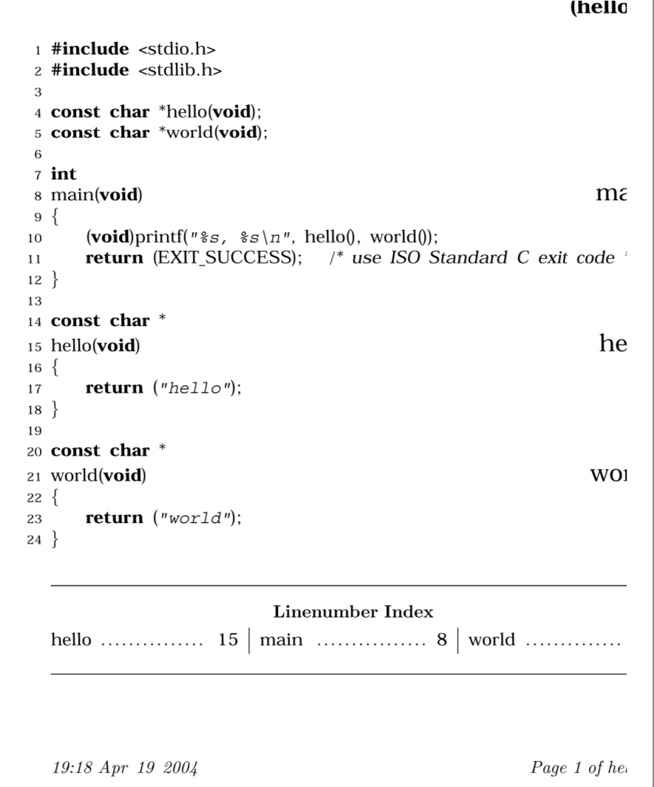

# Глава 4. Инструменты для обработки текста

Некоторые операции с текстовыми файлами настолько широко применимы, что в начале разработки Unix в Bell Labs были разработаны стандартные инструменты для решения этих задач. В этой главе мы рассмотрим наиболее важные из них.

## 4.1 Сортировка текста&#x20;

Текстовые файлы, содержащие независимые записи данных, часто являются кандидатами для сортировки. Предсказуемый порядок записей облегчает жизнь пользователям: книжные указатели, словари, каталоги запчастей и телефонные справочники не имеют большой ценности, если они не упорядочены. Отсортированные записи также могут упростить и повысить эффективность программирования, как мы проиллюстрируем на примере создания office directory в главе 5.&#x20;

Подобно awk, cut и join, sort рассматривает свои входные данные как поток записей, состоящий из полей переменной ширины, при этом записи разделены символами новой строки, а поля - разграничителями с помощью пробела или отдельного символа, определяемого пользователем.

### 4.1.1 Сортировка по строкам

В простейшем случае, когда параметры командной строки не указаны, полные записи сортируются в соответствии с порядком, определенным текущим языковым стандартом. В традиционном языковом стандарте C это означает порядок ASCII, но вы можете установить альтернативный языковой стандарт, как мы описали в разделе “Интернационализация и локализация” \[2.8].

Крошечный двуязычный словарь в кодировке ISO 8859-1 переводит четыре французских слова , отличающихся только ударениями:

```bash
cat french-english                             Show the tiny dictionary
côte coast
cote dimension
coté dimensioned
côté side
```

**sort**

_Использование_

```
sort [ options ] [ file(s) ]
```

_Цель_

Отсортировать входные строки в порядке, определяемом параметрами ключевого поля и типа данных, а также локальными параметрами.

Основные параметры&#x20;

–b&#x20;

Пропускает начальные пробелы.&#x20;

–c

&#x20;Проверяет правильность сортировки входных данных. Выходных данных нет, но код завершения не равен нулю, если входные данные не отсортированы.&#x20;

–d&#x20;

Порядок словаря: значимы только буквенно-цифровые символы и пробелы.&#x20;

-g&#x20;

Общее числовое значение: поля сравниваются как числа с плавающей запятой. Это работает как –n, за исключением того, что числа могут содержать десятичные точки и показатели степени (например, 6.022e+23). Только для версии GNU.&#x20;

–f

&#x20;Неявно складывать буквы в общий регистр, чтобы при сортировке не учитывался регистр символов.&#x20;

–i&#x20;

Игнорировать непечатаемые символы.&#x20;

–k&#x20;

Определите ключевое поле сортировки. Подробнее смотрите в разделе “Сортировка по полям”.

&#x20;–m

&#x20;Объедините уже отсортированные входные файлы в отсортированный выходной поток.&#x20;

–n

&#x20;Сравните поля как целые числа.&#x20;

–o&#x20;

выходной файл Запишите выходные данные в указанный файл, а не в стандартный вывод. Если файл является одним из входных, sort копирует его во временный файл перед сортировкой и записью выходных данных.&#x20;

–r&#x20;

Измените порядок сортировки на убывающий, а не на возрастающий, как по умолчанию.

&#x20;–t

Используйте одиночный символ char в качестве разделителя полей по умолчанию вместо пробела, используемого по умолчанию.

&#x20;–u&#x20;

Только уникальные записи: в группе с одинаковыми ключами удаляются все записи, кроме первой. Значение имеют только ключевые поля: другие части удаленных записей могут отличаться.

_Поведение_

sort считывает указанные файлы или стандартный ввод, если файлы не заданы, и записывает отсортированные данные в стандартный вывод.

Чтобы разобраться в сортировке, используйте инструмент octal dump, od, для отображения французских слов в ASCII и восьмеричном формате:

```bash
$ cut -f1 french-english | od -a -b               Display French words in octal bytes
0000000 c t t e nl c o t e nl c o t i nl c
 143 364 164 145 012 143 157 164 145 012 143 157 164 351 012 143
0000020 t t i nl
 364 164 351 012
0000024
```

Очевидно, что при использовании опции ASCII –a, od удаляет старшие разряды символов, поэтому буквы с ударением были изменены, но мы можем видеть их восьмеричное значение:é - $$351_8$$ , а ô - $$364_8$$.

В системах GNU/Linux вы можете подтвердить значения символов следующим образом

```bash
 man iso_8859_1 Check the ISO 8859-1 manual page
...
 Oct Dec Hex Char Description
 --------------------------------------------------------------------
...
 351 233 E9 é LATIN SMALL LETTER E WITH ACUTE
...
 364 244 F4 ô LATIN SMALL LETTER O WITH CIRCUMFLEX
```

Сначала отсортируйте файл в строгом порядке байтов:

```bash
LC_ALL=C sort french-english                         Sort in traditional ASCII order
cote dimension
coté dimensioned
côte coast
côté side
```

Обратите внимание, что e ( $$145_8$$) начинался до é ( $$351_8$$), а o ( $$157_8$$ ) отсортирован до ô ($$364_8$$), как и ожидалось из их числовых значений.

Теперь отсортируйте текст в канадско-французском порядке:

```bash
$ LC_ALL=fr_CA.iso88591 sort french-english         Sort in Canadian-French locale
côte coast
cote dimension
coté dimensioned
côté side
```

Порядок вывода явно отличается от традиционного упорядочения по необработанным байтовым значениям.

Правила сортировки сильно зависят от языка, страны и культуры, а правила иногда бывают удивительно сложными. Даже в английском языке, который в основном делает вид, что акценты не имеют значения, могут быть сложные правила сортировки: изучите свой местный телефонный справочник, чтобы узнать, как пишутся буквы, цифры, пробелы, знаки препинания и такие варианты имен, как McKay и Mackay.

### 4.1.2 Сортировка по полям

Для большего контроля над сортировкой параметр –k позволяет указать поле для сортировки, а параметр –t позволяет выбрать разделитель полей.

Если значение –t не указано, то поля разделяются пробелами, а начальные и конечные пробелы в записи игнорируются. При использовании параметра –t указанный символ разделяет поля, и пробел является существенным. Таким образом, запись из трех символов, состоящая из space-X-space, имеет одно поле без -t, но три с –t'  ' (первое и третье поля пустые).

За параметром –k следует номер поля или пара номеров, необязательно разделенных пробелом после –k. К каждому номеру может быть добавлен суффикс в виде точки и/или одной из букв-модификаторов, показанных в таблице 4-1.

| Letter | Description                                                             |
| ------ | ----------------------------------------------------------------------- |
| b      | Игнорировать начальные пробелы.                                         |
| d      | Словарный порядок                                                       |
| f      | Неявно складывайте буквы в общий регистр букв                           |
| g      | Сравнивать как обычные числа с плавающей запятой. Только для версии GNU |
| i      | Игнорируйте непечатаемые символы.                                       |
| n      | Сравнивайте как (целые) числа.                                          |
| r      | Обратный порядок                                                        |

Поля и символы внутри полей нумеруются, начиная с единицы.

Если указан только один номер поля, ключ сортировки начинается с начала этого поля и продолжается до конца записи (не до конца поля).

Если задана пара номеров полей, разделенных запятыми, то ключ сортировки начинается с начала первого поля и заканчивается в конце второго поля.

При указании позиции символа с точкой сравнение начинается (первая пара чисел) или заканчивается (вторая пара чисел) в этой позиции символа: –k2.4,5.6 сравнивает, начиная с четвертого символа второго поля и заканчивая шестым символом пятого поля.

Если начало ключа сортировки находится за пределами конца записи, то ключ сортировки пуст, а пустые ключи сортировки сортируются перед всеми непустыми ключами.

Если задано несколько параметров k, сортировка производится по первому ключевому полю, а затем, когда записи совпадают по этому ключу, по второму ключевому полю и так далее.


Хотя опция –k доступна во всех протестированных нами системах, sort также распознает более старую спецификацию полей, которая в настоящее время считается устаревшей, где поля и позиции символов нумеруются с нуля. Начало клавиши для символа mine field n определяется как +n.m, а ключ и –как -n.m. Например, sort +2.1 -3.2 эквивалентен sort -k3.2,4.3. Если позиция символа опущена, то по умолчанию она равна нулю. Таким образом, +4.0nr и +4nr означают одно и то же: цифровой ключ, начинающийся с начала пятого поля и подлежащий сортировке в обратном (убывающем) порядке.


Давайте опробуем эти параметры на примере файла паролей, отсортировав его по имени пользователя, которое находится в первом поле, разделенном двоеточием:

```bash
$ sort -t: -k1,1 /etc/passwd                         Sort by username
bin:x:1:1:bin:/bin:/sbin/nologin
chico:x:12501:1000:Chico Marx:/home/chico:/bin/bash
daemon:x:2:2:daemon:/sbin:/sbin/nologin
groucho:x:12503:2000:Groucho Marx:/home/groucho:/bin/sh
gummo:x:12504:3000:Gummo Marx:/home/gummo:/usr/local/bin/ksh93
harpo:x:12502:1000:Harpo Marx:/home/harpo:/bin/ksh
root:x:0:0:root:/root:/bin/bash
zeppo:x:12505:1000:Zeppo Marx:/home/zeppo:/bin/zsh
```

Для большего контроля добавьте букву-модификатор в поле выбора поля, чтобы определить тип данных в поле и порядок сортировки. Вот как отсортировать файл паролей по убыванию UID:

```bash
$ sort -t: -k3nr /etc/passwd                     Sort by descending UID
zeppo:x:12505:1000:Zeppo Marx:/home/zeppo:/bin/zsh
gummo:x:12504:3000:Gummo Marx:/home/gummo:/usr/local/bin/ksh93
groucho:x:12503:2000:Groucho Marx:/home/groucho:/bin/sh
harpo:x:12502:1000:Harpo Marx:/home/harpo:/bin/ksh
chico:x:12501:1000:Chico Marx:/home/chico:/bin/bash
daemon:x:2:2:daemon:/sbin:/sbin/nologin
bin:x:1:1:bin:/bin:/sbin/nologin
root:x:0:0:root:/root:/bin/bash
```

Более точным указанием поля было бы –k3nr,3 (то есть от начала третьего поля, численно, в обратном порядке, до конца третьего поля), или –k3,3nr, или даже –k3,3 –n –r, но сортировка прекращает сбор числа при первом отсутствии разряда так что –k3nr работает корректно.

В нашем примере с файлом паролей три пользователя имеют общий идентификатор GID в поле 4, поэтому мы могли бы выполнить сортировку сначала по GID, а затем по UID, используя:

```bash
$ sort -t: -k4n -k3n /etc/passwd Sort by GID and UID
root:x:0:0:root:/root:/bin/bash
bin:x:1:1:bin:/bin:/sbin/nologin
daemon:x:2:2:daemon:/sbin:/sbin/nologin
chico:x:12501:1000:Chico Marx:/home/chico:/bin/bash
harpo:x:12502:1000:Harpo Marx:/home/harpo:/bin/ksh
zeppo:x:12505:1000:Zeppo Marx:/home/zeppo:/bin/zsh
groucho:x:12503:2000:Groucho Marx:/home/groucho:/bin/sh
gummo:x:12504:3000:Gummo Marx:/home/gummo:/usr/local/bin/ksh93
```

Полезная опция –u запрашивает у sort вывод только уникальных записей, где unique означает , что их поля ключа сортировки совпадают, даже если в других местах есть различия. В последний раз просматривая файл паролей, мы находим :

```bash
$ sort -t: -k4n -u /etc/passwd Sort by unique GID
root:x:0:0:root:/root:/bin/bash
bin:x:1:1:bin:/bin:/sbin/nologin
daemon:x:2:2:daemon:/sbin:/sbin/nologin
chico:x:12501:1000:Chico Marx:/home/chico:/bin/bash
groucho:x:12503:2000:Groucho Marx:/home/groucho:/bin/sh
gummo:x:12504:3000:Gummo Marx:/home/gummo:/usr/local/bin/ksh93
```

Обратите внимание, что вывод стал короче: в группу 1000 входят три пользователя, но выводился только один из них . Позже в разделе “Удаление Дубликатов” мы покажем другой способ выбора уникальных записей \[4.2].

### 4.1.3 Сортировка текстовых блоков

Иногда требуется отсортировать данные, состоящие из многострочных записей. Хорошим примером может служить список адресов, который удобно хранить с одной или несколькими пустыми строками между адресами. Для таких данных не существует постоянной позиции ключа сортировки, которую можно было бы использовать в параметре a -k, поэтому вам придется внести дополнительную разметку. Вот простой пример:

```bash
$ cat my-friends                                     Show address file
# SORTKEY: Schloß, Hans Jürgen
Hans Jürgen Schloß
Unter den Linden 78
D-10117 Berlin
Germany
# SORTKEY: Jones, Adrian
Adrian Jones
371 Montgomery Park Road
Henley-on-Thames RG9 4AJ
UK
# SORTKEY: Brown, Kim
Kim Brown
1841 S Main Street
Westchester, NY 10502
USA
```

Хитрость сортировки заключается в том, чтобы использовать способность awk обрабатывать разделители записей более общего назначения для распознавания разрывов абзацев, временно заменять разрывы строк внутри каждого адреса другими неиспользуемыми символами, такими как непечатаемый управляющий символ, и заменять разрыв абзаца новой строкой. затем sort видит строки , которые выглядят следующим образом:

```bash
# SORTKEY: Schloß, Hans Jürgen^ZHans Jürgen Schloß^ZUnter den Linden 78^Z...
# SORTKEY: Jones, Adrian^ZAdrian Jones^Z371 Montgomery Park Road^Z...
# SORTKEY: Brown, Kim^ZKim Brown^Z1841 S Main Street^Z...
```

Здесь ^Z - это символ сочетания клавиш Ctrl и Z. Шаг фильтрации после sort восстанавливает разрывы строк и абзацев, а ключевые строки sort при желании легко удаляются с помощью grep. Весь конвейер выглядит следующим образом:

```bash
cat my-friends |                                   Pipe in address file
 awk -v RS="" '{ gsub("\n", "^Z"); print }' |      Convert addresses to single lines
 sort -f | Sort address bundles, ignoring case
 awk -v ORS="\n\n" '{ gsub("^Z", "\n"); print }' |           Restore line structure
 grep -v '# SORTKEY' Remove markup lines 
```

Функция gsub( ) выполняет “глобальные замены”. Она аналогична конструкции s/x/y/g в sed. Переменная RS является разделителем входных записей. Обычно входные записи разделяются новыми строками, что делает каждую строку отдельной записью. Использование RS="" - это особый случай, когда записи разделяются пустыми строками, т.е. каждый блок или “абзац” текста образует отдельную запись. Именно в таком виде мы вводим данные. И, наконец, наш параметр является разделителем выходных записей; каждая выходная запись, напечатанная с помощью print , заканчивается своим значением. По умолчанию он также обычно состоит из одной новой строки; установлен здесь в "\n\n" сохраняется формат ввода с пустыми строками, разделяющими записи. (Более подробную информацию об этих конструкциях можно найти в главе 9.)

Выходные данные этого конвейера в нашем адресном файле выглядят следующим образом:

```bash
Kim Brown
1841 S Main Street
Westchester, NY 10502
USA
Adrian Jones
371 Montgomery Park Road
Henley-on-Thames RG9 4AJ
UK
Hans Jürgen Schloß
Unter den Linden 78
D-10117 Berlin
Germany
```

Прелесть этого подхода в том, что мы можем легко включить дополнительные ключи в каждый адрес, которые можно использовать как для сортировки, так и для выбора: например, дополнительную строку разметки формы:

```
# COUNTRY: UK
```

в каждом адресе, а дополнительный этап конвейера grep '# COUNTRY: UK' непосредственно перед сортировкой позволил бы нам извлекать только адреса в Великобритании для дальнейшей обработки.

Вы могли бы, конечно, перестараться и использовать XML-разметку, чтобы идентифицировать части адреса в мельчайших деталях:

```bash
<address>
 <personalname>Hans Jürgen</personalname>
 <familyname>Schloß</familyname><br/>
 <streetname>Unter den Linden<streetname>
 <streetnumber>78</streetnumber><br/>
 <postalcode>D-10117</postalcode>
 <city>Berlin</city><br/>
 <country>Germany</country>
</address>
```

Используя более совершенные фильтры для обработки данных, вы могли бы порадовать свое почтовое отделение, предварительно отсортировав почту по странам и почтовым индексам, но нашей минимальной разметки и простого конвейера часто бывает достаточно для выполнения этой работы.

### 4.1.4 Эффективность сортировки

Очевидный способ сортировки данных требует сравнения всех пар элементов, чтобы определить, какой из них стоит первым, и приводит к алгоритмам, известным как пузырьковая сортировка и сортировка вставками. Эти быстрые и неприхотливые алгоритмы хороши для небольших объемов данных, но они, безусловно , не работают быстро для больших объемов, потому что их работа по сортировке n записей растет со скоростью n2. Это сильно отличается от почти всех фильтров, которые мы обсуждаем в этой книге: они считывают запись, обрабатывают ее и выводят на экран, поэтому время их выполнения прямо пропорционально количеству записей, n.

К счастью, проблема сортировки привлекла много внимания в компьютерном сообществе, и известны хорошие алгоритмы сортировки, средняя сложность которых составляет $$n_3/_2$$ (shellsort), n регистрирует n (heapsort, mergesort и quicksort), а для ограниченных типов данных - n (сортировка по распределению). Реализация команды сортировки в Unix была тщательно изучена и оптимизирована: вы можете быть уверены, что она выполнит эту работу эффективно и почти наверняка лучше, чем вы могли бы сделать сами, не изучая гораздо больше алгоритмов сортировки.

### 4.1.5 Стабильность сортировки

Важный вопрос, касающийся алгоритмов сортировки, заключается в том, являются ли они стабильными: то есть сохраняется ли порядок ввода одинаковых записей в выходных данных? Стабильная сортировка может быть желательна, когда записи сортируются по нескольким ключам или более одного раза в конвейере. POSIX не требует, чтобы сортировка была стабильной, и большинство реализаций таковыми не являются, как показано в этом примере:

```
$ sort -t_ -k1,1 -k2,2 << EOF                     Sort four lines by first two fields
> one_two
> one_two_three
> one_two_four
> one_two_five
> EOF
one_two
one_two_five
one_two_four
one_two_three

```

Поля сортировки идентичны в каждой записи, но выходные данные отличаются от входных, поэтому сортировка не является стабильной. К счастью, реализация GNU в пакете coreutils\* устраняет этот недостаток с помощью опции --stable: ее выходные данные в этом примере правильно соответствуют входным данным.

### 4.1.6 Подведение итогов сортировки

sort, безусловно, входит в десятку лучших команд Unix: изучите ее как следует, потому что вы будете часто ее использовать. Более подробная информация о sort приведена на боковой панели в начале этой главы, но для получения полной информации о вашей системе обратитесь к страницам руководства по sort(1). сортировка , конечно же, стандартизирована POSIX, поэтому она должна быть доступна на каждом компьютере , который вы, вероятно, будете использовать.

## 4.2. Удаление дубликатов

Иногда бывает полезно удалить из потока данных последовательно повторяющиеся записи. В разделе “Сортировка по полям” \[4.1.2] мы показали, что функция sort -u справится с этой задачей, но мы также увидели, что удаление основано на совпадении ключей, а не на совпадающих записях. Команда uniq предоставляет еще один способ фильтрации данных: она часто используется в конвейере для удаления повторяющихся записей после операции сортировки:

```bash
sort ... | uniq | ...
```

в uniq есть три полезные опции, которые часто используются. Опция –c добавляет к каждой строке вывода количество раз, когда она использовалась, и мы будем использовать ее в фильтре частотности слов в примере 5-5 в главе 5. Параметр –d показывает только те строки, которые дублируются, а параметр –u показывает только те строки, которые не дублируются. Вот несколько примеров:

```
$ cat latin-numbers                        Show the test file
tres
unus
duo
tres
duo
tres

$ sort latin-numbers | uniq               Show unique sorted records
duo
tres
unus

$ sort latin-numbers | uniq -c           Count unique sorted records
 2 duo
 3 tres
 1 unus
 
$ sort latin-numbers | uniq -d           Show only duplicate records
duo
tres

$ sort latin-numbers | uniq -u           Show only nonduplicate records
unus
```

uniq иногда является полезным дополнением к утилите diff для определения различий между двумя похожими потоками данных: списками словарей, путевыми именами в зеркальных деревьях каталогов, телефонными книгами и так далее. В большинстве реализаций есть другие опции, которые вы можете найти на страницах руководства по uniq(1), но они используются редко. Как и sort, uniq стандартизирован POSIX, поэтому вы можете использовать его везде.

## 4.3 Переформатирование абзацев

Большинство мощных текстовых редакторов предоставляют команды, которые позволяют легко переформатировать абзацы, изменяя переносы строк таким образом, чтобы ширина строк не превышала ширины, удобной для чтения человеком; мы часто использовали такие команды при написании этой книги. Иногда вам нужно сделать это с потоком данных в shell-скрипте или в редакторе , в котором отсутствует команда переформатирования, но есть shell escape. В этом случае fmt это то, что вам нужно. Хотя в POSIX нет упоминания о fmt, вы можете найти его во всех современных версиях Unix;  если у вас более старая система, в которой отсутствует fmt, просто установите пакет GNU coreutils.

Хотя в некоторых реализациях fmt есть больше опций, только две из них часто используются: –s означает разделение только длинных строк, но не объединение коротких строк для создания более длинных, и –w n устанавливает ширину выводимой строки равной n символам (по умолчанию: обычно около 75 или около того). Вот несколько примеров с фрагментами орфографического словаря, содержащего всего по одному слову в строке:

```
 sed -n -e 9991,10010p /usr/dict/words | fmt        Reformat 20 dictionary words
Graff graft graham grail grain grainy grammar grammarian grammatic
granary grand grandchild grandchildren granddaughter grandeur grandfather
grandiloquent grandiose grandma grandmother

$ sed -n -e 9995,10004p /usr/dict/words | fmt -w 30    Reformat 10 words into short lines
grain grainy grammar
grammarian grammatic
granary grand grandchild
grandchildren granddaughter 
```

Если в вашей системе нет файла /usr/dict/words, то, вероятно, в ней есть эквивалентный файл с именем /usr/share/dict/words или /usr/share/lib/dict/words.

Опция "только для разделения", -s, помогает обтекать длинные строки, оставляя короткие нетронутыми и, таким образом, сводя к минимуму различия с исходной версией:

```
fmt -s -w 10 << END_OF_DATA             Reformat long lines only 
> one two three four five
> six
> seven
> eight
> END_OF_DATA
one two
three
four five
six
seven
eight
```


Вы могли бы ожидать, что сможете разделить входной поток на одно слово в строке с помощью fmt –w 0 или полностью удалить разрывы строк большой ширины. К сожалению, реализации fmt различаются по поведению:&#x20;

* &#x20;В старых версиях fmt отсутствует параметр –w; они используют –n для указания ширины в n символов.&#x20;
* &#x20;Все они отвергают нулевую ширину, но принимают значение –w 1 или -1.&#x20;
* Все они сохраняют начальный пробел.&#x20;
* В некоторых строках сохраняются строки, которые выглядят как заголовки писем.&#x20;
* Некоторые строки, начинающиеся с точки, сохраняются (команды набора текста troff).&#x20;
* &#x20;Большинство из них ограничивают ширину. Мы обнаружили странную верхнюю границу в 1021 (Solaris),2048 (HP/UX 11),4093 (AIX и IRIX),8189 (OSF/1 4.0), 12285 (OSF/1 5.1) и 2147483647 (наибольшее 32-разрядное целое число со знаком: FreeBSD, GNU/Linux и Mac OS).&#x20;
* &#x20;Версии fmt для NetBSD и OpenBSD имеют разный синтаксис командной строки и, по-видимому, выделяют буфер для хранения выходной строки, поскольку они выдают диагностику нехватки памяти при больших значениях ширины.&#x20;
* IRIX fmt находится в каталоге /usr/sbin, который вряд ли окажется в вашем пути поиска.&#x20;
* В HP/UX до версии 11.0 не было fmt. Эти вариации затрудняют использование fmt в переносимых скриптах или для сложные задачи переформатирования.


## 4.4. Подсчет строк, слов и символов

Мы уже несколько раз использовали утилиту для подсчета слов wc. Это, вероятно, один из старейших и простейших инструментов в наборе инструментов Unix, и POSIX стандартизирует его. По умолчанию wc выводит однострочный отчет о количестве строк, слов и байт:

```bash
 echo This is a test of the emergency broadcast system | wc Report counts
 1  9  49
```

Запросите подмножество этих результатов с помощью –c (байты), –l (строки) и –w (слова). опции:

```bash
$ echo Testing one two three | wc -c Count bytes
22
$ echo Testing one two three | wc -l Count lines
1
$ echo Testing one two three | wc -w Count words
4
```

Параметр –c изначально обозначал количество символов, но в современных системах с многобайтовыми кодировками, такими как UTF-8, байты больше не являются синонимами символов, поэтому POSIX ввел параметр -m для подсчета многобайтовых символов. Для 8-битных символьных данных это то же самое, что и –c.

Хотя wc чаще всего используется с вводом данных из конвейера, он также принимает аргументы файла командной строки, создавая однострочный отчет для каждого из них, за которым следует сводный отчет:

```bash
$ wc /etc/passwd /etc/group Count data in two files
 26 68 1631 /etc/passwd
 10376 10376 160082 /etc/group
 10402 10444 161713 total
```

Современные версии wc учитывают языковые стандарты: установите для переменной окружения LC\_CTYPE значение желаемого языкового стандарта, чтобы повлиять на интерпретацию wc последовательностей байтов в качестве символов и разделителей слов.

В главе 5 мы разработаем соответствующий инструмент wf, который будет сообщать о частоте встречаемости каждого слова.

## 4.5 Печать

По сравнению с компьютерами принтеры являются медленными устройствами, и, поскольку они обычно используются совместно, пользователям, как правило, нежелательно отправлять задания непосредственно на них. Вместо этого большинство операционных систем предоставляют команды для отправки запросов демону печати\*, который ставит задания в очередь на печать и управляет принтером и очередью. Команды печати можно выполнять быстро, поскольку печать выполняется в фоновом режиме при наличии необходимых ресурсов.

Поддержка печати в Unix разделилась на два лагеря с разными командами, но эквивалентной функциональностью, как показано в таблице 4-2. Коммерческие системы Unix и GNU/Linux обычно поддерживают оба лагеря, в то время как системы BSD предлагают только стиль Berkeley. В POSIX указана только команда lp.

| Berkeley | System V | Цель                |
| -------- | -------- | ------------------- |
| lpr      | lp       | отправить в очередь |
| lprm     | cancel   | удалить из очереди  |
| lpq      | lpstat   | статус очереди      |

Вот пример их использования, сначала в стиле Беркли:

```bash
$ lpr -Plcb102 sample.ps                  Send PostScript file to print queue lcb102

$ lpq -Plcb102                            Ask for print queue status
lcb102 is ready and printing
Rank Owner Job File(s) Total Size
active jones 81352 sample.ps 122888346 bytes

$ lprm -Plcb102 81352 Stop the presses!   Kill that huge job
```

А затем в стиде SystemV

```bash
$ lp -d lcb102 sample.ps                 Send PostScript file to print queue lcb102
request id is lcb102-81355 (1 file(s))

$ lpstat -t lcb102                       Ask for print queue status
printer lcb102 now printing lcb102-81355

$ cancel lcb102-81355 Whoops!             Don't print that job!
```

lp и lpr, конечно, могут считывать данные из стандартного ввода, а не из файлов командной строки, поэтому они обычно используются в конце конвейера.&#x20;

Системное управление может сделать определенную отдельную очередь системной по умолчанию, чтобы не указывать имена очередей, если значение по умолчанию приемлемо. Отдельные пользователи могут задать переменную среды PRINTER (Berkeley) или LPDEST (System V), чтобы выбрать персональный принтер по умолчанию.&#x20;

Имена очередей печати зависят от конкретного места: небольшая организация может просто присвоить принтеру очереди имя и сделать его принтером по умолчанию. Более крупные  могут выбирать названия, отражающие местоположение, например аббревиатура здания и номер помещения, или которые указывают на конкретные модели принтеров или их возможности, например, bw для черно-белого принтера и color для дорогого принтера.&#x20;

К сожалению, в современных сетевых интеллектуальных принтерах команды lprm, cancel, lpq и lpstat гораздо менее полезны, чем когда-либо: задания на печать поступают быстро запустите принтер, и демону принтера покажется, что он уже напечатал и, таким образом, удаляются из очереди печати, даже если принтер все еще сохраняет их в памяти или в файловой системе, в то время как другие задания печати все еще обрабатываются. В этом случае единственным выходом является использование панели управления принтера для отмены нежелательного задания.

### 4.5.1 Эволюция технологии печати

Технология печати сильно изменилась с тех пор, как впервые была разработана Unix. Индустрия перешла от больших печатных машин и электрических пишущих машинок, которые формировали символы , ударяя лентой и бумагой по металлическому профилю, к электростатическим, матричным, струйным и лазерным принтерам, которые создают символы из крошечных точек.

Достижения в области микропроцессоров позволили внедрить в принтер простые командные языки, такие как Hewlett-Packard Printer Command Language (PCL) и HP Graphics Language(HPGL), а также полноценные языки программирования , в частности Adobe PostScript. Формат Adobe Portable Document Format (PDF) является потомком PostScript, который является более компактным, но не программируемым. PDF предлагает дополнительные функции, такие как прозрачность цвета, цифровые подписи, контроль доступа к документам, шифрование, улучшенное сжатие данных и независимость от страницы. Последняя функция позволяет высокопроизводительные принтеры позволяют параллельно растрировать страницы, а программы просмотра PDF-файлов позволяют быстро отобразить любую запрошенную страницу.

Новейшее поколение устройств объединяет печать, копирование и сканирование в единую систему с дисковой файловой системой и доступом к сети, поддержкой нескольких языков описания страниц и форматов графических файлов и, по крайней мере, в одном случае, GNU/ Linux в качестве встроенной операционной системы.

К сожалению, программное обеспечение для печати Unix недостаточно быстро адаптировалось к этим усовершенствованиям в технологии печати, и поддержка на командном уровне доступа ко многим функциям новых принтеров остается неудовлетворительной. Два известных программных проекта пытаются исправить эту ситуацию: Common UNIX Printing System\* (CUPS) и lpr next generation† (LPRng). Многие крупные Unix-сайты используют ту или иную версию; обе предоставляют знакомые команды печати Unix, но с гораздо большим количеством возможностей. Оба устройства полностью поддерживают печать файлов PostScript и PDF: при необходимости они используют Aladdin или Интерпретатор GNU ghostscript позволяет конвертировать такие файлы в другие форматы, необходимые менее производительным принтерам. CUPS также поддерживает печать различных форматов графических изображений и расширенную печать для размещения нескольких уменьшенных изображений на одном листе.

### 4.5.2 Другое программное обеспечение для печати

Несмотря на свое название, почтенная команда pr не печатает файлы, а скорее фильтрует данные при подготовке к печати. В простейшем случае pr выдает временную метку заголовка страницы с указанием времени изменения файла или, если ввод осуществляется из канала, с текущим временем, за которым следует имя файла (пустое для конвейерного ввода) и номер страницы с фиксированным количеством (66) строк на странице. Предполагалось, что это позволит печатать красивые объявления. Однако эта простота не сработала с тех пор, как старые механические принтеры 1970-х годов были выведены из эксплуатации. Размеры шрифта и межстрочный интервал по умолчанию принтеры отличаются друг от друга, и обычно используется бумага разных форматов.

```bash
pr file(s) | lp
```

**pr**

_Использование:_

pr \[ options ] \[ file(s) ]

_Цель:_

Разбивка текстовых файлов на страницы для печати

_Основные опции:_

-cn&#x20;

Создайте выходные данные в n столбцах. Этот параметр может быть сокращен до –n (например, -4 вместо –c4).

-f

В качестве префикса к заголовку каждой страницы после первой следует символ ASCII formfeed. Эта опция называется –F во FreeBSD, NetBSD и Mac OS X. OpenBSD распознает обе опции. В POSIX есть обе, но значения для них немного отличаются.

-h althdr

Используйте строку althdr для замены имени файла в заголовке страницы.

-ln

Создавайте n-line страницы. В некоторых реализациях строки заголовка и концовки страницы учитываются , в то время как в других - нет.

-on

Смещение выходных строк с помощью n пробелов.

-t

Подавление заголовков страниц

-wn

здавайте строки, содержащие не более n символов. При выводе в один столбец при необходимости вставляйте более длинные строки в дополнительные строки; в противном случае, при выводе в несколько столбцов, обрезайте длинные строки по размеру.

_Поведение:_

pr считывает указанные файлы или стандартный ввод, если файлы не заданы, и записывает данные с разбивкой по страницам в стандартный вывод.

_Предостережения:_

Реализации pr значительно различаются по поддерживаемым параметрам и форматированию выходных данных; версия GNU coreutils обеспечивает согласованное поведение во всех системах.

Вам, как правило, приходится экспериментировать с настройкой длины выводимой страницы с помощью параметра –l, а часто и ширины страницы с помощью параметра –w и смещения текста с помощью параметра –o. Также важно добавить опцию –f (–F в некоторых системах) для вывода управляющего символа ASCII formfeed в начале каждого заголовка страницы после первого, чтобы гарантировать, что с каждого заголовка начинается новая страница. Реальность такова, что вам обычно приходится использовать что-то вроде этого:

```bash
pr -f -l60 -o10 -w65 file(s) | lp
```

Если позже вы будете использовать другой принтер, вам, возможно, потребуется изменить эти числовые параметры. Это затрудняет надежное использование pr в сценариях переносимой оболочки.

У pr есть одна особенность, которая часто бывает удобной: опция –cn запрашивает вывод в виде n столбцов. Если вы объедините это с опцией –t, чтобы опустить заголовки страниц, вы сможете создавать красивые списки с несколькими столбцами, такие как этот пример, который форматирует 26 слов в пять столбцов:

```bash
pirog@pirog:/usr/share/dict$ sed -n -e 19000,19025p /usr/share/dict/words | pr -c5 -t
USS	      UT's	    Ubuntu	  Uccello's	Uganda
USSR	      UV	    Ubuntu's	  Udall		Ugandan
USSR's	      UV's	    Ucayali	  Udall's	Ugandan's
US's	      Ubangi	    Ucayali's	  Ufa		Ugandans
UT	      Ubangi's	    Uccello	  Ufa's		Uganda's

```

Если ширина столбца слишком мала, pr автоматически обрезает данные, чтобы предотвратить перекрытие столбцов. Мы можем отформатировать те же 26 слов в 10 (усеченных) столбцов следующим образом:

```bash
pirog@pirog:/usr/share/dict$ sed -n -e 19000,19025p /usr/share/dict/words | pr -c10 -t
USS    US's   UT's   Ubangi Ubuntu Uccell Udall' Ufa's	Uganda Uganda
USSR   UT     UV     Ubangi Ucayal Uccell Ufa	 Uganda Uganda Uganda
USSR's UTC    UV's   Ubuntu Ucayal Udall

```

pr имеет множество опций, и исторически сложилось так, что в разных Unix -системах существовали значительные различия в этих опциях, а также в формате вывода и количестве строк на странице. Мы рекомендуем использовать версию из пакета GNU coreutils, поскольку она обеспечивает повсеместный единый интерфейс и предоставляет больше возможностей, чем большинство других версий. Подробности см. на страницах руководства по pr(1).

Несмотря на то, что некоторые принтеры PostScript поддерживают обычный текст, многие из них этого не делают. Системы набора текста, такие как TEX и troff, могут преобразовать размеченные документы в изображения страниц PostScript и/или PDF . Если у вас есть обычный текстовый файл, как его распечатать? Система печати Unix вызывает подходящие фильтры для выполнения преобразования за вас, но в этом случае вы не можете контролировать его внешний вид. Ответ - это фильтры преобразования текста в PostScript, такие как a2ps,\* lptops или только в Sun Solaris, mp. Используйте их вот так:

```bash
a2ps file > file.ps                 Make a PostScript listing of file
a2ps file | lp                      Print a PostScript listing of file
a

lptops file > file.ps               Make a PostScript listing of file
lptops file | lp                    Print a PostScript listing of file

mp file > file.ps                   Make a PostScript listing of file
mp file | lp                        Print a PostScript listing of file
```

Все три варианта имеют параметры командной строки, позволяющие выбрать шрифт, указать размер шрифта, включить или отключить заголовки страниц и выбрать вывод с несколькими столбцами.

В системах BSD, IBM AIX и Sun Solaris есть vgrind,\* который фильтрует файлы на различных языках программирования, преобразуя их во входные данные troff, с комментариями, выделенными курсивом, ключевыми словами, выделенными жирным шрифтом, и текущей функцией, указанной на полях; затем эти данные набираются и выводятся в формате PostScript. Производная программа grind† выполняет аналогичную работу, но с более широким выбором шрифтов, нумерацией строк, индексацией и поддержкой многих других языков программирования. Программа grind обеспечивает ввод текста, который легко выводится в PostScript и PDF. На рисунке 4.1 показан пример ее вывода. Обе программы просты в использовании для печати списков набранных программ:

```
$ tgrind -p hello.c                           Typeset and print hello.c

$ tgrind -i 1 -fn Bookman -p hello.c          Print the listing shown in Figure 4-1

$ vgrind hello.c | lp                         Typeset and print hello.c
```


<figure><figcaption></figcaption></figure>

## 4.6. Извлечение первой и последней строк

Иногда бывает полезно извлечь всего несколько строк из текстового файла — чаще всего это строки ближе к началу или концу. Например, названия глав для XML-файлов этой книги отображаются в первых шести строках каждого файла, а в конце файлов журнала заданий можно просмотреть сводку о последних действиях.

Обе эти операции просты. Вы можете отобразить первые n записей стандартного ввода или каждый из списка файлов командной строки с помощью любого из этих параметров.:

```bash
head -n n [ file(s) ]

head -n [ file(s) ]

awk 'FNR <= n' [ file(s) ]

sed -e nq [ file(s) ]

sed nq [ file(s) ]
```

Для POSIX требуется параметр head, равный -n 3 вместо -3, но каждая реализация, которую мы тестировали, допускает и то, и другое.

Если имеется только одна команда редактирования, sed позволяет не указывать параметр –e. Если для отображения требуется менее n строк, это не является ошибкой.

Последние n строк могут быть отображены следующим образом:

```bash
tail -n n [ file ]

tail -n [ file ]
```

Как и в случае с head, POSIX определяет только первую форму, но обе они принимаются во всех наших системах.

Любопытно, что, хотя head обрабатывает несколько файлов в командной строке, традиционные и POSIX tail этого не делают. Эта проблема исправлена во всех современных версиях tail.

В интерактивном сеансе командной строки иногда желательно отслеживать вывод в файл, такой как файл журнала, пока он еще записывается. Параметр –f просит tail отобразить указанное количество строк в конце файла, а затем перейти в бесконечный цикл, отключившись на секунду, прежде чем проснуться и проверить, нет ли дополнительных выходных данных для отображения. При нажатии клавиши –f tail завершается только тогда, когда вы прерываете его, обычно набирая Ctrl-C:

```bash
$ tail -n 25 -f /var/log/messages         Watch the growth of the system message log
...
^C Ctrl-C stops tail
```

Поскольку tail не завершается сам по себе с помощью параметра –f, этот параметр вряд ли будет полезен в сценариях оболочки.

Коротких и простых альтернатив tail с помощью awk или sed не существует, поскольку для выполнения этой работы требуется ведение истории последних записей.

Хотя мы не иллюстрируем их здесь подробно, есть несколько других команд , которые мы используем в небольших примерах по всей книге и которые стоит добавить в ваш набор инструментов:

* dd копирует данные в блоки заданного пользователем размера и количества. Он также имеет некоторые ограниченные возможности для преобразования между прописными и строчными буквами, а также между ASCII и EBCDIC. Однако для преобразования набора символов есть современная команда iconv, соответствующая стандарту POSIX, для преобразования файлов из одного набора кодов в другой обладает гораздо большей гибкостью.&#x20;
* file сопоставляет несколько выбранных начальных байт содержимого каждого из своих файлов-аргументов с базой данных шаблонов и выводит краткий однострочный отчет на стандартный  вывод по каждому из них. Большинство реализаций file, предоставляемых поставщиками, распознают около 100 типов файлов, но не могут классифицировать двоичные исполняемые файлы и объектные файлы других версий Unix или файлы из других операционных систем. Однако существует гораздо лучшая версия с открытым исходным кодом\*, которая пользуется преимуществами многих разработчиков: она может распознавать более 1200 типов файлов, в том числе многие из операционных систем, отличных от Unix.&#x20;
* od, команда octal dump, выводит потоки байтов в формате ASCII, восьмеричном и шестнадцатеричном формате. Параметры командной строки позволяют задать количество считываемых байт и выбрать формат вывода.
* strings выполняет поиск последовательностей из четырех или более символов, пригодных для печати , заканчивающихся новой строкой или нулем, и выводит их на стандартный вывод. Это часто полезно для просмотра двоичных файлов, таких как скомпилированные программы или файлы данных. Программное обеспечение для настольных компьютеров, изображения и звуковые файлы иногда содержат полезные текстовые данные в самом начале, а GNU head предоставляет удобную опцию -c, позволяющую ограничить вывод заданным количеством символов.

```bash
$ strings -a horne01.jpg | head -c 256 | fmt -w 65        Examine astronomical image
JFIF Photoshop 3.0 8BIM Comet Hale-Bopp shows delicate
filaments in it's blue ion tail in this exposure made Monday
morning 3/17/97 using 12.5 inch F/4 Newtonian reflecting
telescope. The 15 minute exposure was made on Fujicolor SG-800
Plus film. 8BIM 8BI
```

## 4.7 Краткое изложение

В этой главе было рассмотрено около 30 утилит для обработки текстовых файлов. В совокупности они представляют собой мощный набор инструментов для написания сценариев оболочки. Наиболее важной и сложной из них является sort. Команды fmt, uniq и wc часто являются именно теми инструментами, которые необходимы в конвейере для упрощения или обобщения данных. Когда вам нужно получить краткий обзор коллекции незнакомых файлов, часто лучше использовать file, head, strings и tail , чем просматривать каждый файл по очереди в текстовом редакторе. a2ps, tgrind и vgrind  могут облегчить чтение списков ваших программ, включая сценарии оболочки.

