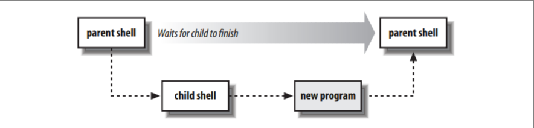

# Приступая к работе

Когда вам нужно выполнить какую-то работу за компьютером, лучше всего использовать инструмент, подходящий для конкретной работы. Вы не используете текстовый редактор для составления баланса в чековой книжке или калькулятор для составления предложения. Точно так же разные языки программирования удовлетворяют разные потребности, когда приходит время выполнять какую-то задачу, связанную с компьютером.

Сценарии командной оболочки чаще всего используются для задач системного администрирования или для объединения существующих программ для выполнения какой-либо небольшой конкретной работы. Как только вы поймете, как выполнять эту работу, вы можете объединить команды в отдельную программу или скрипт, которые затем можно запускать напрямую. Более того, если это полезно, другие люди могут пользоваться программой, рассматривая ее как черный ящик, программу, которая выполняет свою работу , но им не обязательно знать, как она это делает.

В этой главе мы проведем краткое сравнение между различными типами языков программирования, а затем приступим к написанию нескольких простых сценариев оболочки.

## 2.1 Языки сценариев в сравнении с компилируемыми Языками

Большинство средне- и крупномасштабных программ написаны на компилируемых языках, таких как Fortran, Ada, Pascal, C, Си++ или Java. Программы преобразуются из исходного кода в объектный код, который затем выполняется непосредственно аппаратными средствами компьютера.\*

`*Это утверждение не совсем верно для Java, но оно достаточно близко для обсуждения.`

Преимущество компилируемых языков в том, что они эффективны. Их недостаток в том, что они обычно работают на низком уровне, имея дело с байтами, целыми числами, числами с плавающей запятой и другими объектами машинного уровня. Например, в C++ трудно сказать что-то простое вроде “скопируйте все файлы из этого каталога вон в тот каталог”.

Так называемые скриптовые языки обычно интерпретируются. Обычная скомпилированная программа, интерпретатор, считывает программу, переводит ее во внутреннюю форму и затем выполняет программу.\*

## 2.2 Зачем использовать Shell-скрипты?

Преимущество языков сценариев в том, что они часто работают на более высоком уровне, чем компилируемые языки, и могут легче работать с такими объектами, как файлы и каталоги. Недостатком является то, что они часто менее эффективны, чем компилируемые языки. Обычно компромисс оправдан; написание простого скрипта, написание кода на C или C++ которого заняло бы два дня, может занять час, и обычно скрипт выполняется достаточно быстро, чтобы не создавать проблем с производительностью. Примерами скриптовых языков являются awk, Perl, Python, Ruby и shell. Поскольку оболочка является универсальной для Unix-систем, а язык стандартизирован POSIX, сценарии оболочки могут быть написаны один раз и, при тщательном написании, использоваться в различных системах. Таким образом, причины использования сценария оболочки следующие:

_**Простота**_&#x20;

_shell_ - это язык высокого уровня; с ее помощью вы можете четко и просто выражать сложные операции.

_**Переносимость**_

Используя только функции, указанные в POSIX, у вас есть все шансы перенести свой скрипт без изменений на различные системы.

_**Простота разработки**_&#x20;

Часто можно написать мощный и полезный скрипт за короткое время.

## 2.3 Простой скрипт

Давайте начнем с простого сценария. Предположим, вы хотите узнать, сколько пользователей в данный момент вошли в систему. Команда who сообщает вам, кто вошел в систему:

```bash
$ who
george pts/2 Dec 31 16:39 (valley-forge.example.com)
betsy pts/3 Dec 27 11:07 (flags-r-us.example.com)
benjamin dtlocal Dec 27 17:55 (kites.example.com)
jhancock pts/5 Dec 27 17:55 (:32)
camus pts/6 Dec 31 16:22
tolstoy pts/14 Jan 2 06:42
```

В большой многопользовательской системе список может исчезнуть с экрана, прежде чем вы сможете подсчитать всех пользователей, и делать это каждый раз в любом случае неудобно. Это прекрасная возможность для автоматизации. Чего не хватает, так это способа подсчета количества пользователей. Для этого мы используем программу wc (word count), которая подсчитывает строки, слова и символы. В данном случае мы хотим, чтобы wc -l подсчитывал только строки:

```bash
$ who | wc -l Count users
```

Символ | (pipe) создает конвейер между двумя программами: выходные данные who становятся входными данными wc. Результатом, выводимым wc, является количество пользователей, вошедших в систему. Следующий шаг - превратить этот конвейер в отдельную команду. Вы делаете это, вводя команды в обычный файл, а затем делая файл исполняемым с помощью chmod, вот так:

```
$ cat > nusers       Create the file, copy terminal input with cat
who | wc -l          Program text
^D Ctrl-D            Ctrl-D is end-of-file
$ chmod +x nusers    Make it executable
$ ./nusers           Do a test run           
 6                   Output is what we expect
```

Это показывает типичный цикл разработки для небольших одно- или двухстрочных командных скриптов.: сначала вы экспериментируете непосредственно с командной строкой. Затем, как только вы определите правильные заклинания для выполнения того, что вы хотите, вы помещаете их в отдельный скрипт и делаете его исполняемым. С этого момента вы можете использовать этот скрипт напрямую.

## 2.4 Автономные скрипты: #! Первая строка

Когда командная оболочка запускает программу, она запрашивает ядро Unix запустить новый процесс и запустить данную программу в этом процессе. Ядро знает, как это сделать для скомпилированных программ. Наш сценарий оболочки nusers не является скомпилированной программой; когда оболочка запрашивает у ядра его запуск, ядро не может этого сделать, возвращая ошибку “не исполняемый файл формата”. Оболочка, получив эту ошибку, сообщает: “Ага, это не скомпилированная программа, это, должно быть, сценарий оболочки”, а затем переходит к запуску новой копии /bin/sh (стандартной оболочки) для запуска программы.

Механизм “возврата к /bin/sh” хорош, когда есть только одна оболочка. Однако, поскольку современные Unix-системы имеют несколько оболочек, должен быть способ сообщить Ядро Unix, какую оболочку использовать при запуске определенного сценария оболочки. На самом деле, это помогает создать общий механизм, позволяющий напрямую вызывать интерпретатор любого языка программирования, а не только командную оболочку. Это делается с помощью специальной первой строки в файле скрипта, которая начинается с двух символов #!.

Когда первые два символа файла равны #!, ядро просматривает оставшуюся часть строки в поисках полного пути к интерпретатору, который будет использоваться для запуска программы. (Все промежуточные пробелы пропускаются.) Ядро также выполняет поиск единственного параметра, который должен быть передан этому интерпретатору. Ядро вызывает интерпретатор с заданным параметром вместе с остальной частью командной строки. Например, предположим, что csh-скрипт\* с именем /usr/ucb/whizprog, с этой первой строкой:

```bash
#! /bin/csh -f
```

Кроме того, предположим, что /usr/ucb включен в путь поиска командной строки (описанный ниже). Пользователь может ввести команду whizprog -q /dev/tty01. Ядро интерпретирует строку #! и вызывает csh следующим образом:

```bash
/bin/csh -f /usr/ucb/whizprog -q /dev/tty01
```

Этот механизм позволяет легко вызывать любой интерпретируемый язык. Например, это хороший способ вызвать автономную awk-программу:

```bash
#! /bin/awk -f
awk program here
```

Сценарии оболочки обычно начинаются с #! /bin/sh. Используйте путь к POSIX-совместимой оболочке , если ваш /bin/sh не совместим с POSIX. Также есть некоторые “подводные камни” низкого уровня , на которые следует обратить внимание:

* В современных системах максимальная длина строки #! варьируется от 63 до 1024 символов. Старайтесь, чтобы оно не превышало 64 символов. (Репрезентативный список различных ограничений приведен в таблице 2-1).
* В некоторых системах “остальная часть командной строки”, передаваемая интерпретатору, содержит полный путь к команде. В других системах это не так; программе передается командная строка в том виде, в котором она была введена. Таким образом, сценарии, которые обрабатывают аргументы командной строки, не могут переносимо зависеть от наличия полного пути .
* Не ставьте завершающий пробел после параметра, если он присутствует. Он будет передан в вызываемую программу вместе с параметром.
* Вы должны знать полный путь к запускаемому интерпретатору. Это может помешать переносимости между разными поставщиками, поскольку разные поставщики размещают данные в разных местах (например, /bin/awk или /usr/bin/awk).
* В устаревших системах, у которых нет #! интерпретатора в ядре, некоторые оболочки будут делать это сами, и они могут быть придирчивы к наличию или отсутствию пробелов между #! и именем интерпретатора.
* В таблице 2-1 приведены различные ограничения длины строки для строки #! в разных системах Unix. (Они были обнаружены в результате экспериментов.) Результаты удивительны тем, что они часто не являются степенями двойки.

| Vendor platform          | O/S version                   | Maximum length |
| ------------------------ | ----------------------------- | -------------- |
| Apple Power Mac          | Mac Darwin 7.2 (Mac OS 10.3.2 | 512            |
| Compaq/DEC Alpha         | OSF/1 4.0                     | 1024           |
| Compaq/DEC/HP Alpha      | OSF/1 5.1                     | 1000           |
| GNU/Linux                | Red Hat 6, 7, 8, 9; Fedora 1  | 127            |
| HP PA–RISC and Itanium-2 | HP–UX 10, 11                  | 127            |
| IBM RS/6000              | AIX 4.2                       | 255            |
| Intel x86                | FreeBSD 4.4                   | 64             |
| Intel x86                | FreeBSD 4.9, 5.0, 5.1         | 128            |
| Intel x86                | NetBSD 1.6                    | 63             |
| Intel x86                | OpenBSD 3.2                   | 63             |
| SGI MIPS                 | IRIX 6.5                      | 255            |
| Sun SPARC, x86           | Solaris 7, 8, 9, 10           | 1023           |

Стандарт POSIX оставляет поведение #! “неопределенным”. Это стандартный способ сказать, что такая функция может использоваться в качестве расширения, оставаясь совместимой с POSIX.

Все последующие сценарии в этой книге начинаются со строки #!. Вот пересмотренная программа для пользователей:

```
$ cat nusers                             Show contents
#! /bin/sh -                             Magic #! line
who | wc -l                              Commands to run
```

Опция – говорит о том, что больше нет опций оболочки; это функция безопасности для предотвращения определенных видов атак с использованием спуфинга.

## 2.5 Основные конструкции shell

В этом разделе мы познакомим вас с основными компоновочными блоками, используемыми практически во всех сценариях shell. Вы, несомненно, будете знакомы с некоторыми из них или со всеми сразу после интерактивного использования shell.

### 2.5.1 Команды и аргументы

Основная задача shell - просто выполнять команды. Это наиболее очевидно , когда оболочка используется в интерактивном режиме: вы вводите команды по одной за раз, и оболочка выполняет их, вот так:

```bash
$ cd work ; ls -l whizprog.c
-rw-r--r-- 1 tolstoy devel 30252 Jul 9 22:52 whizprog.c
$ make
...
```

В этих примерах показаны основы работы с командной строкой Unix. Во-первых, формат простой, с пробелами (пробел и/или символы табуляции), разделяющими различные компоненты, задействованные в команде.

Во-вторых, имя команды, что вполне логично, является первым элементом в строке. Чаще всего за параметрами следуют опции, а затем за параметрами следуют любые дополнительные аргументы команды . Не используется произвольный синтаксис, такой как:

`COMMAND=CD,ARG=WORK`&#x20;

`COMMAND=LISTFILES,MODE=LONG,ARG=WHIZPROG.C`

Такие командные языки были типичны для более крупных систем, доступных на момент разработки Unix. Синтаксис командной оболочки Unix в свободной форме был настоящим новшеством в свое время, что в значительной степени способствовало удобочитаемости сценариев командной оболочки.

В-третьих, параметры начинаются с тире (или знака минус) и состоят из одной буквы. Параметры необязательны и могут требовать указания аргумента (например, cc -o whizprog whizprog.c). Параметры, для которых не требуется аргумент, могут быть сгруппированы вместе: например, ls -lt whizprog.c, а не ls -lt -t whizprog.c (что работает, но требует дополнительного ввода).

Длинные опции становятся все более распространенными, особенно в вариантах стандартных утилит GNU, а также в программах, написанных для X Window System (X11). Например:

```bash
$ cd whizprog-1.1
$ patch --verbose --backup -p1 < /tmp/whizprog-1.1-1.2-patch
```

В зависимости от программы, длинные опции начинаются либо с одного тире, либо с двух (как только что показано). (< /tmp/whizprog-1.1-1.2-patch - это перенаправление ввода-вывода. Это приводит к тому, что исправление считывается из файла /tmp/whizprog-1.1-1.2-  вместо ввода с клавиатуры. Перенаправление ввода-вывода - одна из основных тем, рассматриваемых далее в этой главе.)

Первоначально введенное в SystemV, но формализованное в POSIX соглашение предусматривает использование двух тире (--) для обозначения конца списка опций. Любые другие аргументы в командной строке, которые выглядят как параметры, должны обрабатываться так же, как и любые другие аргументы (например, как имена файлов).

Наконец, несколько команд в одной строке разделены точкой с запятой. Командная оболочка выполняет их последовательно. Если вы используете амперсанд (&) вместо точки с запятой, оболочка выполняет предыдущую команду в фоновом режиме, что просто означает, что она не ожидает завершения команды, прежде чем перейти к следующей команде.

Shell распознает три основных типа команд: встроенные команды, функцииs hell и внешние команды:

* _**Встроенные команды**_ - это просто команды, которые выполняет сама оболочка. Некоторые команды встроены по необходимости, например, cd для изменения каталога или read для ввода данных от пользователя (или файла) в переменную оболочки. Для повышения эффективности в оболочку часто встраиваются другие команды. Чаще всего к ним относятся команда test (описанная позже в разделе “Команда тестирования” \[6.2.4]), которая широко используется в сценариях оболочки, и команды ввода-вывода, такие как echo или printf.
* _**Функции Shell**_ - это автономные фрагменты кода, написанные на языке shell, которые используются так же, как и команды. Мы отложим их обсуждение до раздела “Функции” \[6.5]. На данный момент достаточно знать, что они вызываются и действуют точно так же, как обычные команды
* _**Внешние команды**_ - это те, которые запускаются командной оболочкой путем создания отдельного процесса. Основными шагами являются:

1. Создайте новый процесс. Этот процесс начинается как копия оболочки.
2. В новом процессе выполните поиск по каталогам, указанным в переменной PATH, для данной команды. Типичным значением параметра PATH может быть /bin:/usr/bin:/usr/X11R6/bin:/usr/local/bin . (Поиск по пути пропускается, если имя команды содержит символ косой черты /.)
3. В новом процессе выполните найденную программу, заменив запущенную программу оболочки новой программой.
4. Когда программа завершается, исходная оболочка продолжает работу, считывая следующую команду из терминала или выполняя следующую команду в скрипте. Это показано на рисунке 2.1

<figure><figcaption></figcaption></figure>

Это основной процесс. Конечно, командная оболочка может выполнять за вас множество других функций, таких как расширение переменных и групповых символов, выполнение командной и арифметической подстановки и так далее. Мы будем касаться этих тем по мере чтения книги.

### 2.5.2 Переменные

_**Переменная**_ - это имя, которое вы присваиваете определенной части информации, например, first\_name или driver\_lic\_no. Переменные есть во всех языках программирования, и shell не является исключением. Каждая переменная имеет значение, представляющее собой содержимое или информацию, которую вы присвоили переменной. В случае shell значения переменных могут быть и часто являются пустыми, то есть не содержат символов. Это допустимо, распространено и полезно. Пустые значения называются null, и мы будем часто использовать этот термин в остальной части книги.

Имена переменных оболочки начинаются с буквы или символа подчеркивания и могут содержать любое количество следующих букв, цифр или знаков подчеркивания. Количество символов в имени переменной не ограничено. Переменные оболочки содержат строковые значения, и количество символов, которые они могут содержать, также не ограничено. (Оболочка Bourne была одной из немногих ранних Unix-программ, которые придерживались принципа “без произвольных ограничений”). Например:

```bash
$ myvar=this_is_a_long_string_that_does_not_mean_much       Assign a value
$ echo $myvar                                               Print the value
this_is_a_long_string_that_does_not_mean_much
```

Как вы можете видеть, переменным присваиваются значения путем ввода имени переменной, за которым сразу следует символ =, и нового значения без каких-либо промежуточных пробелов. Значения переменных оболочки извлекаются путем добавления к имени переменной символа $. Используйте кавычки при присвоении буквального значения, содержащего пробелы:

```bash
first=isaac middle=bashevis last=singer   Multiple assignments allowed on one line
fullname="isaac bashevis singer"          Use quotes for whitespace in value
oldname=$fullname                         Quotes not needed to preserve spaces in value
```

Как показано в предыдущем примере, двойные кавычки (обсуждаемые далее в разделе ”Кавычки“ \[7.7]) необязательны, если значение одной переменной используется в качестве нового значения второй переменной. Однако их использование тоже не повредит и необходимо при объединении переменных:

```bash
fullname="$first $middle $last"             Double quotes required here
```

### 2.5.3 Простой вывод с помощью эхо-сигнала

Мы только что видели команду echo для вывода значения myvar, и вы, вероятно, использовали ее в командной строке. Задача echo - выводить данные либо для запроса, либо для генерации данных для дальнейшей обработки.

Исходная команда echo просто выводила свои аргументы обратно в стандартный вывод, причем каждый из них отделялся от следующего одним пробелом и заканчивался новой строкой:

```bash
$ echo Now is the time for all good men
Now is the time for all good men
$ echo to come to the aid of their country.
to come to the aid of their country.
```

К сожалению, со временем появились разные версии echo. В версии BSD первый аргумент был равен –n, что позволило исключить символ новой строки в конце. Например (подчеркивание обозначает курсор терминала):

```
$ echo -n "Enter your name: "                     Print prompt
Enter your name: _                                Enter data
```

_**echo**_

\
&#xNAN;_&#x418;спользование_&#x20;

_echo_ \[ строка ... ]

_Цель_

Для создания выходных данных из скриптов оболочки

_Основные опции_&#x20;

нет.

_Поведение_

echo выводит каждый аргумент в виде стандартного вывода, разделенного одним пробелом и заканчивающегося новой строкой. Он интерпретирует escape-последовательности в каждой строке, которые представляют специальные символы, а также управляет их поведением

_Предостережения_

Исторические различия в поведении различных вариантов Unix затрудняют использование echo portable для всех видов вывода, кроме самых простых.

Многие версии поддерживают опцию –n. Если она указана, echo не выводит окончательную новую строку . Это полезно для вывода подсказок. Однако текущая стандартная версия echo для POSIX не включает эту опцию. Смотрите обсуждение в тексте.

Версия System V интерпретировала специальные escape-последовательности (кратко объясненные) в аргументах. Например, \c указывал, что echo не должен выводить окончательную новую строку:

```bash
$ echo "Enter your name: \c"                         Print prompt
Enter your name: _                                   Enter data
```

Управляющие последовательности - это способ представления символов, которые трудно ввести или которые трудно увидеть в программе. Когда echo видит управляющую последовательность, он выводит соответствующий символ. Допустимые управляющие последовательности приведены в таблице 2-2.

| Sequence | Description                                                                                                                                         |
| -------- | --------------------------------------------------------------------------------------------------------------------------------------------------- |
| \a       | Alert character, usually the ASCII BEL character.                                                                                                   |
| \b       | Backspace.                                                                                                                                          |
| \c       | Suppress the final newline in the output. Furthermore, any characters left in the argument, and any following arguments, are ignored (not printed). |
| \f       | Formfeed.                                                                                                                                           |
| \n       | Newline.                                                                                                                                            |
| \r       | Carriage return.                                                                                                                                    |
| \t       | Horizontal tab.                                                                                                                                     |
| \v       | Vertical tab.                                                                                                                                       |
| \\\\     | A literal backslash character                                                                                                                       |
| \0ddd    | Character represented as a 1- to 3-digit octal value                                                                                                |

При написании сценариев оболочки последовательность \a наиболее полезна для привлечения внимания пользователя. Последовательность \0ddd полезна для (очень) примитивных манипуляций курсором путем отправки escape-последовательностей терминала, но мы не рекомендуем этого делать.

Поскольку многие системы по умолчанию все еще используют BSD-интерфейс для echo, в этой книге мы используем только его простейшую форму. Мы используем printf для более сложного вывода.

### 2.5.4 Более точный вывод с помощью printf

Различия между двумя версиями echo привели к одной из самых печально известных проблем, связанных с переносимостью версий Unix. Во время первого этапа стандартизации для POSIX члены комитета не смогли договориться о том, как стандартизировать echo, поэтому они пришли к компромиссу. Хотя echo был частью стандарта POSIX, стандарт не определял поведение, если первым аргументом было –n или если какой-либо аргумент содержал escape-последовательности. Вместо этого поведение было оставлено как определяемое реализацией, что означало, что каждый поставщик должен был документировать, что делает его версия echo.\* По сути, echo можно было бы использовать портативно, только если бы оно использовалось самым простым способом. Вместо этого они использовали команду printf из девятого издания исследовательской Unix -системы. Эта команда более гибкая, чем echo, но за счет некоторой дополнительной сложности.

Команда printf создана по образцу библиотечной процедуры printf( ) из библиотеки C. Он полностью дублирует возможности этой функции (смотрите страницы руководства по printf(3)), и вполне вероятно, что если вы когда-либо программировали на C, C++, awk, Perl, Python или Tcl, вы знакомы с основами. Конечно, есть несколько особенностей, характерных для версии на уровне оболочки.

Команда printf может выводить простую строку точно так же, как команда echo:

```bash
printf "Hello, world\n"
```

Основное отличие, которое вы сразу заметите, заключается в том, что, в отличие от echo, printf автоматически не вводит новую строку. Вы должны явно указать ее как \n. Полный синтаксис команды printf состоит из двух частей:

```bash
printf format-string [arguments ...]
```

\*Интересно, что текущая версия стандарта содержит echo, по сути, то же самое , что и версия SystemV, которая обрабатывает escape–последовательности в своих аргументах и не обрабатывает -n специально.

Первая часть представляет собой строку, описывающую желаемый результат; ее лучше всего представить в виде строковой константы в кавычках. Эта строка представляет собой смесь символов, которые должны быть напечатаны буквально, и спецификаций формата, которые представляют собой специальные заполнители, описывающие, как печатать каждый соответствующий аргумент.

Вторая часть - это список аргументов, например, список строк или значений переменных, которые соответствуют спецификациям формата. (Если аргументов больше, чем спецификаций формата, printf циклически просматривает спецификации формата в строке формата, повторно используя их по порядку, пока не завершит работу.) Спецификации формата предшествует знак процента (%), а спецификатором является один из символов, описанных далее в книге. Двумя основными спецификаторами формата являются %s для строк и %d для целых десятичных чисел.

В строке формата обычные символы выводятся дословно. Управляющие последовательности, аналогичные тем, что используются в echo, интерпретируются и затем выводятся в виде соответствующего символа. Спецификаторы формата, которые начинаются с символа % и заканчиваются одной из определенных букв, управляют выводом следующих соответствующих аргументов. Например, %s используется для строк:

```bash
$ printf "The first program always prints '%s, %s!'\n" Hello world
The first program always prints 'Hello, world!'
```

Все подробности о printf приведены в разделе “Полная история о printf” \[7.4].

### 2.5.5 Базовое перенаправление ввода-вывода

Стандартный ввод-вывод - это, пожалуй, самая фундаментальная концепция в философии программных средств.\* Идея заключается в том, что у программ должны быть источник данных, приемник данных (куда поступают данные ) и место для сообщения о проблемах. Они называются стандартным вводом, стандартным выводом и стандартной ошибкой соответственно. Программа не должна знать и не должна заботиться о том, какое устройство находится за ее входными и выходными данными: файлы на диске, терминалы, накопители на магнитной ленте, сетевые подключения или даже другая запущенная программа! Программа может ожидать, что эти стандартные места будут уже открыты и готовы к использованию при запуске.

Многие, если не большинство, Unix-программы следуют этому принципу. По умолчанию они считывают стандартный ввод, записывают стандартный вывод и отправляют сообщения об ошибках в standard error. Такие программы называются фильтрами по причинам, которые вскоре станут ясны. По умолчанию для стандартного ввода, стандартного вывода и стандартной ошибки используется терминал. Это можно увидеть с помощью cat:

```
$ cat                         With no arguments, read standard input, write standard output
now is the time               Typed by the user
now is the time               Echoed back by cat
for all good men
for all good men
to come to the aid of their country
to come to the aid of their country
^D Ctrl-D, End of file
```

Возможно, вам интересно, кто инициализирует стандартный ввод, вывод и ошибку для запущенной программы? В конце концов, кто-то же должен открывать эти файлы для любой данной программы, даже для интерактивной оболочки, которую каждый пользователь видит при входе в систему!

Ответ заключается в том, что когда вы входите в систему, Unix назначает местом по умолчанию для стандартного ввода, вывода и сообщения об ошибке ваш терминал. Перенаправление ввода-вывода - это процесс, с помощью которого вы в интерактивном режиме на терминале или с помощью сценария оболочки изменяете места, из которых поступают входные данные, или в которые отправляются выходные данные.

#### 2.5.5.1 Перенаправление и конвейеры

Оболочка предоставляет несколько синтаксических обозначений, указывающих, как изменить источники и назначения ввода-вывода по умолчанию. Здесь мы рассмотрим основные из них; позже мы расскажем о них подробнее. Переходя от простого к сложному, приведем следующие обозначения:

_Измените стандартный ввод на <_&#x20;

&#x20;  Используйте program < file, чтобы стандартным вводом программы был файл: tr -d '\r' < dos-file.txt

_Измените стандартный выходной сигнал с помощью >_&#x20;

&#x20; Используйте program > file, чтобы преобразовать стандартный вывод программы в файл: tr -d '\r' < dos-file.txt > unix-file.txt

Этот вызов tr удаляет символы возврата каретки ASCII из dos-file.txt, помещая преобразованные данные в unix-file.txt. Исходные данные в dos-файле. текст не изменяется. (Команда tr более подробно рассматривается в главе 5.) Перенаправитель > создает файл назначения, если он не существует. Однако, если файл существует, то он обрезается; все существующее содержимое теряется.

_Добавить в файл с помощью >>_

&#x20; Используйте program >> file для отправки стандартного вывода программы в конец файла. Как и >, оператор >> создает целевой файл, если он не существует. Однако, если он уже существует, то вместо усечения файла все новые данные, сгенерированные запущенной программой, добавляются в конец файла:

```
for f in dos-file*.txt
do
 tr -d '\r' < $f >> big-unix-file.txt
done
```

(Цикл for описан в разделе “Циклы” \[6.4].)

_Создать конвейер с помощью |_&#x20;

&#x20; Используйте program1 | program2, чтобы стандартный вывод program1 стал стандартным вводом program2.

Хотя < и > связывают ввод и вывод с файлами, конвейер объединяет две или более запущенных программы. Стандартный вывод первой программы становится стандартным вводом второй. В благоприятных случаях конвейеры могут выполняться в десять раз быстрее, чем аналогичный код, использующий временные файлы. Большая часть этой книги посвящена тому, как объединить различные инструменты в конвейеры , которые становятся все более сложными и мощными. Например:

```bash
tr -d '\r' < dos-file.txt | sort > unix-file.txt
```

Этот конвейер удаляет символы возврата каретки из входного файла, а затем сортирует данные, отправляя результирующий вывод в целевой файл.

_**tr**_

_Использование_

tr \[ options ] источник-список символов  замена-список символов\


_Цель_

Для транслитерации символов. Например, преобразование прописных букв в строчные. Опции позволяют удалять символы и сжимать последовательности одинаковых символов.


_Основные опции_

–c    Дополняет значения в списке исходных символов. Символы, которые переводит tr, становятся теми, которых нет в списке исходных символов. Этот параметр обычно используется с одним из –d или –s.&#x20;

–C    Аналогично –c, но работает с (возможно, многобайтовыми) символами, а не с двоичными байтовыми значениями. Смотрите предостережения.&#x20;

–d    Удаляет символы из исходного списка символов из входных данных вместо их транслитерации.

&#x20;–s   “Выжимает” повторяющиеся символы. Каждая последовательность повторяющихся символов , перечисленных в исходном списке символов, заменяется одним экземпляром этого символа.


_Поведение_

&#x20;Выполняет функцию фильтра, считывая символы из стандартного ввода и записывая их в стандартный вывод. Каждый вводимый символ в списке исходных символов заменяется соответствующим символом в списке заменяемых символов. Могут использоваться классы символов и эквивалентности в стиле POSIX, и tr также поддерживает обозначение повторяющихся символов в replace-char-list. Подробную информацию о вашей системе смотрите на страницах руководства по tr(1).


_Предостережения_&#x20;

Согласно POSIX, параметр –c работает с двоичными байтовыми значениями, тогда как –C работает с символами, указанными в текущем языковом стандарте. По состоянию на начало 2005 года многие системы еще не поддерживали параметр –C.
