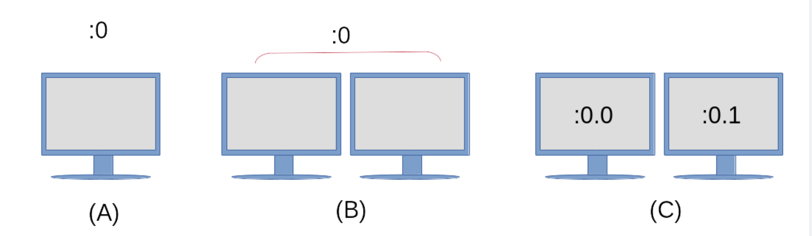

# Урок 6.1.1.

## Введение <a href="#sec.106.1_01-in" id="sec.106.1_01-in"></a>

X Window System — это программный стек, который используется для отображения текста и графики на экране. Общий вид и дизайн X-клиента не определяются X Window System, а задаются каждым отдельным X-клиентом, _оконным менеджером_ (например, Window Maker, Tab Window Manager) или полноценной _средой рабочего стола_, такой как KDE, GNOME или Xfce. Среды рабочего стола будут рассмотрены в следующем уроке. В этом уроке основное внимание будет уделено базовой архитектуре и распространённым инструментам для системы X Window, которые администратор использует для настройки X.

X Window System является кроссплатформенной и работает в различных операционных системах, таких как Linux, BSD, Solaris и других Unix-подобных системах. Также существуют реализации для macOS от Apple и Microsoft Windows.

Основной версией протокола X, используемой в современных дистрибутивах Linux, является _X.org_ версии 11, обычно обозначаемая как _X11_. Протокол X — это механизм взаимодействия между X-клиентом и X-сервером. Различия между X-клиентом и X-сервером будут описаны ниже.

Предшественником X Window System была оконная система под названием _W_, разработанная совместно IBM, DEC и Массачусетским технологическим институтом. Это программное обеспечение появилось в 1984 году в рамках _проекта Athena_. Когда разработчики начали работу над новым сервером отображения, они выбрали следующую букву английского алфавита: «X». Развитие X Window System в настоящее время контролируется _консорциумом MIT X_.

## Архитектура системы X Window <a href="#x_window_system_architecture" id="x_window_system_architecture"></a>

Система X Window предоставляет механизмы для рисования базовых двумерных фигур (и трёхмерных фигур с помощью расширений) на дисплее. Она состоит из клиента и сервера, и в большинстве случаев, когда требуется графический рабочий стол, оба этих компонента находятся на одном компьютере. Клиентский компонент представляет собой приложение, например эмулятор терминала, игру или веб-браузер. Каждое клиентское приложение сообщает X-серверу о расположении и размере своего окна на экране компьютера. Клиент также обрабатывает то, что поступает в это окно, а X-сервер выводит на экран запрошенный рисунок. Система X Window также обрабатывает ввод с таких устройств, как мыши, клавиатуры, трекпады и другие.

Базовая структура системы X Window

<figure><figcaption></figcaption></figure>

Система X Window является сетевой, и несколько X-клиентов с разных компьютеров в сети могут отправлять запросы на отрисовку на один удалённый X-сервер. Это сделано для того, чтобы администратор или пользователь могли получить доступ к графическому приложению в удалённой системе, которое может быть недоступно в их локальной системе.

Ключевой особенностью X Window System является её модульность. За время существования X Window System в её структуру были добавлены новые функции. Эти новые компоненты были добавлены только в качестве расширений X-сервера, оставив основной протокол X11 без изменений. Эти расширения содержатся в файлах библиотеки _Xorg_. Примеры библиотек Xorg: `libXrandr`, `libXcursor`, `libX11`, `libxkbfile` и несколько других, каждая из которых предоставляет расширенные функции X-серверу.

_Display manager_ обеспечивает графический вход в систему. Эта система может быть как локальным компьютером, так и компьютером в сети. _Display manager_ запускается после загрузки компьютера и запускает сеанс X-сервера для прошедшего проверку пользователя. _Display manager_ также отвечает за поддержание X-сервера в рабочем состоянии. Примеры дисплейных менеджеров включают GDM, SDDM и LightDM.

Каждый экземпляр запущенного X-сервера имеет _имя отображения_ для идентификации. Имя отображения содержит следующее:

```
hostname:displaynumber.screennumber
```

Отображаемое имя также указывает графическому приложению, где оно должно отображаться и на каком хосте (при использовании удалённого X-подключения).

`hostname` относится к имени системы, в которой будет отображаться приложение. Если в отображаемом имени отсутствует имя хоста, то предполагается, что это локальный хост.

`displaynumber` ссылается на набор используемых «экранов», будь то один экран ноутбука или несколько экранов на рабочей станции. Каждому запущенному сеансу X-сервера присваивается номер дисплея, начиная с `0`.

По умолчанию `screennumber` — `0`. Это может быть в том случае, если только один физический экран или несколько физических экранов настроены на работу как один экран. Когда все экраны в конфигурации с несколькими мониторами объединены в один логический экран, окна приложений можно свободно перемещать между экранами. В ситуациях, когда каждый экран настроен на работу независимо от других, на каждом экране будут открываться окна приложений, и их нельзя будет перемещать с одного экрана на другой. Каждому независимому экрану будет присвоен собственный номер. Если используется только один логический экран, то точка и номер экрана не указываются.

Отображаемое имя запущенного сеанса X сохраняется в переменной среды `DISPLAY`:

```bash
$ echo $DISPLAY
:0
```

В выходных данных подробно описывается следующее:

1. Используемый X-сервер находится в локальной системе, поэтому слева от двоеточия ничего не отображается.
2. Текущий сеанс X-сервера является первым, на что указывает `0` сразу после двоеточия.
3. Используется только один логический экран, поэтому номер экрана не отображается.

Чтобы дополнительно проиллюстрировать эту концепцию, обратитесь к следующей диаграмме:

Примеры Конфигураций отображения

<figure><figcaption></figcaption></figure>

А)

Единый монитор с единой конфигурацией дисплея и только одним экраном.

(B)

Настроен как один дисплей с двумя физическими мониторами, настроенными как один экран. Окна приложений можно свободно перемещать между двумя мониторами.

(C)

Конфигурация с одним дисплеем (обозначается `:0`), однако каждый монитор является независимым экраном. Оба экрана по-прежнему будут использовать одни и те же устройства ввода, такие как клавиатура и мышь, однако приложение, открытое на экране `:0.0`, нельзя будет переместить на экран `:0.1` и наоборот.

Чтобы запустить приложение на определённом экране, присвойте номер экрана переменной среды `DISPLAY` перед запуском приложения:

```bash
$ DISPLAY=:0.1 firefox &
```

Эта команда запустит веб-браузер Firefox на экране справа на схеме выше. Некоторые наборы инструментов также предоставляют параметры командной строки, позволяющие запустить приложение на определённом экране. См. `--screen` и `--display` на странице `gtk-options(7)` руководства.

## Конфигурация X-сервера <a href="#x_server_configuration" id="x_server_configuration"></a>

Традиционно основным файлом конфигурации, используемым для настройки X-сервера, является файл `/etc/X11/xorg.conf` . В современных дистрибутивах Linux X-сервер настраивается во время работы при запуске X-сервера, поэтому файл `xorg.conf` может отсутствовать.

Файл `xorg.conf` разделён на отдельные разделы, называемые _секциями_. Каждый раздел начинается с термина `Section` и содержит _название раздела_, которое относится к конфигурации компонента. Каждый `Section` заканчивается соответствующим `EndSection`. Типичный файл `xorg.conf` содержит следующие разделы:

`InputDevice`

Используется для настройки конкретной модели клавиатуры или мыши.

`InputClass`

В современных дистрибутивах Linux этот раздел обычно находится в отдельном файле конфигурации, расположенном в `/etc/X11/xorg.conf.d/`. `InputClass` используется для настройки _класса_ аппаратных устройств, таких как клавиатуры и мыши, а не конкретного устройства. Ниже приведён пример файла `/etc/X11/xorg.conf.d/00-keyboard.conf`:

```bash
Section "InputClass"
        Identifier "system-keyboard"
        MatchIsKeyboard "on"
        Option "XkbLayout" "us"
        Option "XkbModel" "pc105"
EndSection
```

Опция `XkbLayout` определяет раскладку клавиш на клавиатуре, например, Дворака, для левшей или правшей, QWERTY и язык. Опция `XkbModel` используется для определения типа используемой клавиатуры. Таблицу моделей, раскладок и их описаний можно найти в `xkeyboard-config(7)`. Файлы, связанные с раскладками клавиатуры, можно найти в `/usr/share/X11/xkb`. Пример раскладки клавиатуры для греческого политонического языка на компьютере Chromebook выглядит следующим образом:

```bash
Section "InputClass"
        Identifier "system-keyboard"
        MatchIsKeyboard "on"
        Option "XkbLayout" "gr(polytonic)"
        Option "XkbModel" "chromebook"
EndSection
```

Кроме того, раскладку клавиатуры можно изменить во время работы X-сессии с помощью команды `setxkbmap` . Вот пример использования этой команды для настройки греческой политонической раскладки на компьютере Chromebook:

```bash
$ setxkbmap -model chromebook -layout "gr(polytonic)"
```

Эта настройка будет действовать только в течение сеанса X. Чтобы изменения стали постоянными, измените файл `/etc/X11/xorg.conf.d/00-keyboard.conf` и добавьте необходимые настройки.


Команда `setxkbmap` использует _расширение X для клавиатуры_ (XKB). Это пример дополнительной функциональности системы X Window с использованием расширений.


В современных дистрибутивах Linux есть команда `localectl` через `systemd`, которую также можно использовать для изменения раскладки клавиатуры. Она автоматически создаст файл конфигурации `/etc/X11/xorg.conf.d/00-keyboard.conf`: И снова пример настройки греческой политонической клавиатуры на Chromebook, на этот раз с помощью команды `localectl`:

```bash
$ localectl --no-convert set-x11-keymap "gr(polytonic)" chromebook
```

Здесь используется опция `--no-convert` для предотвращения изменения `localectl` раскладки клавиатуры хоста.

`Monitor`

В разделе `Monitor` описывается используемый физический монитор и место его подключения. Ниже приведён пример конфигурации, в которой аппаратный монитор подключён ко второму порту дисплея и используется в качестве основного монитора.

```bash
Section "Monitor"
        Identifier  "DP2"
        Option      "Primary" "true"
EndSection
```

`Device`

В разделе `Device` описывается используемая физическая видеокарта. В этом разделе также содержится модуль ядра, используемый в качестве драйвера для видеокарты, а также его физическое расположение на материнской плате.

```bash
Section "Device"
        Identifier  "Device0"
        Driver      "i915"
        BusID       "PCI:0:2:0"
EndSection
```

`Screen`

Раздел `Screen` объединяет разделы `Monitor` и `Device`. Пример раздела `Screen` может выглядеть следующим образом:

```bash
Section "Screen"
        Identifier "Screen0"
        Device     "Device0"
        Monitor    "DP2"
EndSection
```

`ServerLayout`

Раздел `ServerLayout` объединяет все разделы, такие как мышь, клавиатура и экраны, в один интерфейс X Window System.

```bash
Section "ServerLayout"
	Identifier   "Layout-1"
	Screen       "Screen0" 0 0
	InputDevice  "mouse1"  "CorePointer"
	InputDevice  "system-keyboard"  "CoreKeyboard"
EndSection
```


Не все разделы могут быть найдены в файле конфигурации. В случаях, когда раздел отсутствует, значения по умолчанию предоставляются запущенным экземпляром X-сервера.


Файлы конфигурации, заданные пользователем, также находятся в `/etc/X11/xorg.conf.d/`. Файлы конфигурации, предоставляемые дистрибутивом, находятся в `/usr/share/X11/xorg.conf.d/`. Файлы конфигурации, расположенные в `/etc/X11/xorg.conf.d/`, анализируются до файла `/etc/X11/xorg.conf`, если он существует в системе.

Команда `xdpyinfo` используется на компьютере для отображения информации о запущенном экземпляре X-сервера. Ниже приведён пример вывода команды:

```bash
$ xdpyinfo
name of display:    :0
version number:    11.0
vendor string:    The X.Org Foundation
vendor release number:    12004000
X.Org version: 1.20.4
maximum request size:  16777212 bytes
motion buffer size:  256
bitmap unit, bit order, padding:    32, LSBFirst, 32
image byte order:    LSBFirst
number of supported pixmap formats:    7
supported pixmap formats:
    depth 1, bits_per_pixel 1, scanline_pad 32
    depth 4, bits_per_pixel 8, scanline_pad 32
    depth 8, bits_per_pixel 8, scanline_pad 32
    depth 15, bits_per_pixel 16, scanline_pad 32
    depth 16, bits_per_pixel 16, scanline_pad 32
    depth 24, bits_per_pixel 32, scanline_pad 32
    depth 32, bits_per_pixel 32, scanline_pad 32
keycode range:    minimum 8, maximum 255
focus:  None
number of extensions:    25
    BIG-REQUESTS
    Composite
    DAMAGE
    DOUBLE-BUFFER
    DRI3
    GLX
    Generic Event Extension
    MIT-SCREEN-SAVER
    MIT-SHM
    Present
    RANDR
    RECORD
    RENDER
    SECURITY
    SHAPE
    SYNC
    X-Resource
    XC-MISC
    XFIXES
    XFree86-VidModeExtension
    XINERAMA
    XInputExtension
    XKEYBOARD
    XTEST
    XVideo
default screen number:    0
number of screens:    1

screen #0:
  dimensions:    3840x1080 pixels (1016x286 millimeters)
  resolution:    96x96 dots per inch
  depths (7):    24, 1, 4, 8, 15, 16, 32
  root window id:    0x39e
  depth of root window:    24 planes
  number of colormaps:    minimum 1, maximum 1
  default colormap:    0x25
  default number of colormap cells:    256
  preallocated pixels:    black 0, white 16777215
  options:    backing-store WHEN MAPPED, save-unders NO
  largest cursor:    3840x1080
  current input event mask:    0xda0033
    KeyPressMask             KeyReleaseMask           EnterWindowMask
    LeaveWindowMask          StructureNotifyMask      SubstructureNotifyMask
    SubstructureRedirectMask PropertyChangeMask       ColormapChangeMask
  number of visuals:    270
...
```

Наиболее важные части вывода выделены жирным шрифтом, например, название дисплея (которое совпадает с содержимым переменной среды `DISPLAY`), информация о версии используемого X-сервера, количество и список используемых расширений Xorg, а также дополнительная информация о самом экране.

## **Создание базового файла конфигурации Xorg**

Несмотря на то, что X создаст свою конфигурацию после запуска системы в современных версиях Linux, файл `xorg.conf` по-прежнему можно использовать. Чтобы создать постоянный файл `/etc/X11/xorg.conf` выполните следующую команду:

```bash
$ sudo Xorg -configure
```


Если сеанс X уже запущен, вам нужно будет указать в команде другой `DISPLAY` символ, например:

```bash
$ sudo Xorg : 1 -configure
```


В некоторых дистрибутивах Linux вместо `X` можно использовать команду `Xorg`, так как `X` является символической ссылкой на `Xorg`.

В вашем текущем рабочем каталоге будет создан файл `xorg.conf.new` . Содержимое этого файла основано на том, что X-сервер обнаружил в аппаратном обеспечении и драйверах локальной системы. Чтобы использовать этот файл, его нужно переместить в каталог `/etc/X11/` и переименовать в `xorg.conf`:

```bash
$ sudo mv xorg.conf.new /etc/X11/xorg.conf
```


Дополнительные сведения о компонентах оконной системы X можно найти в следующих разделах руководства: `xorg.conf(5)`, `Xserver(1)`, `X(1)` и `Xorg(1)`.


## Wayland

Wayland — это более новый протокол отображения, разработанный для замены X Window System. Многие современные дистрибутивы Linux используют его в качестве сервера отображения по умолчанию. Он требует меньше системных ресурсов и занимает меньше места при установке, чем X. Проект начался в 2010 году и до сих пор активно развивается, в том числе с участием действующих и бывших разработчиков X.org.

В отличие от X Window System, между клиентом и ядром нет экземпляра сервера. Вместо этого клиентское окно работает с собственным кодом или кодом инструментария (например, Gtk+ или Qt) для рендеринга. Для рендеринга к ядру Linux отправляется запрос по протоколу Wayland. Ядро пересылает запрос по протоколу Wayland компоновщику Wayland, который обрабатывает ввод с устройств, управление окнами и композицию. Компоновщик — это часть системы, которая объединяет отображаемые элементы в визуальное изображение на экране.

Большинство современных наборов инструментов, таких как Gtk+ 3 и Qt 5, были обновлены, чтобы обеспечить рендеринг либо в X Window System, либо на компьютере с Wayland. На данный момент не все автономные приложения поддерживают рендеринг в Wayland. Для приложений и фреймворков, которые по-прежнему ориентированы на работу в X Window System, приложение может работать в _XWayland_. Система XWayland — это отдельный X-сервер, который работает внутри клиента Wayland и, таким образом, отображает содержимое клиентского окна в отдельном экземпляре X-сервера.

Подобно тому, как X Window System использует переменную среды `DISPLAY` для отслеживания используемых экранов, протокол Wayland использует переменную среды `WAYLAND_DISPLAY` . Ниже приведён пример вывода из системы, в которой используется дисплей Wayland:

```bash
$ echo $WAYLAND_DISPLAY
wayland-0
```

Эта переменная окружения недоступна в системах под управлением X.

## Управляемые Упражнения <a href="#sec.106.1_01-ge" id="sec.106.1_01-ge"></a>

1. Какую команду вы бы использовали, чтобы определить, какие расширения Xorg доступны в системе?
2. Вы только что получили новую 10-кнопочную мышь для своего компьютера, однако для корректной работы всех кнопок потребуется дополнительная настройка. Не изменяя остальную конфигурацию X-сервера, в каком каталоге вы бы создали новый файл конфигурации для этой мыши и какой раздел конфигурации использовался бы в этом файле?
3. Какой компонент установки Linux отвечает за поддержание работы X-сервера?
4. Какой переключатель командной строки используется с командой `X` для создания нового файла конфигурации `xorg.conf`?

## Исследовательские упражнения <a href="#sec.106.1_01-ee" id="sec.106.1_01-ee"></a>

1. Каким будет содержимое переменной среды `DISPLAY` в системе с именем `lab01` при использовании конфигурации с одним дисплеем? Предположим, что переменная среды `DISPLAY` просматривается в эмуляторе терминала на третьем независимом экране.
2. С помощью какой команды можно создать файл конфигурации клавиатуры для использования в X Window System?
3. В типичной установке Linux пользователь может переключиться на виртуальный терминал, нажав клавиши Ctrl+Alt+F1-F6 на клавиатуре. Вас попросили настроить систему киосков с графическим интерфейсом, и вам нужно отключить эту функцию, чтобы предотвратить несанкционированное вмешательство в систему. Вы решили создать файл `/etc/X11/xorg.conf.d/10-kiosk.conf` конфигурации. Какой параметр нужно указать в разделе `ServerFlags` (который используется для установки глобальных параметров Xorg на сервере)? Ознакомьтесь со страницей `xorg(1)` руководства, чтобы найти этот параметр.

## Краткие сведения <a href="#sec.106.1_01-su" id="sec.106.1_01-su"></a>

В этом уроке мы рассмотрели систему X Window, которая используется в Linux. Система X Window используется для отображения изображений и текста на экранах в соответствии с различными конфигурационными файлами. Система X Window часто используется для настройки устройств ввода, таких как мыши и клавиатуры. В этом уроке мы рассмотрели следующие моменты:

* Архитектура системы X Window на высоком уровне.
* Какие файлы конфигурации используются для настройки системы X Windows и где они находятся в файловой системе.
* Как использовать `DISPLAY` переменную окружения в системе, работающей под управлением X.
* Краткое введение в протокол отображения Wayland.

Были рассмотрены следующие команды и файлы конфигурации:

* Изменение раскладки клавиатуры в системе Xorg с помощью `setxkbmap` и `localectl`.
* `Xorg`Команда для создания нового `/etc/X11/xorg.conf` файла конфигурации.
* Содержимое файлов конфигурации Xorg, расположенных по адресам: `/etc/X11/xorg.conf`, `/etc/X11/xorg.conf.d/` и `/usr/share/X11/xorg.conf.d/`.
* `xdpyinfo` Команда для отображения общей информации о запущенном сеансе X-сервера.

## Ответы на Упражнения с Руководством <a href="#sec.106.1_01-age" id="sec.106.1_01-age"></a>

1.  Какую команду вы бы использовали, чтобы определить, какие расширения Xorg доступны в системе?

    ```bash
    $ xdpyinfo
    ```
2.  Вы только что получили новую 10-кнопочную мышь для своего компьютера, однако для корректной работы всех кнопок потребуется дополнительная настройка. Не изменяя остальную конфигурацию X-сервера, в каком каталоге вы бы создали новый файл конфигурации для этой мыши и какой раздел конфигурации использовался бы в этом файле?

    Пользовательские конфигурации должны находиться в `/etc/X11/xorg.conf.d/` и в конкретном разделе, необходимом для этой конфигурации мыши, который будет `InputDevice`.
3.  Какой компонент установки Linux отвечает за поддержание работы X-сервера?

    Диспетчер отображения.
4.  Какой переключатель командной строки используется с командой `X` для создания нового файла конфигурации `xorg.conf`?

    ```bash
    -configure
    ```

    Помните, что `X` команда - это символическая ссылка на `Xorg` команду.

## Ответы на Исследовательские упражнения <a href="#sec.106.1_01-aee" id="sec.106.1_01-aee"></a>

1.  Каким будет содержимое переменной среды `DISPLAY` в системе с именем `lab01` при использовании конфигурации с одним дисплеем? Предположим, что переменная среды `DISPLAY` просматривается в эмуляторе терминала на третьем независимом экране.

    ```bash
    $ echo $DISPLAY
    lab01:0.2
    ```
2.  С помощью какой команды можно создать файл конфигурации клавиатуры для использования в X Window System?

    ```bash
    $ localectl
    ```
3.  В типичной установке Linux пользователь может переключиться на виртуальный терминал, нажав клавиши Ctrl+Alt+F1-F6 на клавиатуре. Вас попросили настроить систему киосков с графическим интерфейсом, и вам нужно отключить эту функцию, чтобы предотвратить несанкционированное вмешательство в систему. Вы решили создать файл `/etc/X11/xorg.conf.d/10-kiosk.conf` конфигурации. Какой параметр нужно указать в разделе `ServerFlags` (который используется для установки глобальных параметров Xorg на сервере)? Ознакомьтесь со страницей `xorg.conf(5)` руководства, чтобы найти этот параметр.

    ```bash
    Section "ServerFlags"
        Option  "DontVTSwitch"  "True"
    EndSection
    ```
