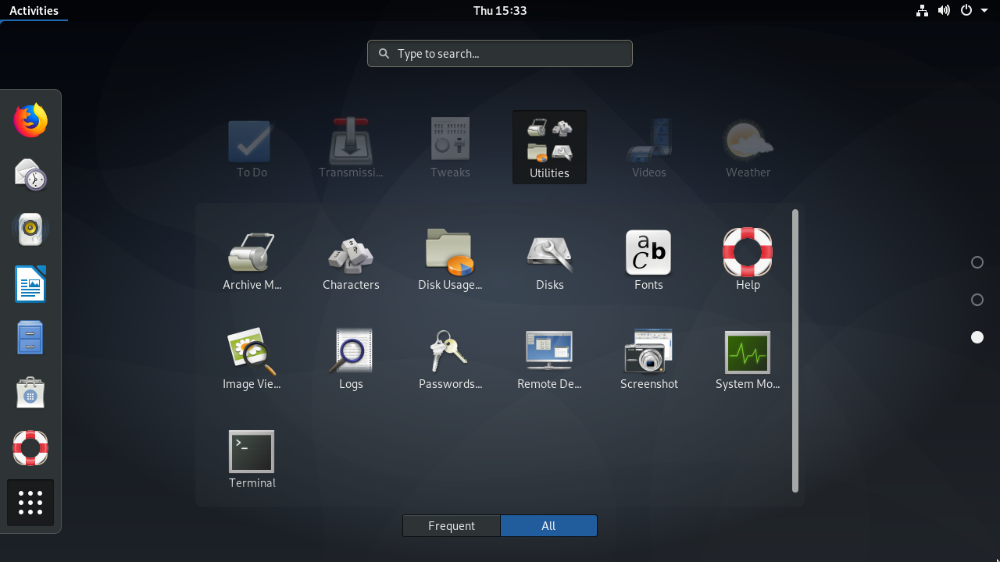

# Урок 6.2.

## Введение 

Операционные системы на базе Linux известны своим продвинутым интерфейсом командной строки, но он может показаться сложным для пользователей, не имеющих технического образования. Чтобы сделать использование компьютера более интуитивным, сочетание дисплеев с высоким разрешением и устройств ввода-вывода привело к появлению графических пользовательских интерфейсов. В то время как интерфейс командной строки требует предварительных знаний об именах программ и их параметрах конфигурации, _графический пользовательский интерфейс_ (_graphical user interface_ GUI) позволяет запускать программы, указывая на знакомые визуальные элементы, что делает процесс обучения менее сложным. Кроме того, графический интерфейс лучше всего подходит для работы с мультимедиа и другими визуально ориентированными задачами.

Действительно, графический пользовательский интерфейс — это почти синоним компьютерного интерфейса, и в большинстве дистрибутивов Linux графический интерфейс установлен по умолчанию. Однако не существует единой монолитной программы, отвечающей за полнофункциональные графические рабочие столы, доступные в системах Linux. Вместо этого каждый графический рабочий стол на самом деле представляет собой большую коллекцию программ и их зависимостей, которые варьируются в зависимости от дистрибутива и личных предпочтений пользователя.

## X Window System 

В Linux и других Unix-подобных операционных системах, где она используется, _система X Window_ (также известная как _X11_ или просто _X_) предоставляет низкоуровневые ресурсы, связанные с отображением графического интерфейса и взаимодействием с ним пользователя, такие как:

* Обработка входных событий, таких как движения мыши или нажатия клавиш.
* Возможность вырезать, копировать и вставлять текстовое содержимое между отдельными приложениями.
* Программный интерфейс , к которому прибегают другие программы для отрисовки графических элементов.

Хотя X Window System отвечает за управление графическим отображением (сам видеодрайвер является частью X), она не предназначена для самостоятельного отрисовки сложных визуальных элементов. Формы, цвета, оттенки и любые другие визуальные эффекты генерируются приложением, работающим поверх X. Такой подход даёт приложениям широкие возможности для создания пользовательских интерфейсов, но он также может привести к дополнительным затратам на разработку, выходящим за рамки приложения, и к несоответствиям во внешнем виде и поведении по сравнению с другими программными интерфейсами.

С точки зрения разработчика, внедрение _среды рабочего стола_ упрощает программирование графического интерфейса, связанного с разработкой основного приложения, а с точки зрения пользователя — обеспечивает единообразие взаимодействия с различными приложениями. Среды рабочего стола объединяют программные интерфейсы, библиотеки и вспомогательные программы, которые взаимодействуют друг с другом для реализации традиционных, но постоянно развивающихся концепций дизайна.

## Среда рабочего стола 

Традиционный графический интерфейс настольного компьютера состоит из различных окон — термин _«окно»_ здесь используется для обозначения любой автономной области экрана, — связанных с запущенными процессами. Поскольку сама система X Window предлагает только базовые интерактивные функции, удобство работы пользователя зависит от компонентов, предоставляемых средой рабочего стола.

Вероятно, самым важным компонентом среды рабочего стола является _менеджер окон_, который управляет размещением и оформлением окон. Именно менеджер окон добавляет в окно строку заголовка, кнопки управления, которые обычно связаны с действиями по сворачиванию, разворачиванию и закрытию, и управляет переключением между открытыми окнами.


Основные концепции, лежащие в основе графических интерфейсов настольных компьютеров, были позаимствованы из реальных офисных рабочих пространств. Говоря метафорически, экран компьютера — это рабочий стол, на котором размещаются такие объекты, как документы и папки. Окно приложения с содержимым документа имитирует физические действия, такие как заполнение формы или рисование. Как и на реальных рабочих столах, на компьютерных рабочих столах также есть программные аксессуары, такие как блокноты, часы, календари и т. д., большинство из которых основаны на своих «реальных» аналогах.


Все среды рабочего стола предоставляют оконный менеджер, внешний вид которого соответствует _набору виджетов_. Виджеты — это информативные или интерактивные визуальные элементы, такие как кнопки или поля ввода текста, расположенные внутри окна приложения. Стандартные компоненты рабочего стола — например, панель запуска приложений, панель задач и т. д. — и сам оконный менеджер используют такие наборы виджетов для создания своих интерфейсов.

Программные библиотеки, такие как _GTK+_ и _Qt_, предоставляют виджеты, которые программисты могут использовать для создания сложных графических интерфейсов для своих приложений. Исторически сложилось так, что приложения, разработанные с помощью GTK+, не выглядели так же, как приложения, созданные с помощью Qt, и наоборот, но благодаря лучшей поддержке тем в современных средах разработки это различие стало менее очевидным.

В целом, GTK+ и Qt предлагают одни и те же функции, касающиеся виджетов. Простые интерактивные элементы могут быть неотличимы друг от друга, в то время как составные виджеты — например, диалоговое окно, используемое приложениями для открытия или сохранения файлов, — могут выглядеть совершенно по-разному. Тем не менее, приложения, созданные с использованием разных наборов инструментов, могут работать одновременно, независимо от набора инструментов для виджетов, используемого другими компонентами рабочего стола.

В дополнение к базовым компонентам рабочего стола, которые сами по себе можно считать отдельными программами, среды рабочего стола используют метафору рабочего стола (Метафора рабочего стола — это концепция, используемая в дизайне пользовательских интерфейсов, которая позволяет пользователям взаимодействовать с компьютером через визуальные элементы и метафоры, знакомые им из реального мира. Например, файлы и папки представлены как объекты на рабочем столе, которые можно легко перемещать, открывать и удалять. Это делает работу с компьютером более интуитивно понятной и удобной для пользователей.), предоставляя минимальный набор вспомогательных приложений, разработанных в соответствии с теми же принципами дизайна. Все основные среды рабочего стола обычно предоставляют следующие приложения:

Приложения, связанные с системой

Эмулятор терминала, файловый менеджер, менеджер установки пакетов, инструменты настройки системы.

Коммуникация и Интернет

Менеджер контактов, почтовый клиент, веб-браузер.

Офисные приложения

Календарь, калькулятор, текстовый редактор.

Среды рабочего стола могут включать в себя множество других служб и приложений: экран приветствия при входе в систему, менеджер сеансов, межпроцессное взаимодействие, агент связки ключей (Keyring agent (агент связки ключей) — это программа или компонент, который отвечает за управление паролями и другими конфиденциальными данными на компьютере. Он обеспечивает безопасное хранение и доступ к этим данным, а также помогает предотвратить несанкционированный доступ к личной информации пользователя)и т. д. Они также включают в себя функции, предоставляемые сторонними системными службами, такими как _PulseAudio_ для звука и _CUPS_ для печати. Для работы этих функций не требуется графическая среда, но среда рабочего стола предоставляет графические интерфейсы для упрощения настройки и работы с такими ресурсами.

## Популярные среды рабочего стола

Многие проприетарные операционные системы поддерживают только одну официальную среду рабочего стола, которая привязана к конкретной версии и не подлежит изменению. В отличие от них, операционные системы на базе Linux поддерживают различные варианты сред рабочего стола, которые можно использовать в сочетании с X. У каждой среды рабочего стола есть свои особенности, но обычно они имеют общие концепции дизайна:

* Программа запуска приложений, в которой перечислены встроенные и сторонние приложения, доступные в системе.
* Правила, определяющие приложения по умолчанию, связанные с типами файлов и протоколами.
* Инструменты настройки для настройки внешнего вида и поведения среды рабочего стола.

_Gnome_ — одна из самых популярных сред рабочего стола, которая является основным выбором в таких дистрибутивах, как Fedora, Debian, Ubuntu, SUSE Linux Enterprise, Red Hat Enterprise Linux, CentOS и т. д. В своей третьей версии Gnome претерпел значительные изменения во внешнем виде и структуре, отказавшись от метафоры рабочего стола и представив _Gnome Shell_ в качестве нового интерфейса.

\

<figure><figcaption>
Рисунок 1. Gnome Shell Activities
</figcaption></figure>

Полноэкранный лаунчер _Gnome Shell Activities_ общего назначения заменил традиционный лаунчер приложений и панель задач. Однако по-прежнему можно использовать Gnome 3 в старом стиле, выбрав опцию _Gnome Classic_ на экране входа в систему

_KDE_ — это обширная экосистема приложений и платформа для разработки. Последняя версия среды рабочего стола _KDE Plasma_ используется по умолчанию в openSUSE, Mageia, Kubuntu и т. д. Использование библиотеки Qt — отличительная черта KDE, придающая ей узнаваемый внешний вид и множество оригинальных приложений. KDE даже предоставляет инструмент настройки для обеспечения визуального единства с приложениями GTK+.

<figure><figcaption>
Рисунок 2. Настройки KDE GTK
</figcaption></figure>

_Xfce_ — это среда рабочего стола, которая отличается эстетичным внешним видом и не требует много ресурсов компьютера. Её структура очень модульна, что позволяет пользователю активировать и деактивировать компоненты в соответствии со своими потребностями и предпочтениями.

<figure><figcaption>
Рисунок 3. Рабочий стол Xfce
</figcaption></figure>

Существует множество других сред рабочего стола для Linux, обычно предоставляемых альтернативными дистрибутивами. Например, дистрибутив Linux Mint предоставляет две оригинальные среды рабочего стола: _Cinnamon_ (ответвление Gnome 3) и _MATE_ (ответвление Gnome 2). _LXDE_ — это среда рабочего стола, оптимизированная для низкого потребления ресурсов, что делает её хорошим выбором для установки на старое оборудование или одноплатные компьютеры. Хотя LXDE не предлагает всех функций более тяжёлых сред рабочего стола, она предоставляет все основные функции, ожидаемые от современного графического пользовательского интерфейса.


Сочетания клавиш играют важную роль во взаимодействии с рабочей средой. Некоторые сочетания клавиш, такие как Alt+Tab для переключения между окнами или Ctrl+c для копирования текста, являются универсальными для всех рабочих сред, но в каждой рабочей среде есть свои собственные сочетания клавиш. Сочетания клавиш можно найти в инструменте настройки клавиатуры, предоставляемом рабочей средой, где можно добавлять или изменять сочетания клавиш.


## Совместимость с настольными компьютерами 

Разнообразие сред рабочего стола в операционных системах на базе Linux ставит перед разработчиками непростую задачу: как обеспечить их корректную работу со сторонними графическими приложениями или системными службами без необходимости реализовывать специальную поддержку для каждой из них. Общие методы и спецификации для разных сред рабочего стола значительно улучшают взаимодействие с пользователем и решают многие проблемы разработки, поскольку графические приложения должны взаимодействовать с текущей средой рабочего стола независимо от того, для какой среды рабочего стола они изначально были разработаны. Кроме того, важно сохранять общие настройки рабочего стола, если пользователь в конечном итоге меняет среду рабочего стола.

Организация _freedesktop.org_ поддерживает большое количество спецификаций для обеспечения совместимости. Принятие полной спецификации не является обязательным, но многие из них широко используются:

_Местоположения каталогов_

Где находятся личные настройки и другие файлы, относящиеся к конкретному пользователю.

_Элементы рабочего стола_

Приложения командной строки могут запускаться в среде рабочего стола с помощью любого эмулятора терминала, но было бы слишком запутанно, если бы все они были доступны в панели запуска приложений. Записи в среде рабочего стола — это текстовые файлы, заканчивающиеся на `.desktop`, которые используются средой рабочего стола для сбора информации о доступных приложениях и способах их использования.

_Автоматический запуск приложения_

_Элементы рабочего стола,_ указывающие на приложение, которое должно запускаться автоматически после входа пользователя в систему.

_Перетаскивание_

Как приложения должны обрабатывать события перетаскивания.

_Корзина_

Общее расположение файлов, удалённых файловым менеджером, а также способы хранения и удаления файлов оттуда.

_Темы значков_

Общий формат для взаимозаменяемых библиотек значков.

## Нелокальный доступ 

В X Window Systems используется дизайн, основанный на автономных _дисплеях_, где один и тот же _менеджер X-дисплея_ может одновременно управлять несколькими сеансами графического рабочего стола. По сути, дисплей аналогичен текстовому терминалу: и то, и другое относится к машине или программному приложению, используемому в качестве точки входа для создания независимого сеанса операционной системы. Хотя наиболее распространённая настройка предполагает один графический сеанс, запущенный на локальном компьютере, возможны и другие, менее традиционные настройки:

* Переключение между активными сеансами графического рабочего стола на одном компьютере.
* К одному компьютеру подключено несколько устройств отображения (например, экран, клавиатура, мышь), каждое из которых управляет собственным сеансом графического рабочего стола.
* Удалённые сеансы графического рабочего стола, при которых графический интерфейс отправляется по сети на удалённый дисплей.

Удалённые сеансы работы с компьютером изначально поддерживаются X, который использует _протокол управления диспетчером X-дисплея_ (_X Display Manager Control Protocol_ XDMCP) для связи с удалёнными дисплеями. Из-за высокой пропускной способности XDMCP редко используется через Интернет или в низкоскоростных локальных сетях. Безопасность также является проблемой XDMCP: локальный дисплей взаимодействует с привилегированным удалённым диспетчером X-дисплея для выполнения удалённых процедур, поэтому возможная уязвимость может позволить выполнять произвольные привилегированные команды на удалённом компьютере.

Кроме того, для XDMCP требуются экземпляры X, работающие на обоих концах соединения, что может сделать его использование невозможным, если система X11 недоступна на всех задействованных компьютерах. На практике для удалённого подключения к графическому рабочему столу используются другие, более эффективные и менее затратные методы.

_Virtual Network Computing_ (VNC) — это независимый от платформы инструмент для просмотра и управления удалёнными рабочими столами с помощью протокола _Remote Frame Buffer_ protocol  (RFB). С его помощью события, создаваемые локальной клавиатурой и мышью, передаются на удалённый рабочий стол, который, в свою очередь, отправляет любые обновления экрана для локального отображения. На одном компьютере можно запустить несколько серверов VNC, но каждому серверу VNC требуется отдельный TCP-порт в сетевом интерфейсе для приёма входящих запросов на сеанс. По соглашению, первый VNC-сервер должен использовать TCP-порт 5900, второй — 5901 и так далее.

Для запуска VNC-сервера не требуются специальные привилегии. Обычный пользователь может, например, войти в свою удалённую учётную запись и запустить оттуда собственный VNC-сервер. Затем на локальном компьютере можно использовать любое клиентское приложение VNC для доступа к удалённому рабочему столу (при условии, что доступны соответствующие сетевые порты). Файл `~/.vnc/xstartup` — это сценарий оболочки, который запускается VNC-сервером при запуске и может использоваться для определения среды рабочего стола, которую VNC-сервер сделает доступной для VNC-клиента. Важно отметить, что VNC изначально не поддерживает современные методы шифрования и аутентификации, поэтому его следует использовать в сочетании со сторонним приложением, предоставляющим такие функции. Для защиты VNC-соединений часто используются методы, включающие VPN-туннели и SSH-туннели.

_Протокол удалённого рабочего стола_ (RDP) в основном используется для удалённого доступа к рабочему столу операционной системы _Microsoft Windows_ через сетевой порт TCP 3389. Несмотря на то, что он использует проприетарный протокол RDP от Microsoft, клиентская реализация, используемая в системах Linux, представляет собой программы с открытым исходным кодом, лицензированные по _Универсальной общественной лицензии GNU_ (GPL), и не имеет юридических ограничений на использование.

_Simple Protocol for Independent Computing Environments_ (Spice) включает набор инструментов, предназначенных для доступа к среде рабочего стола _виртуализированных_ систем либо на локальном компьютере, либо в удаленном расположении. В дополнение к этому протокол Spice предлагает встроенные функции для интеграции локальной и удаленной систем, такие как возможность доступа к локальным устройствам (например, к динамикам и подключенным USB-устройствам) с удаленного компьютера и обмена файлами между двумя системами.

Существуют специальные клиентские команды для подключения к каждому из этих протоколов удаленного рабочего стола, но клиент удаленного рабочего стола _Remmina_ предоставляет интегрированный графический интерфейс, который облегчает процесс подключения, при необходимости сохраняя настройки подключения для последующего использования. В Remmina есть плагины для каждого отдельного протокола, а также плагины для XDMCP, VNC, RDP и Spice. Правильный выбор инструмента зависит от используемых операционных систем, качества сетевого подключения и того, какие функции среды удаленного рабочего стола должны быть доступны.

## Управляемые Упражнения 

1. Какой тип приложения предоставляет сеансы оконной оболочки в среде рабочего стола?
2. Из-за разнообразия сред рабочего стола Linux у одного и того же приложения может быть несколько версий, каждая из которых лучше всего подходит для определённого набора виджетов. Например, у торрент-клиента _Transmission_ есть две версии: _transmission-gtk_ и _transmission-qt_. Какую из них следует установить, чтобы обеспечить максимальную интеграцию с KDE?
3. Какие среды рабочего стола Linux рекомендуются для недорогих одноплатных компьютеров с небольшой вычислительной мощностью?

## Исследовательские упражнения 

1. В X Window System есть два способа скопировать и вставить текст: с помощью традиционных клавиш Ctrl+c и Ctrl+v (также доступны в меню окна) или с помощью щелчка средней кнопкой мыши для вставки выделенного в данный момент текста. Как лучше всего копировать и вставлять текст из эмулятора терминала?
2. В большинстве сред рабочего стола сочетание клавиш Alt+F2 открывает окно _«Выполнения программы»_, в котором можно запускать программы из командной строки. В KDE какая команда запускает эмулятор терминала по умолчанию?
3. Какой протокол лучше всего подходит для доступа к удалённому рабочему столу Windows из среды рабочего стола Linux?

## Краткие сведения 

В этом уроке представлен обзор графических рабочих столов, доступных для систем Linux. Сама по себе система X Window предоставляет только простые функции интерфейса, поэтому среды рабочего стола расширяют возможности графического оконного интерфейса. В уроке рассматриваются следующие темы:

* Графический интерфейс и концепции системы X Window.
* Среды рабочего стола, доступные для Linux.
* Сходства и различия между средами рабочего стола.
* Как получить доступ к среде удаленного рабочего стола.

Рассматривались следующие концепции и программы:

* Система X Window.
* Популярные среды рабочего стола: KDE, Gnome, Xfce.
* Протоколы удалённого доступа: XDMCP, VNC, RDP, Spice.

1.  Какой тип приложения предоставляет сеансы оконной оболочки в среде рабочего стола?

    Любой эмулятор терминала, например Konsole, Gnome Terminal, xterm и т. д., предоставит доступ к локальной интерактивной оболочке.
2.  Из-за разнообразия сред рабочего стола Linux у одного и того же приложения может быть несколько версий, каждая из которых лучше всего подходит для определённого набора виджетов. Например, у торрент-клиента _Transmission_ есть две версии: _transmission-gtk_ и _transmission-qt_. Какую из них следует установить, чтобы обеспечить максимальную интеграцию с KDE?

    KDE построен на базе библиотеки Qt, поэтому необходимо установить версию Qt — _transmission-qt_.
3.  Какие среды рабочего стола Linux рекомендуются для недорогих одноплатных компьютеров с небольшой вычислительной мощностью?

    Базовые среды рабочего стола, в которых не используется слишком много визуальных эффектов, например Xfce и LXDE.

## Ответы на Упражнения с Руководством 

1.  Какой тип приложения предоставляет сеансы оконной оболочки в среде рабочего стола?

    Любой эмулятор терминала, например Konsole, Gnome Terminal, xterm и т. д., предоставит доступ к локальной интерактивной оболочке.
2.  Из-за разнообразия сред рабочего стола Linux у одного и того же приложения может быть несколько версий, каждая из которых лучше всего подходит для определённого набора виджетов. Например, у торрент-клиента _Transmission_ есть две версии: _transmission-gtk_ и _transmission-qt_. Какую из них следует установить, чтобы обеспечить максимальную интеграцию с KDE?

    KDE построен на базе библиотеки Qt, поэтому необходимо установить версию Qt — _transmission-qt_.
3.  Какие среды рабочего стола Linux рекомендуются для недорогих одноплатных компьютеров с небольшой вычислительной мощностью?

    Базовые среды рабочего стола, в которых не используется слишком много визуальных эффектов, например Xfce и LXDE.

## Ответы на Исследовательские упражнения 

1.  В X Window System есть два способа скопировать и вставить текст: с помощью традиционных клавиш Ctrl+c и Ctrl+v (также доступны в меню окна) или с помощью щелчка средней кнопкой мыши для вставки выделенного в данный момент текста. Как лучше всего копировать и вставлять текст из эмулятора терминала?

    В интерактивных сеансах командной строки для остановки выполнения программы используется сочетание клавиш Ctrl+c, поэтому рекомендуется использовать среднюю кнопку мыши.
2.  В большинстве сред рабочего стола сочетание клавиш Alt+F2 открывает окно _«Выполнить программу»_, в котором можно запускать программы из командной строки. В KDE какая команда запускает эмулятор терминала по умолчанию?

    Команда `konsole` запускает эмулятор терминала KDE, но также работают и общие термины, такие как _terminal_.
3.  Какой протокол лучше всего подходит для доступа к удалённому рабочему столу Windows из среды рабочего стола Linux?

    Протокол удалённого рабочего стола (RDP) изначально поддерживается как Windows, так и Linux.

\
