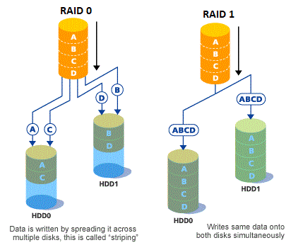
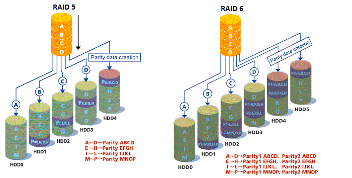

# 20. Настройка RAID (204.1)

## **20.1 Configuring RAID (204.1)**

Кандидаты должны уметь настраивать и внедрять программный RAID. Эта задача включает в себя использование и настройку RAID 0, 1 и 5.

### **20.1.1 Основные области знаний**

Файлы конфигурации программного обеспечения raid и утилиты\


### **20.1.2 Термины и утилиты**

* mdadm
* mdadm.conf
* fdisk
* /proc/mdstat

### **20.1.3 Что такое RAID?**

RAID расшифровывается как "Redundant Array of Inexpensive Disks" "Избыточный массив недорогих дисков".

Основная идея RAID заключается в объединении нескольких небольших недорогих накопителей в массив, который обеспечивает производительность, превышающую производительность одного большого и дорогого накопителя. Этот массив дисков будет восприниматься компьютером как единый логический блок памяти или диск.

Некоторые из концепций, используемых в этой главе, являются важными факторами при принятии решения о том, какой уровень RAID использовать в конкретной ситуации.&#x20;

**Четность** - это концепция, используемая для повышения избыточности хранилища.&#x20;

**Бит четности** - это двоичная цифра, которая добавляется для обеспечения того, чтобы количество\
битов со значением единица в данном наборе битов всегда было четным или нечетным. Благодаря разумному использованию части емкости RAID для хранения битов четности сбои в работе отдельных дисков могут происходить без потери данных, поскольку недостающий бит может быть пересчитан с использованием бита четности.&#x20;

**I/O транзакции** - это перемещение данных на RAID-устройство или с него. Каждая транзакция ввода-вывода состоит из одного или нескольких блоков данных. Один диск может обрабатывать максимальное случайное число транзакций в секунду, поскольку у механизма есть\
время поиска, прежде чем данные могут быть прочитаны или записаны.&#x20;

В зависимости от конфигурации RAID, одна транзакция ввода-вывода в RAID может\
инициировать несколько транзакций ввода-вывода для его участников. Это влияет на производительность RAID-устройства с точки зрения максимального количества\
операций ввода-вывода и скорости передачи данных.&#x20;

**Скорость передачи данных** - это объем данных, который может обрабатывать один диск или RAID-устройство в секунду. Это значение обычно варьируется для операций чтения и записи, случайного или последовательного доступа и т.д.

RAID - это метод, с помощью которого информация распределяется по нескольким дискам с использованием таких методов, как чередование дисков (уровень RAID 0), зеркальное отображение дисков (уровень RAID 1) и чередование с распределенной четностью (уровень RAID 5), для достижения избыточности, снижения задержки и/или увеличения пропускной способности для чтения и/или запись на диск и максимальная возможность восстановления после сбоев жесткого диска.

Основная концепция RAID заключается в том, что данные могут быть распределены по каждому диску в массиве согласованным образом. Для этого данные сначала должны быть разбиты на блоки одинакового размера (часто размером 32 КБ или 64 Кб, хотя могут использоваться и другие размеры). Затем каждый блок данных записывается на каждый диск по очереди. Когда данные должны быть прочитаны, процесс выполняется в обратном порядке, создавая иллюзию, что несколько дисков на самом деле являются одним большим диском. Основные причины использования RAID включают:

* повышенная скорость передачи данных
* увеличенное количество транзакций в секунду
* увеличенная пропускная способность одноблочного устройства
* повышенная эффективность восстановления после сбоя одного диска

### **Уровни RAID**

Существует несколько различных способов настройки RAID-подсистемы - некоторые из них обеспечивают максимальную производительность, другие - доступность, а третьи сочетают в себе и то, и другое. Для экзамена LPIC-2 важно следующее:

* RAID-0 (чередование/striping)
* RAID-1 (зеркальное отображение/mirroring)
* RAID-⅘
* Линейный режим Linear mode

**Уровень 0**\
RAID 0 /RAID уровня 0, часто называемый "чередованием", представляет собой метод последовательного отображения данных, ориентированный на производительность. Это означает, что данные, записываемые в массив, разбиваются на "полосы" и записываются на диски-элементы массива. Это обеспечивает высокую производительность ввода-вывода при низких затратах, но не обеспечивает избыточности. Емкость массива равна сумме емкостей входящих в него дисков. В результате RAID 0 в основном используется в приложениях, требующих высокой производительности и способных выдерживать более низкую надежность.

**Уровень 1**\
RAID 1/RAID уровня 1, или "зеркальное отображение", используется дольше, чем любая другая форма RAID. Уровень 1 обеспечивает избыточность, записывая идентичные данные на каждый элемент массива, оставляя зеркальную копию на каждом диске. Зеркальное отображение остается популярным благодаря своей простоте и высокому уровню доступности данных. Уровень 1 работает с двумя или более дисками, которые могут использовать параллельный доступ для обеспечения высокой скорости передачи данных при чтении, но чаще работают независимо друг от друга для обеспечения высокой скорости транзакций ввода-вывода. Уровень 1 обеспечивает высокую надежность данных и повышает производительность приложений, требующих большого объема чтения, но при относительно высокой стоимости. Емкость массива равна емкости самого маленького диска-элемента.

**Уровень 4**\
RAID 4 Для защиты данных в RAID 4 уровня 4 используется система контроля четности, сконцентрированная на одном диске. Она лучше подходит для операций ввода-вывода,\
чем для передачи больших файлов. Поскольку выделенный диск для проверки четности является узким местом, уровень 4 редко используется без сопутствующих технологий, таких как кэширование с обратной записью. Емкость массива равна емкости дисков-элементов за вычетом емкости одного диска-элемента.

**Уровень 5**\
Наиболее распространенным типом RAID является RAID 5-го уровня. Распределяя четность между некоторыми или всеми дисками-членами массива, RAID 5-го уровня устраняет проблему записи, присущую уровню 4. Единственным узким местом является процесс вычисления четности.\
Из-за широкого использования современных процессоров и программного RAID-массива это больше не проблема. Как и в случае с уровнем 4, результатом является асимметричная производительность, при которой операции чтения значительно превосходят операции записи. Уровень 5 часто используется вместе кэшированием с обратной записью для уменьшите асимметрии. Емкость массива равна суммарной емкости всех дисков-элементов за вычетом емкости одного\
диска-элемента. При выходе из строя одного диска-элемента последующие операции чтения могут быть рассчитаны на основе распределенной четности таким образом, чтобы данные не терялись. Для RAID 5 требуется как минимум три диска.

**Линейный RAID**

Linear RAID - это простая группировка дисков для создания виртуального диска большего размера. В linear RAID блоки распределяются последовательно с одного диска-элемента, переходя к следующему диску только после того, как первый будет полностью заполнен. Разница с "чередованием" заключается в том, что для приложений с одним процессом нет увеличения производительности, в основном все записывается на один и тот же диск. Диски (разделы) могут иметь разные размеры, в то время как для "чередования" требуется, чтобы они были примерно одинакового размера. Если у вас есть большое количество наиболее часто используемых дисков при использовании линейного RAID-массива несколько процессов могут получать преимущества при чтении, поскольку каждый процесс может обращаться к другому диску. Линейный RAID также не обеспечивает избыточности и, по сути, снижает надежность; если какой-либо из дисков-элементов выходит из строя, весь массив не может быть использован. Емкость - это общая емкость всех дисков-элементов.

RAID может быть реализован как аппаратно, так и программно; оба сценария описаны ниже.

<figure><figcaption></figcaption></figure>

<figure><figcaption></figcaption></figure>

<figure><figcaption></figcaption></figure>

Таблица сравнения уровней RAID:

<table><thead><tr><th width="117.27557373046875">УРОВНИ RAID</th><th width="130.963134765625">RAID 0</th><th width="115.79937744140625">RAID1</th><th width="108.1787109375">RAID5</th><th width="146.8443603515625">RAID6</th><th width="183.741455078125">RAID1+0</th></tr></thead><tbody><tr><td>Мин. дисков</td><td>2</td><td>2</td><td>3</td><td>4</td><td>4</td></tr><tr><td>Отказоустойчив</td><td>-</td><td>1 диск</td><td>1 диск</td><td>2 диска</td><td>До одного сбоя диска в каждом подмассиве</td></tr><tr><td>Избыточность</td><td>-</td><td>50%</td><td>1 диск</td><td>2 диска</td><td>50%</td></tr><tr><td>Скорость чтения</td><td>быстр.</td><td>быстр.</td><td>медл.</td><td>медл.</td><td>быстр.</td></tr><tr><td>Скорость записи</td><td>быстр.</td><td>fair</td><td>медл.</td><td>медл.</td><td>медл.</td></tr><tr><td>Стоимость</td><td>дешев.</td><td>высок.</td><td>высок.</td><td>оч. высок.</td><td>высок.</td></tr><tr><td>Использование</td><td>Высокопроизводительные рабочие станции, регистрация данных, рендеринг в реальном времени</td><td>Операционная система, базы данных транзакций</td><td>Хранение данных, веб-сервис, архивирование</td><td>Архив данных, резервное копирование на диск, решения для обеспечения высокой доступности, серверы с большими требованиями к производительности.</td><td>Быстрые базы данных, серверы приложений</td></tr></tbody></table>

### **Аппаратный RAID**

Аппаратная система управляет подсистемой RAID независимо от хоста и предоставляет хосту только один диск на каждый массив RAID.

Типичное аппаратное RAID-устройство может подключаться к контроллеру SCSI и представлять RAID-массив (массивы) как один накопитель SCSI. Внешняя система RAID переносит все функции управления RAID на контроллер, расположенный во внешней дисковой подсистеме.

Контроллеры SCSI RAID также выпускаются в виде плат, которые действуют как контроллер SCSI для операционной системы, но сами управляют всеми коммуникациями с накопителями. В таких случаях вы подключаете накопители к контроллеру RAID так же, как к контроллеру SCSI, но затем добавляете их в конфигурацию контроллера RAID, и операционная система не замечает разницы.

### **Программный RAID**

Программный RAID реализует различные уровни RAID в коде диска (блочного устройства) ядра. Он также предлагает самое дешёвое из возможных решений: не требуются дорогостоящие карты дисковых контроллеров или шасси с возможностью горячей замены, а программный RAID работает как с более дешёвыми дисками SATA, так и с дисками SCSI. Благодаря современным быстрым процессорам производительность программного RAID может превосходить производительность аппаратного RAID.

Программный RAID MD позволяет значительно повысить производительность и надёжность дисковой системы Linux без необходимости покупать дорогостоящие аппаратные RAID-контроллеры или корпуса. Драйвер MD в ядре Linux — это пример полностью независимого от аппаратного обеспечения решения RAID. Производительность программного массива зависит от производительности и нагрузки процессора сервера. Кроме того, внедрение и настройка программного решения RAID могут существенно повлиять на производительность.

Концепция программного RAID проста: она позволяет объединить два (по крайней мере, три для RAID5) или более блочных устройств (обычно это разделы диска) в одно RAID-устройство. Таким образом, если у вас есть три пустых раздела (например, sdc1, sdc2, и sdc3), с помощью программного RAID вы можете объединить эти разделы и использовать их как одно RAID-устройство, `/dev/md0`.  Затем его можно отформатировать для хранения файловой системы и использовать как любой другой раздел.

### /proc/mdstat <a href="#proc-mdstat" id="proc-mdstat"></a>

/proc/mdstat позволяет проверить состояние драйвера md. Он также показывает информацию о программном RAID-массиве, если таковой имеется.

```bash
root@server1:~# cat /proc/mdstat 
Personalities : 
unused devices: <none>
```

Давайте начнём создавать RAID-массив, состоящий из двух жёстких дисков с уровнем RAID 0:

```bash
root@server1:~# ls /dev/sd*
/dev/sda  /dev/sda1  /dev/sda2  /dev/sda5  /dev/sdb  /dev/sdc
```

### тип раздела 0xFD <a href="#partition-type-0xfd" id="partition-type-0xfd"></a>

Каждый жёсткий диск должен быть отформатирован с использованием специального типа раздела 0xFD, прежде чем он сможет участвовать в RAID-массиве. Такое разделение имеет ряд преимуществ: во-первых, если эти жёсткие диски будут перенесены в другую систему, операционная система распознает этот формат и поймёт, что имеет дело с RAID-массивом.

```bash
root@server1:~# fdisk /dev/sdb

Welcome to fdisk (util-linux 2.27.1).
Changes will remain in memory only, until you decide to write them.
Be careful before using the write command.


Command (m for help): n
Partition type
   p   primary (0 primary, 0 extended, 4 free)
   e   extended (container for logical partitions)
Select (default p): p
Partition number (1-4, default 1): 1
First sector (2048-20971519, default 2048): 
Last sector, +sectors or +size{K,M,G,T,P} (2048-20971519, default 20971519): 

Created a new partition 1 of type 'Linux' and of size 10 GiB.

Command (m for help): t
Selected partition 1
Partition type (type L to list all types): l

 0  Empty           24  NEC DOS         81  Minix / old Lin bf  Solaris        
 1  FAT12           27  Hidden NTFS Win 82  Linux swap / So c1  DRDOS/sec (FAT-
 2  XENIX root      39  Plan 9          83  Linux           c4  DRDOS/sec (FAT-
 3  XENIX usr       3c  PartitionMagic  84  OS/2 hidden or  c6  DRDOS/sec (FAT-
 4  FAT16 <32M      40  Venix 80286     85  Linux extended  c7  Syrinx         
 5  Extended        41  PPC PReP Boot   86  NTFS volume set da  Non-FS data    
 6  FAT16           42  SFS             87  NTFS volume set db  CP/M / CTOS / .
 7  HPFS/NTFS/exFAT 4d  QNX4.x          88  Linux plaintext de  Dell Utility   
 8  AIX             4e  QNX4.x 2nd part 8e  Linux LVM       df  BootIt         
 9  AIX bootable    4f  QNX4.x 3rd part 93  Amoeba          e1  DOS access     
 a  OS/2 Boot Manag 50  OnTrack DM      94  Amoeba BBT      e3  DOS R/O        
 b  W95 FAT32       51  OnTrack DM6 Aux 9f  BSD/OS          e4  SpeedStor      
 c  W95 FAT32 (LBA) 52  CP/M            a0  IBM Thinkpad hi ea  Rufus alignment
 e  W95 FAT16 (LBA) 53  OnTrack DM6 Aux a5  FreeBSD         eb  BeOS fs        
 f  W95 Ext'd (LBA) 54  OnTrackDM6      a6  OpenBSD         ee  GPT            
10  OPUS            55  EZ-Drive        a7  NeXTSTEP        ef  EFI (FAT-12/16/
11  Hidden FAT12    56  Golden Bow      a8  Darwin UFS      f0  Linux/PA-RISC b
12  Compaq diagnost 5c  Priam Edisk     a9  NetBSD          f1  SpeedStor      
14  Hidden FAT16 <3 61  SpeedStor       ab  Darwin boot     f4  SpeedStor      
16  Hidden FAT16    63  GNU HURD or Sys af  HFS / HFS+      f2  DOS secondary  
17  Hidden HPFS/NTF 64  Novell Netware  b7  BSDI fs         fb  VMware VMFS    
18  AST SmartSleep  65  Novell Netware  b8  BSDI swap       fc  VMware VMKCORE 
1b  Hidden W95 FAT3 70  DiskSecure Mult bb  Boot Wizard hid fd  Linux raid auto
1c  Hidden W95 FAT3 75  PC/IX           bc  Acronis FAT32 L fe  LANstep        
1e  Hidden W95 FAT1 80  Old Minix       be  Solaris boot    ff  BBT            
Partition type (type L to list all types): fd
Changed type of partition 'Linux' to 'Linux raid autodetect'.

Command (m for help): w
The partition table has been altered.
Calling ioctl() to re-read partition table.
Syncing disks.
```

и давайте сделаем это для другого диска:

```bash
root@server1:~# fdisk /dev/sdc

Welcome to fdisk (util-linux 2.27.1).
Changes will remain in memory only, until you decide to write them.
Be careful before using the write command.

Device does not contain a recognized partition table.
Created a new DOS disklabel with disk identifier 0xbc1e0832.

Command (m for help): n
Partition type
   p   primary (0 primary, 0 extended, 4 free)
   e   extended (container for logical partitions)
Select (default p): p
Partition number (1-4, default 1): 1
First sector (2048-20971519, default 2048): 
Last sector, +sectors or +size{K,M,G,T,P} (2048-20971519, default 20971519): 

Created a new partition 1 of type 'Linux' and of size 10 GiB.

Command (m for help): t
Selected partition 1
Partition type (type L to list all types): fd
Changed type of partition 'Linux' to 'Linux raid autodetect'.

Command (m for help): w
The partition table has been altered.
Calling ioctl() to re-read partition table.
Syncing disks.

root@server1:~# ls /dev/sd* -l
brw-rw---- 1 root disk 8,  0 Jan  6 21:26 /dev/sda
brw-rw---- 1 root disk 8,  1 Jan  6 21:26 /dev/sda1
brw-rw---- 1 root disk 8,  2 Jan  6 21:26 /dev/sda2
brw-rw---- 1 root disk 8,  5 Jan  6 21:26 /dev/sda5
brw-rw---- 1 root disk 8, 16 Jan  6 22:14 /dev/sdb
brw-rw---- 1 root disk 8, 17 Jan  6 22:14 /dev/sdb1
brw-rw---- 1 root disk 8, 32 Jan  6 22:15 /dev/sdc
brw-rw---- 1 root disk 8, 33 Jan  6 22:15 /dev/sdc1
```

Пришло время использовать инструмент администрирования нескольких устройств (дисков) для создания RAID-массива.

### mdadm <a href="#mdadm" id="mdadm"></a>

Программные RAID-устройства Linux реализованы с помощью драйвера md (Multiple Devices). mdadm — это инструмент для создания, управления и мониторинга RAID-устройств с помощью драйвера md в Linux. В зависимости от вашего дистрибутива вам может потребоваться установить mdadm:

```bash
root@server1:~# apt install mdadm 

root@server1:~# mdadm --create --verbose /dev/md0 --level=0 --raid-devices=2 /dev/sdb1 /dev/sdc1
mdadm: chunk size defaults to 512K
mdadm: Defaulting to version 1.2 metadata
mdadm: array /dev/md0 started.
```

Cоздан /dev/md0, состоящий из двух дисков по 10 гигабайт с уровнем RAID 0.

```bash
root@server1:~# ls /dev/md*
/dev/md0
root@server1:~# lsblk
NAME    MAJ:MIN RM  SIZE RO TYPE  MOUNTPOINT
sdb       8:16   0   10G  0 disk  
└─sdb1    8:17   0   10G  0 part  
  └─md0   9:0    0   20G  0 raid0 
sr0      11:0    1 1024M  0 rom   
sdc       8:32   0   10G  0 disk  
└─sdc1    8:33   0   10G  0 part  
  └─md0   9:0    0   20G  0 raid0 
sda       8:0    0   50G  0 disk  
├─sda2    8:2    0    1K  0 part  
├─sda5    8:5    0 1021M  0 part  [SWAP]
└─sda1    8:1    0   49G  0 part  /

root@server1:~# ls /dev/md*
/dev/md0
root@server1:~# fdisk /dev/md0 

Welcome to fdisk (util-linux 2.27.1).
Changes will remain in memory only, until you decide to write them.
Be careful before using the write command.

Device does not contain a recognized partition table.
Created a new DOS disklabel with disk identifier 0x5b547cee.

Command (m for help): n
Partition type
   p   primary (0 primary, 0 extended, 4 free)
   e   extended (container for logical partitions)
Select (default p): p
Partition number (1-4, default 1): 1
First sector (2048-41906175, default 2048): 
Last sector, +sectors or +size{K,M,G,T,P} (2048-41906175, default 41906175): 

Created a new partition 1 of type 'Linux' and of size 20 GiB.

Command (m for help): w
The partition table has been altered.
Calling ioctl() to re-read partition table.
Syncing disks.
```

давайте взглянем на mdstat:

```bash
root@server1:~# cat /proc/mdstat 
Personalities : [linear] [multipath] [raid0] [raid1] [raid6] [raid5] [raid4] [raid10] 
md0 : active raid0 sdc1[1] sdb1[0]
      20953088 blocks super 1.2 512k chunks

unused devices: <none>
```

Для настройки программного RAID с помощью `mdadm` (Multiple Devices Admin) требуется только, чтобы драйвер md был настроен в ядре или загружен как модуль ядра. Дополнительный файл `mdadm.conf` может использоваться для упрощения `mdadm` при выполнении общих задач, таких как определение нескольких массивов и используемых ими устройств. `mdadm.conf` имеет ряд возможных опций, описанных далее, но в целом файл содержит подробную информацию об массивах и устройствах. Следует отметить, что, хотя это и не требуется, `mdadm.conf` значительно снижает нагрузку на администраторов по "запоминанию" желаемой конфигурации массива при запуске. `mdadm` Используется (как следует из его аббревиатуры) для настройки нескольких устройств и управления ими. Ключевым моментом здесь является _несколько_. Для того чтобы RAID обеспечивал какой-либо вид избыточности логических дисков, очевидно, что в массиве должно быть по крайней мере два физических блочных устройства (три для RAID5) для обеспечения избыточности, следовательно, защиты. Поскольку `mdadm` управляет несколькими устройствами, его применение не ограничивается только реализацией RAID, но может также использоваться для создания нескольких путей передачи данных. `mdadm` имеет несколько режимов, перечисленных ниже:

**Assemble**

«Восстанавливает» ранее существовавший массив. Обычно используется при переносе массивов на новые хосты, но чаще применяется при запуске системы для запуска ранее существовавшего массива.

**Build**

Не создаёт суперблоки массива и, следовательно, не уничтожает уже существующие данные. Может быть полезен при попытке восстановить устаревшие данные или получить к ним доступ. (нельзя использовать в сочетании с `mdadm.conf`). Обычно используется с устаревшими массивами и применяется редко.

**Create**

Создаёт массив с нуля, используя уже существующие блочные устройства, и активирует массив.

**Grow**

Используется для изменения существующего массива, например для добавления или удаления устройств.&#x20;

**Misc**

Используется для выполнения различных разовых задач по обслуживанию системы. Может использоваться для создания начального файла mdadm.conf для существующего массива, для перевода массива в режим только для чтения и в режим чтения/записи, а также для проверки состояния устройств массива. Более типичные варианты использования описаны более подробно далее в этом разделе.

Ядро Linux предоставляет специальный драйвер `/dev/md0` для доступа к отдельным разделам диска как к логическому RAID-массиву. Эти разделы в RAID-массиве на самом деле _не обязательно_ должны быть на разных дисках, но для устранения рисков лучше использовать разные диски. `mdadm` Также может использоваться для создания нескольких путей, в том числе для устройств файловой системы (поскольку несколько путей создаются на уровне блоков). Однако, как и в случае с созданием RAID-массива из нескольких файловых систем на одном физическом диске, мультипуть на одном физическом диске создаёт лишь иллюзию избыточности, и его использование, вероятно, следует ограничить только тестовыми целями или из чистого любопытства.

Некоторые полезные опции:

| Опция                              | Описание                                       |
| ---------------------------------- | ---------------------------------------------- |
| -v                                 | -verbose                                       |
| -C /dev/md01                       | --create /dev/md01                             |
| -l2                                | --level=2                                      |
| -n2                                | --raid-devices=2                               |
| -x 3 /dev/sdX1 /dev/sdY1 /dev/sdZ1 | --spare-device=3 /dev/sdX1 /dev/sdY1 /dev/sdZ1 |

### **Удаление диска из массива**

Мы не можем удалить диск напрямую из массива, если он не вышел из строя, поэтому сначала нам нужно вывести его из строя (если он не вышел из строя естественным образом):

```bash
mdadm --fail /dev/md0 /dev/sdb1
mdadm --remove /dev/md0 /dev/sdb1
```

### **Добавление диска в существующий массив**

```bash
mdadm --add /dev/md0 /dev/sdb1
```

### **Остановите и удалите Raid-массив**

```bash
mdadm --stop /dev/md0
mdadm --remove /dev/md0
```

и, наконец, мы можем даже удалить суперблок с каждого диска

```bash
mdadm --zero-superblock /dev/sdb
mdadm --zero-superblock /dev/sdc
```
