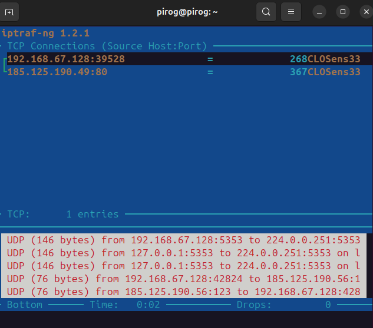
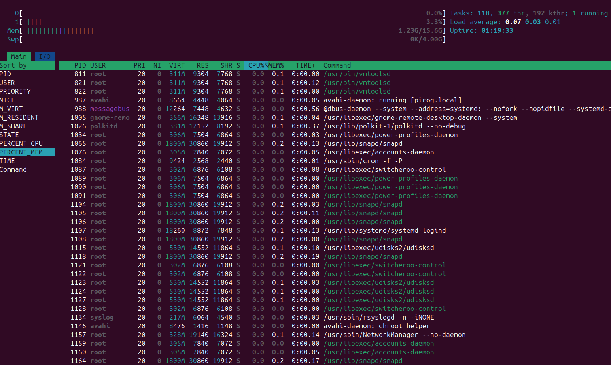

# 4. Измерение использования аппаратных ресурсов и устранение проблем (200.1)

## 4.1 Измерение и устранение проблем с использованием ресурсов&#x20;

### 4.1.1 Цели

Кандидаты должны уметь измерять аппаратные ресурсы и пропускную способность сети, выявлять и устранять проблемы с ресурсами.

## 4.2 Основные области знаний:&#x20;

* Измерение загрузки процессора&#x20;
* Измерение использования памяти&#x20;
* Измерение дискового ввода-вывода
* &#x20;Измерение сетевого ввода-вывода&#x20;
* Измерение пропускной способности брандмауэров и маршрутизации&#x20;
* Отображение использования пропускной способности клиента
* Сопоставление системных симптомов с вероятными проблемами&#x20;
* Оценка пропускной способности и выявление узких мест в системе, включая сеть

### 4.2.1 Термины и утилиты:&#x20;

* iostat&#x20;
* iotop&#x20;
* vmstat&#x20;
* netstat
* ss&#x20;
* iptraf&#x20;
* pstree,&#x20;
* ps&#x20;
* w&#x20;
* lsof&#x20;
* top&#x20;
* htop&#x20;
* uptime&#x20;
* sar&#x20;
* swap&#x20;
* процессы, заблокированные при вводе-выводе
* blocks in&#x20;
* blocks out&#x20;
* network

## 4.3 iostat


В зависимости от версии вашего дистрибутива Linux может потребоваться установка пакета, такого как Debian _**sysstat**_, для доступа к таким инструментам, как iostat, sar, mpstat и т.д. Пакет Debian _**procps**_ содержит такие утилиты, как free, uptime , vmstat, w , sysctl и т.д.


Команда iostat используется для мониторинга загрузки устройств системного ввода-вывода (I/O). Это делается путем отслеживания времени активности устройств в зависимости от их средней скорости передачи данных. Без каких-либо опций команда iostat отображает статистику с момента последней перезагрузки системы. Когда в iostat передаются аргументы interval и count , в выходные данные добавляется статистика за каждый указанный интервал времени . Параметр -y также можно использовать для подавления статистики с момента последней перезагрузки.

Использование:

```bash
$ iostat options interval count
```

Примеры:

<pre class="language-bash"><code class="lang-bash">$ iostat


Linux 3.2.0-4-686-pae (debian)  05/07/2013  _i686_  (2 CPU)
<strong>avg-cpu:  %user   %nice %system %iowait  %steal   %idle
</strong>1.25    0.32    3.76    0.20    0.00   94.46

Device:            tps    kB_read/s    kB_wrtn/s    kB_read    kB_wrtn
sda              12.21       214.81        17.38     333479      26980


$ iostat 1 3

Linux 3.2.0-4-686-pae (debian)  05/07/2013  _i686_  (2 CPU)

avg-cpu:  %user   %nice %system %iowait  %steal   %idle
24.24    1.51    7.49    4.97    0.00   61.79

Device:            tps   Blk_read/s   Blk_wrtn/s   Blk_read   Blk_wrtn
sda              14.06       249.94       121.22    1337998     648912

avg-cpu:  %user   %nice %system %iowait  %steal   %idle
13.13    0.00    6.21    0.60    0.00   80.06

Device:            tps   Blk_read/s   Blk_wrtn/s   Blk_read   Blk_wrtn
sda               2.51         4.01        28.86         40        288

avg-cpu:  %user   %nice %system %iowait  %steal   %idle
11.11    0.00    5.71    0.00    0.00   83.18

Device:            tps   Blk_read/s   Blk_wrtn/s   Blk_read   Blk_wrtn
sda               0.30         0.00         3.20          0         32


$ iostat -c

Linux 3.2.0-4-686-pae (debian)  05/07/2013  _i686_  (2 CPU)

avg-cpu:  %user   %nice %system %iowait  %steal   %idle
9.16    0.05   17.01    1.37    0.00   72.42
</code></pre>

## 4.4 iotop

Команда iotop аналогична команде top. Она отображает информацию об использовании ввода-вывода, выводимую ядром Linux, и таблицу текущего использования ввода-вывода процессами или потоками в системе.

iotop отображает столбцы с данными о пропускной способности ввода-вывода, считываемыми и записываемыми каждым процессом/потоком в течение периода выборки. Также отображается процент времени, затраченного потоком/процессом на замену и ожидание ввода-вывода. Для каждого процесса отображается его приоритет ввода-вывода (класс/уровень). Кроме того, в верхней части интерфейса отображается общая пропускная способность ввода-вывода, считываемая и записываемая в течение периода выборки.

Использование:

```bash
$ iotop options
```

Пример:

```bash
$ iotop -b |head
Total DISK READ : 0.00 B/s | Total DISK WRITE : 213.38 M/s
Actual DISK READ: 0.00 B/s | Actual DISK WRITE: 0.00 B/s
TID PRIO USER DISK READ DISK WRITE SWAPIN IO COMMAND
6 be/4 root 0.00 B/s 0.00 B/s 0.00 % 99.99 % [kworker/u8:0]
191 be/3 root 0.00 B/s 0.00 B/s 0.00 % 94.14 % [jbd2/sda1-8]
2976 be/4 root 0.00 B/s 213.38 M/s 0.00 % 0.00 % dd if=/dev/zero of=/tmp/foo
1 be/4 root 0.00 B/s 0.00 B/s 0.00 % 0.00 % init
2 be/4 root 0.00 B/s 0.00 B/s 0.00 % 0.00 % [kthreadd]
3 be/4 root 0.00 B/s 0.00 B/s 0.00 % 0.00 % [ksoftirqd/0]
5 be/0 root 0.00 B/s 0.00 B/s 0.00 % 0.00 % [kworker/0:0H]
```

## 4.5 vmstat

Команда vmstat предоставляет статистику виртуальной памяти о процессах, памяти, подкачке, блочном вводе-выводе, ловушках и загрузке процессора.

Использование:&#x20;

```bash
$ vmstat options delay count
```

Пример:

```bash
pirog@pirog:~$ vmstat 2 2
procs -----------memory---------- ---swap-- -----io---- -system-- -------cpu-------
 r  b   swpd   free   buff  cache   si   so    bi    bo   in   cs us sy id wa st gu
 1  0      0 14501008  35340 784404    0    0  6314   277 1161   10  6 12 82  0  0  0
 0  0      0 14501008  35340 784468    0    0     0     0  505  771  0  1 99  0  0  0

```


&#x20;Обратите внимание, что в первой строке всегда будут отображаться средние значения с момента загрузки компьютера, поэтому ими следует пренебречь. Значения, относящиеся к памяти и вводу-выводу, выражены в килобайтах (1024 байта). Старые ядра (до версии 2.6) могли бы выдавать блоки размером 512, 2048 или 4096 байт. Значения, относящиеся к измерениям процессора, выражаются в процентах от общего времени процессора. Имейте это в виду при интерпретации результатов измерений в многопроцессорной системе, поскольку в этих системах vmstat усредняет количество процессоров в выходных данных. Все пять полей CPU должны составлять в сумме 100% для каждого показанного интервала. Это не зависит от количества процессоров или ядер. Другими словами: vmstat нельзя использовать для отображения статистики по процессору или ядру (в этом случае следует использовать mpstat или ps). vmstat примет задержку в секундах и количество отсчетов (повторений) в качестве аргумента, но результаты измерения процесса и памяти всегда будут мгновенными.

**В первом столбце процесса "r"** указано количество процессов, которые в данный момент находятся в очереди запуска процессора. Эти процессы ожидают выполнения процессора, также известного как процессорное время.

**Во втором столбце процесса "b"** указано количество процессов, которые в данный момент находятся в очереди блоков. Эти процессы перечислены как находящиеся в режиме непрерывного ожидания, что означает, что они ожидают, пока устройство вернет либо входные, либо выходные данные (I/O).

**В первом столбце памяти "swpd"** указан объем используемой виртуальной памяти, выраженный в килобайтах (1024 байта). Виртуальная память состоит из дискового пространства подкачки, которое работает значительно медленнее, чем физическая память, размещенная внутри микросхем памяти.

**Во втором столбце памяти, "free"**, указан объем памяти, который в данный момент не используется, не кэшируется и не буферизуется.

**В третьем столбце памяти, "buff"**, указан объем памяти, выделенный в данный момент для буферов. Буферизованная память содержит необработанные дисковые блоки.

**В четвертом столбце памяти "cache"** указан объем памяти, выделенный в данный момент для кэширования. Кэшированная память содержит файлы.

**В пятом столбце памяти, "inact"**, указан объем неактивной памяти. Это отображается только с помощью параметра -a.

**В шестом столбце памяти, "act"**, указан объем активной памяти. Это отображается только с помощью параметра -a

**В первом столбце подкачки "si"** указан объем памяти, загружаемый с диска (в секунду).

**Во втором столбце подкачки "so"** указан объем памяти, который выгружается на диск (в секунду).

**В первом столбце ввода-вывода "bi**" указано количество блоков в секунду, получаемых от блочного устройства.

**Во втором столбце ввода-вывода "bo"** указано количество блоков в секунду, отправляемых на блочное устройство.&#x20;

**В первом системном столбце "in"** указано количество прерываний в секунду (включая тактовые).&#x20;

**Во втором системном столбце "cs"** указано количество переключений контекста в секунду.&#x20;

**Количество переключений контекста** — это показатель, который отражает, сколько раз за определённое время операционная система переключалась между различными процессами или потоками. Это происходит, когда один процесс или поток приостанавливается, а другой начинает выполняться. Переключение контекста требует времени и ресурсов процессора, поэтому большое количество переключений может замедлить работу системы.

Столбцы, относящиеся к процессору, выражены в процентах от общего времени процессора.&#x20;

**В первом столбце cpu, "us"** (пользовательский код), отображается процент времени, затраченного на выполнение кода, не относящегося к ядру.&#x20;

**Второй столбец cpu, "sy"** (системный код), показывает процент времени, затраченного на выполнение кода ядра.&#x20;

**Третий столбец cpu, "id"**, показывает процент времени простоя.&#x20;

**Четвертый столбец cpu, "wa"**, показывает процент времени, затраченного на ожидание ввода-вывода.&#x20;

**Пятый столбец cpu, "st"** (steal time), показывает процент времени, украденного у виртуальной машины. Это количество реального процессорного времени, которое виртуальная машина (гипервизор или VirtualBox) выделила для выполнения задач, отличных от запуска вашей виртуальной машины.

**Шестой столбец "gu"**, показывает время, затраченное на запуск гостевого кода KVM (гостевое время, включая время ожидания гостя).

## 4.6 netstat

Команда netstat показывает сетевые подключения, таблицы маршрутизации, статистику интерфейса, маскарадные подключения и членство в многоадресной рассылке. Результаты зависят от первого аргумента:

* (аргумент не указан) - будут перечислены все активные сокеты всех настроенных семейств адресов.
* \--route, -r - показаны таблицы маршрутизации ядра, выходные данные идентичны route -e (выполняется с привилегиями суперпользователя, тогда как -r может быть выполнен обычным пользователем)
* \--groups, -g, -содержит информацию о членстве в группах многоадресной рассылки для IPv4 и IPv6
* \--interfaces, -i - список всех сетевых интерфейсов и некоторых специфических свойств
* \--statistics, -s - выводит сводную статистику по каждому протоколу, аналогичную выводам SNMP
* \--masquerade, -M - выводит список маскарадинг  подключений в ядрах до версии 2.4. В более новых ядрах вместо этого используйте route с повышенными правами `cat /proc/net/ip_conntrack`. Чтобы это работало, необходимо загрузить модуль ядра `ipt_MASQUERADE`. Это относится к ядрам 2.x and 3.x.

Использование:

```bash
$ netstat address_family_options options
```

Примеры:

```bash
pirog@pirog:~$ netstat -aln --tcp
Active Internet connections (servers and established)
Proto Recv-Q Send-Q Local Address           Foreign Address         State      
tcp        0      0 127.0.0.53:53           0.0.0.0:*               LISTEN     
tcp        0      0 127.0.0.54:53           0.0.0.0:*               LISTEN     
tcp        0      0 127.0.0.1:631           0.0.0.0:*               LISTEN     
tcp        0      0 192.168.67.128:41934    213.180.204.183:80      TIME_WAIT  
tcp6       0      0 ::1:631                 :::*                    LISTEN 
```

```bash
pirog@pirog:~$ netstat -al --tcp
Active Internet connections (servers and established)
Proto Recv-Q Send-Q Local Address           Foreign Address         State      
tcp        0      0 _localdnsstub:domain    0.0.0.0:*               LISTEN     
tcp        0      0 _localdnsproxy:domain   0.0.0.0:*               LISTEN     
tcp        0      0 localhost:ipp           0.0.0.0:*               LISTEN     
tcp6       0      0 ip6-localhost:ipp       [::]:*                  LISTEN 
```

## 4.7 ss

Команда ss используется для отображения статистики сокетов. Она может отображать статистику для ПАКЕТНЫХ сокетов, TCP-сокетов, UDP-сокетов, DCCP-сокетов, RAW сокетов, доменных сокетов Unix и многого другого. Это позволяет отображать информацию, аналогичную команде netstat, но может отображать больше информации о TCP и состоянии.

Большинство дистрибутивов Linux поставляются с ss. Знакомство с этим инструментом поможет вам лучше понять, что происходит в системных сокетах, и поможет найти возможные причины проблем с производительностью.

Использование:

```bash
 $ ss options filter
```

Пример:

```bash
pirog@pirog:~$ ss -at
State         Recv-Q        Send-Q               Local Address:Port                 Peer Address:Port        Process        
LISTEN        0             4096                 127.0.0.53%lo:domain                    0.0.0.0:*                          
LISTEN        0             4096                    127.0.0.54:domain                    0.0.0.0:*                          
LISTEN        0             4096                     127.0.0.1:ipp                       0.0.0.0:*                          
LISTEN        0             4096                         [::1]:ipp                          [::]:*                      
```


## 4.8 iptraf

Iptraf tool - это утилита сетевого мониторинга для IP-сетей, которая может использоваться для мониторинга нагрузки в IP-сети. Она перехватывает пакеты в сети и отображает информацию о текущем трафике в ней.

iptraf собирает такие данные, как количество пакетов и байтов TCP-соединения, статистика интерфейса и индикаторы активности, разбивка трафика TCP/UDP, а также количество пакетов и байтов локальной сети. Функции Iptraf включают в себя монитор IP-трафика, который отображает информацию о флаге TCP, количестве пакетов и байтов, сведения о ICMP, типах пакетов OSPF и предупреждения о слишком большом количестве IP-пакетов.

Использование:

```bash
  $ iptraf options
```

Пример:

<figure><figcaption></figcaption></figure>

## 4.9 ps

Использование:

```bash
 $ ps options
```

Команда ps отображает список процессов, запущенных в данный момент. Это те же процессы, которые отображаются командой top.

1. Параметры UNIX - они могут быть сгруппированы и должны предваряться одним тире&#x20;
2. Параметры BSD - они могут быть сгруппированы и должны использоваться без тире&#x20;
3. Параметры GNU long - перед ними ставятся два тире

В GNU ps эти параметры могут быть скомбинированы, но имейте в виду, что в зависимости от версии Linux, с которой вы работаете, вы можете столкнуться с менее гибким вариантом ps. В зависимости от используемого дистрибутива, справочная страница ps может содержать около 900 строк. Из-за своей универсальности, мы рекомендуем вам ознакомиться со справочной страницей и попробовать некоторые варианты, которые может предложить ps.

Примеры:

```bash
pirog@pirog:~$ ps ef
    PID TTY      STAT   TIME COMMAND
   3267 pts/0    Ss     0:00 bash SYSTEMD_EXEC_PID=2404 SSH_AUTH
   4349 pts/0    R+     0:00  \_ ps ef SHELL=/bin/bash SESSION_M
   2265 tty2     Ssl+   0:00 /usr/libexec/gdm-wayland-session en
   2280 tty2     Sl+    0:00  \_ /usr/libexec/gnome-session-bina
```

```bash
pirog@pirog:~$ ps -ef
UID          PID    PPID  C STIME TTY          TIME CMD
root           1       0  0 16:48 ?        00:00:01 /sbin/init splash
root           2       0  0 16:48 ?        00:00:00 [kthreadd]
root           3       2  0 16:48 ?        00:00:00 [pool_workqueue_release]
root           4       2  0 16:48 ?        00:00:00 [kworker/R-rcu_gp]
root           5       2  0 16:48 ?        00:00:00 [kworker/R-sync_wq]
root           6       2  0 16:48 ?        00:00:00 [kworker/R-slub_flushwq]
root           7       2  0 16:48 ?        00:00:00 [kworker/R-netns]
root           8       2  0 16:48 ?        00:00:01 [kworker/0:0-events]
root           9       2  0 16:48 ?        00:00:00 [kworker/0:0H-kblockd]
...
```

## 4.10 pstree

Команда pstree отображает те же процессы, что и ps и top, но выходные данные представлены в виде древовидной структуры. Корень дерева находится в pid (или init, если pid опущен), и если указано имя пользователя, дерево будет иметь корень для всех процессов, принадлежащих этому имени пользователя. pstree предоставляет простой способ отследить процесс по его родительскому идентификатору процесса (PPID). Выходные данные в квадратных скобках с префиксом в виде числа - это идентичные ветви процессов, сгруппированные вместе, число с префиксом представляет количество повторений. Сгруппированные дочерние потоки также показаны в квадратных скобках, но в качестве дополнения название процесса будет указано в фигурных скобках . В последней строке выходных данных указано количество дочерних потоков для данного процесса.

Использование:

```bash
$ pstree options pid|username
```

Пример:

<pre class="language-bash"><code class="lang-bash"><strong>pirog@pirog:~$ top
</strong>
top - 17:46:48 up 58 min,  1 user,  load average: 0.07, 0.03, 0.00
Tasks: 307 total,   1 running, 306 sleeping,   0 stopped,   0 zombie
%Cpu(s):  0.2 us,  0.8 sy,  0.0 ni, 99.0 id,  0.0 wa,  0.0 hi,  0.0 si,  0.0 st 
MiB Mem :  15944.8 total,  13850.5 free,   1463.6 used,    954.3 buff/cache     
MiB Swap:   4096.0 total,   4096.0 free,      0.0 used.  14481.2 avail Mem 

    PID USER      PR  NI    VIRT    RES    SHR S  %CPU  %MEM     TIME+ COMMAND         
   2404 pirog     20   0 3921636 286864 129084 S   2.0   1.8   0:28.31 gnome-shell     
   3259 pirog     20   0  625620  57016  44192 S   0.7   0.3   0:03.25 gnome-terminal- 
   4376 pirog     20   0   14536   5792   3616 R   0.3   0.0   0:00.02 top             
      1 root      20   0   23060  13980   9500 S   0.0   0.1   0:01.72 systemd         
      2 root      20   0       0      0      0 S   0.0   0.0   0:00.03 kthreadd        
      3 root      20   0       0      0      0 S   0.0   0.0   0:00.00 pool_workqueue+ 
      4 root       0 -20       0      0      0 I   0.0   0.0   0:00.00 kworker/R-rcu_+ 
      5 root       0 -20       0      0      0 I   0.0   0.0   0:00.00 kworker/R-sync+ 
      6 root       0 -20       0      0      0 I   0.0   0.0   0:00.00 kworker/R-slub+ 
      7 root       0 -20       0      0      0 I   0.0   0.0   0:00.00 kworker/R-netns 
      8 root      20   0       0      0      0 I   0.0   0.0   0:01.18 kworker/0:0-ev+ 
      9 root       0 -20       0      0      0 I   0.0   0.0   0:00.00 kworker/0:0H-k+ 
     11 root      20   0       0      0      0 I   0.0   0.0   0:00.00 kworker/u512:0+ 
     12 root       0 -20       0      0      0 I   0.0   0.0   0:00.00 kworker/R-mm_p+ 
     13 root      20   0       0      0      0 I   0.0   0.0   0:00.00 rcu_tasks_kthr+ 
     14 root      20   0       0      0      0 I   0.0   0.0   0:00.00 rcu_tasks_rude+ 
     15 root      20   0       0      0      0 I   0.0   0.0   0:00.00 rcu_tasks_trac+ 

pirog@pirog:~$ pstree 3259
gnome-terminal-─┬─bash───pstree
                └─6*[{gnome-terminal-}]

</code></pre>

## 4.11 w

Команда w отображает информацию о пользователях, которые в данный момент вошли в систему на компьютере, их процессах и ту же статистику , которая предоставляется командой uptime.

Использование:

```bash
$ w options user
```

Пример:

```bash
pirog@pirog:~$ w -p
 17:51:00 up  1:03,  1 user,  load average: 0.00, 0.00, 0.00
USER     TTY      FROM             LOGIN@   IDLE   JCPU   PCPU WHAT
pirog    tty2     -                16:48    1:02m  0.03s  0.03s 2156/2280 /usr/libexec
```

## 4.12 lsof

Команда lsof используется для отображения информации об открытых файлах и соответствующих им процессах. lsof будет обрабатывать обычные файлы, каталоги, специальные файлы блоков, специальные символьные файлы, исполняемые текстовые ссылки, библиотеки, потоки или сетевые файлы. По умолчанию lsof отображает неформатированные выходные данные, которые могут быть трудночитаемыми, но очень удобными для интерпретации другими программами. Параметр -F играет здесь важную роль. Параметр -F используется для получения выходных данных, которые могут быть использованы такими программами, как C, Perl и awk. Для получения подробной информации об использовании и возможностях ознакомьтесь с руководящими страницами.

Использование:

```bash
$ lsof options names
```

Аргумент names здесь действует как фильтр. Без опций lsof отобразит все открытые файлы, принадлежащие всем активным процессам

Примеры:

```bash
pirog@pirog:~$ sudo lsof /var/run/utmp
lsof: WARNING: can't stat() fuse.portal file system /run/user/1000/doc
      Output information may be incomplete.
lsof: WARNING: can't stat() fuse.gvfsd-fuse file system /run/user/1000/gvfs
      Output information may be incomplete.
```

```bash
pirog@pirog:~$ sudo lsof +d /var/log
lsof: WARNING: can't stat() fuse.portal file system /run/user/1000/doc
      Output information may be incomplete.
lsof: WARNING: can't stat() fuse.gvfsd-fuse file system /run/user/1000/gvfs
      Output information may be incomplete.
COMMAND   PID   USER   FD   TYPE DEVICE SIZE/OFF    NODE NAME
vmtoolsd  726   root    3w   REG    8,2     2254 1836941 /var/log/vmware-vmsvc-root.log
rsyslogd 1134 syslog    7w   REG    8,2    33931 1836695 /var/log/auth.log
rsyslogd 1134 syslog    8w   REG    8,2  2361341 1836722 /var/log/syslog
rsyslogd 1134 syslog    9w   REG    8,2  1174315 1836738 /var/log/kern.log
vmtoolsd 2576  pirog    5w   REG    8,2     1351 1837634 /var/log/vmware-vmusr-pirog.log

```

## 4.13 free

Команда free отображает текущий обзор общего объема физической памяти и памяти подкачки в системе, а также объема свободной памяти, используемой памяти и буферов, используемых ядром.

Четвертый столбец, называемый общим, устарел, но теперь используется для отображения памяти, используемой для tmpfs (shmem в _**/proc/meminfo**_).

Использование:

```bash
$ free options
```

Пример:

```bash
pirog@pirog:~$ free -h
               total        used        free      shared  buff/cache   available
Mem:            15Gi       1.5Gi        13Gi        40Mi       1.0Gi        14Gi
Swap:          4.0Gi          0B       4.0Gi

```

## 4.14 top

Команда top предоставляет "динамический обзор работающей системы в режиме реального времени"

Использование:

```
$ top options
```

Пример:

```bash
top - 18:01:26 up  1:13,  1 user,  load average: 0.00, 0.00, 0.00
Tasks: 304 total,   1 running, 303 sleeping,   0 stopped,   0 zombie
%Cpu(s):  0.8 us,  1.4 sy,  0.0 ni, 97.8 id,  0.0 wa,  0.0 hi,  0.0 si,  0.0 st 
MiB Mem :  9.3/15944.8  [                                                                  ] 
MiB Swap:  0.0/4096.0   [                                                                  ] 

    PID USER      PR  NI    VIRT    RES    SHR S  %CPU  %MEM     TIME+ COMMAND               
   2404 pirog     20   0 3907364 287404 129360 S   5.6   1.8   0:34.79 /usr/bin/gnome-shell  
   3259 pirog     20   0  627528  58304  44584 S   1.0   0.4   0:04.75 /usr/libexec/gnome-t+ 
   4956 pirog     20   0   16072   6568   4392 R   0.3   0.0   0:00.21 top                   
      1 root      20   0   23060  14108   9500 S   0.0   0.1   0:01.84 /sbin/init splash     
      2 root      20   0       0      0      0 S   0.0   0.0   0:00.03 [kthreadd]            
      3 root      20   0       0      0      0 S   0.0   0.0   0:00.00 [pool_workqueue_rele+ 
      4 root       0 -20       0      0      0 I   0.0   0.0   0:00.00 [kworker/R-rcu_gp]
```

Благодаря интерактивному режиму наиболее важными клавишами при работе с top являются вспомогательные  клавиши h или ? и клавиша выхода q . На следующей схеме представлен обзор наиболее важных функциональных клавиш и их эквивалентных альтернатив.:

```bash
key equivalent-key-combinations
Up alt + \         or alt + k
Down alt + /       or alt + j
Left alt + <       or alt + h
Right alt + >      or alt + l (lower case L)
PgUp alt + Up      or alt + ctrl + k
PgDn alt + Down    or alt + ctrl + j
Home alt + Left    or alt + ctrl + h
End alt + Right    or alt + ctrl + l
```

## 4.15 htop

Использование:

```bash
$ htop options
```

Команда htop похожа на команду top, но позволяет выполнять прокрутку по вертикали и горизонтали, чтобы вы могли видеть все процессы, запущенные в системе, а также их полные командные строки. Задачи, связанные с процессами (удаление, переименование), можно выполнять без ввода их идентификаторов PID.

Пример:

<figure><figcaption></figcaption></figure>

## 4.16 uptime

Команда uptime показывает, как долго работает система, сколько пользователей вошли в систему, среднюю загрузку системы за последние 1, 5 и 15 минут и текущее время. Поддерживается параметр -V для получения информации о версии.

Использование:

```bash
$ uptime options
```

Пример:

```bash
pirog@pirog:~$ uptime
 18:10:47 up  1:22,  1 user,  load average: 0.14, 0.04, 0.01
```

## 4.17 sar

Команда sar собирает, сообщает или сохраняет информацию о работе системы.

```bash
$ sar options interval count
```

Примеры:

```bash
pirog@pirog:~$ sar
Linux 6.11.0-17-generic (pirog-VMware-Virtual-Platform) 	02/18/2025 	_x86_64_	(2 CPU)

04:24:17 PM  LINUX RESTART	(2 CPU)

04:28:55 PM  LINUX RESTART	(2 CPU)

04:35:19 PM  LINUX RESTART	(2 CPU)

04:37:18 PM  LINUX RESTART	(2 CPU)

04:40:40 PM  LINUX RESTART	(2 CPU)

04:48:08 PM  LINUX RESTART	(2 CPU)

04:50:16 PM     CPU     %user     %nice   %system   %iowait    %steal     %idle
05:00:04 PM     all      0.09      0.00      0.08      0.00      0.00     99.83
05:10:11 PM     all      0.20      0.00      0.19      0.00      0.00     99.60
05:20:06 PM     all      0.08      0.00      0.07      0.01      0.00     99.85
05:30:10 PM     all      0.31      0.13      0.39      0.02      0.00     99.15
05:40:38 PM     all      0.65      0.13      0.62      0.01      0.00     98.59
05:50:03 PM     all      0.37      0.00      0.33      0.00      0.00     99.30
06:00:28 PM     all      0.68      0.00      0.54      0.01      0.00     98.77
06:10:26 PM     all      0.73      0.13      0.88      0.01      0.00     98.25
Average:        all      0.39      0.05      0.39      0.01      0.00     99.16

```

При отсутствии опций sar выведет приведенную выше статистику.

При использовании опции -d sar выведет статистику по диску.

```bash
pirog@pirog:~$ sar -d
Linux 6.11.0-17-generic (pirog-VMware-Virtual-Platform) 	02/18/2025 	_x86_64_	(2 CPU)

04:24:17 PM  LINUX RESTART	(2 CPU)

04:28:55 PM  LINUX RESTART	(2 CPU)

04:35:19 PM  LINUX RESTART	(2 CPU)

04:37:18 PM  LINUX RESTART	(2 CPU)

04:40:40 PM  LINUX RESTART	(2 CPU)

04:48:08 PM  LINUX RESTART	(2 CPU)

04:50:16 PM       DEV       tps     rkB/s     wkB/s     dkB/s   areq-sz    aqu-sz     await     %util
05:00:04 PM     loop0      0.00      0.00      0.00      0.00      0.00      0.00      0.00      0.00
05:00:04 PM     loop1      0.00      0.00      0.00      0.00      0.00      0.00      0.00      0.00
05:00:04 PM     loop2      0.00      0.00      0.00      0.00      0.00      0.00      0.00      0.00

```

Опция -b отображает выходные данные, относящиеся к статистике ввода-вывода и скорости передачи:

```bash
04:50:16 PM       tps      rtps      wtps      dtps   bread/s   bwrtn/s   bdscd/s
05:00:04 PM      0.71      0.12      0.59      0.00      4.73      8.13      0.00
05:10:11 PM      1.65      0.87      0.78      0.00     32.88     47.88      0.00
05:20:06 PM      0.46      0.00      0.46      0.00      0.01     12.14      0.00
05:30:10 PM      8.54      7.35      1.19      0.00    295.72    213.45      0.00
05:40:38 PM      2.43      0.57      1.86      0.00     41.55    219.44      0.00
05:50:03 PM      0.81      0.03      0.78      0.00      1.50     12.67      0.00
06:00:28 PM      3.08      1.80      1.28      0.00    150.83     30.16      0.00
06:10:26 PM      4.23      3.07      1.16      0.00     63.02    215.07      0.00
Average:         2.76      1.74      1.02      0.00     74.92     96.15      0.00
```

Некоторые из наиболее важных опций, которые следует использовать с sar,&#x20;

* -c - системные вызовы&#x20;
* -p и -w Действия по поиску и замене страниц
* -q Очередь запуска
* -r  Свободная память и  подкачка с течением времени

## 4.18 Сопоставление системных симптомов с вероятными проблемами

Чтобы устранить проблему, сначала необходимо уметь отличать нормальное поведение системы от ненормального.

В предыдущем разделе описан ряд очень специфичных системных утилит, а также их использование. В этом разделе основное внимание уделяется сопоставлению этих измерений и возможности обнаружения аномалий, которые, в свою очередь, могут быть связаны с ненормальным поведением системы. Проблемы, связанные с ресурсами, имеют очень заметный общий фактор.

Они являются результатом того, что один или несколько ресурсов не в состоянии удовлетворить спрос при определенных обстоятельствах.

Эти ресурсы могут быть связаны, но не ограничиваются ими: центральный процессор, физическая или виртуальная память, хранилище, сетевые интерфейсы и соединения, а также ввод/вывод между одним или несколькими из этих компонентов.

## 4.19 Оценка пропускной способности и выявление узких мест в системе, включая сетевое взаимодействие.

Чтобы определить, связана ли определенная проблема с нехваткой ресурсов, сначала необходимо правильно сформулировать саму проблему. Затем это сформулированное "отклонение" в поведении должно быть сопоставлено с ожидаемым поведением, которое было бы результатом безотказной работы операционной системы.

По возможности следует изучить исторические данные из sar или других инструментов и сравнить их с такими инструментами реального времени, как top, vmstat, netstat и iostat .

Проблемы, о которых сообщают пользователи или средства создания отчетов, часто связаны с доступностью: ресурсы либо не доступны в установленном порядке, либо вообще недоступны. В данном случае "в течение приемлемого периода времени". О такого рода проблемах часто сообщают, потому что они легко заметны пользователям, то есть влияют на работу с ними.

При отсутствии исходных данных сами измерения ресурсов могут помочь определить первопричину проблемы, связанной с ресурсами. Например, если один из упомянутых выше ресурсов загружен на 100%, то наличие ненормального поведения системы должно быть легко объяснимо; однако поиск точного источника проблемы может потребовать немного больше усилий. Утилиты, представленные в предыдущей главе, должны быть полезны и здесь.

Примеры:

```bash
$ top
$ vmstat
$ iostat
$ netstat
```

Выявление узких мест в сетевой среде требует нескольких шагов. Подход, основанный на наилучшей практике, может быть описан следующим образом:

* **Создайте карту сети**&#x20;
* **Определите поведение, зависящее от времени**&#x20;
* **Определите проблему**&#x20;
* **Определите отклоняющееся поведение**&#x20;
* **Определите причину**
