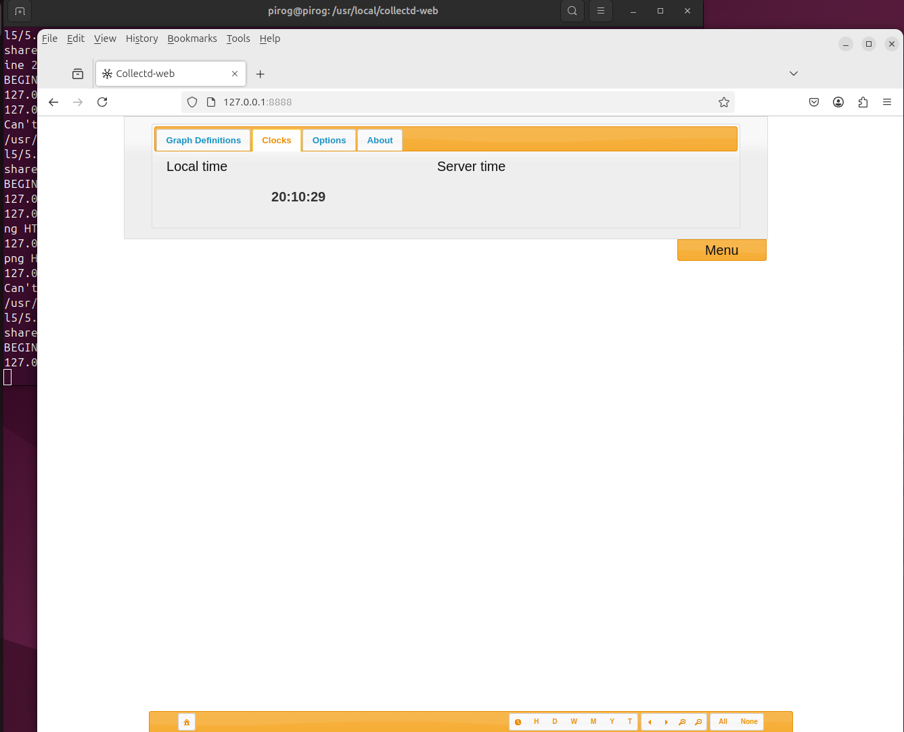

# 5.6. collectd

Collected - это Unix-демон, который собирает статистику, связанную с производительностью системы, а также предоставляет средства для хранения значений в различных форматах, таких как файлы базы данных RRD (Round Robin). Статистика, собранная Collected, помогает определить текущие показатели производительности и спрогнозировать загрузку системы в будущем.

Collected установлен по умолчанию во многих дистрибутивах, однако его можно легко установить из репозиториев в системах red hat или debian, здесь мы используем систему Ubuntu 24.04 LTS:

```bash
pirog@pirog:~$ sudo apt install collectd
```

Чтобы настроить параметры мониторинга, измените файлы collected.conf

```bash
pirog@pirog:~$ dpkg -L  collectd | grep etc
/etc
/etc/collectd
/etc/collectd/collectd.conf
/etc/collectd/collectd.conf.d
/etc/collectd/collectd.conf.d/filters.conf
/etc/collectd/collectd.conf.d/thresholds.conf
```

и это огромный конфигурационный файл, состоящий из разных разделов. Которые не являются частью нашего экзамена!

```bash
##############################################################################
# Global                                                                     #
#----------------------------------------------------------------------------#
# Global settings for the daemon.                                            #
##############################################################################

#Hostname    "localhost"
#FQDNLookup   true
#BaseDir     "/var/lib/collectd"
#PIDFile     "/var/run/collectd.pid"
#PluginDir   "/usr/lib64/collectd"
#TypesDB     "/usr/share/collectd/types.db"

#----------------------------------------------------------------------------#
# When enabled, plugins are loaded automatically with the default options    #
# when an appropriate <Plugin ...> block is encountered.                     #
# Disabled by default.                                                       #
#----------------------------------------------------------------------------#
#AutoLoadPlugin false

#----------------------------------------------------------------------------#
# When enabled, internal statistics are collected, using "collectd" as the   #
# plugin name.                                                               #
# Disabled by default.                                                       #
#----------------------------------------------------------------------------#
#CollectInternalStats false

#----------------------------------------------------------------------------#
# Interval at which to query values. This may be overwritten on a per-plugin #
# base by using the 'Interval' option of the LoadPlugin block:               #
#   <LoadPlugin foo>                                                         #
#       Interval 60                                                          #
#   </LoadPlugin>                                                            #
#----------------------------------------------------------------------------#
#Interval     10

#MaxReadInterval 86400
#Timeout         2
#ReadThreads     5
#WriteThreads    5

# Limit the size of the write queue. Default is no limit. Setting up a limit is
# recommended for servers handling a high volume of traffic.
#WriteQueueLimitHigh 1000000
#WriteQueueLimitLow   800000

##############################################################################
# Logging                                                                    #
#----------------------------------------------------------------------------#
# Plugins which provide logging functions should be loaded first, so log     #
# messages generated when loading or configuring other plugins can be        #
# accessed.                                                                  #
##############################################################################

LoadPlugin syslog
#LoadPlugin logfile
#LoadPlugin log_logstash

#<Plugin logfile>
#    LogLevel info
#    File STDOUT
#    Timestamp true
#    PrintSeverity false
#</Plugin>

#<Plugin log_logstash>
#    LogLevel info
#    File "/var/log/collectd.json.log"
#</Plugin>

#<Plugin syslog>
#    LogLevel info
#</Plugin>

##############################################################################
# LoadPlugin section                                                         #
#----------------------------------------------------------------------------#
# Lines beginning with a single `#' belong to plugins which have been built  #
# but are disabled by default.                                               #
#                                                                            #
# Lines beginning with `##' belong to plugins which have not been built due  #
# to missing dependencies or because they have been deactivated explicitly.  #
##############################################################################
.
..
....

LoadPlugin cpu
#LoadPlugin cpufreq
#LoadPlugin cpusleep

#LoadPlugin df
#LoadPlugin disk
#LoadPlugin dns

LoadPlugin interface
#LoadPlugin ipc
#LoadPlugin ipmi
#LoadPlugin iptables
#LoadPlugin ipvs
#LoadPlugin irq
#LoadPlugin java
LoadPlugin load
##LoadPlugin lpar
#LoadPlugin lua
#LoadPlugin lvm
#LoadPlugin madwifi
#LoadPlugin mbmon
#LoadPlugin mcelog
#LoadPlugin md
#LoadPlugin memcachec
#LoadPlugin memcached
LoadPlugin memory
##LoadPlugin mic
#LoadPlugin modbus
#LoadPlugin mqtt
#LoadPlugin multimeter
#LoadPlugin mysql
##LoadPlugin netapp
#LoadPlugin netlink
LoadPlugin network
#LoadPlugin nfs

#LoadPlugin rrdtool
......
....
..
.
##############################################################################
# Plugin configuration                                                       #
#----------------------------------------------------------------------------#
# In this section configuration stubs for each plugin are provided. A desc-  #
# ription of those options is available in the collectd.conf(5) manual page. #
##############################################################################
.
..
...
#<Plugin apache>
#  <Instance "local">
#    URL "http://localhost/status?auto"
#    User "www-user"
#    Password "secret"
#    CACert "/etc/ssl/ca.crt"
#  </Instance>
#</Plugin>

#<Plugin rrdtool>
#       DataDir "/var/lib/collectd/rrd"
#       CreateFilesAsync false
#       CacheTimeout 120
#       CacheFlush   900
#       WritesPerSecond 50
#</Plugin>

...
..
##############################################################################
# Filter configuration                                                       #
#----------------------------------------------------------------------------#
# The following configures collectd's filtering mechanism. Before changing   #
# anything in this section, please read the `FILTER CONFIGURATION' section   #
# in the collectd.conf(5) manual page.                                       #
##############################################################################

# Load required matches:
#LoadPlugin match_empty_counter
#LoadPlugin match_hashed
#LoadPlugin match_regex
#LoadPlugin match_value
#LoadPlugin match_timediff
..
...
..
#############################################################################
# Threshold configuration                                                    #
#----------------------------------------------------------------------------#
# The following outlines how to configure collectd's threshold checking      #
# plugin. The plugin and possible configuration options are documented in    #
# the collectd-threshold(5) manual page.                                     #
##############################################################################

#LoadPlugin "threshold"
#<Plugin threshold>
#  <Type "foo">
#    WarningMin    0.00
#    WarningMax 1000.00
#    FailureMin    0.00
#    FailureMax 1200.00
#    Invert false
#    Instance "bar"
#  </Type>
#
#  <Plugin "interface">
#    Instance "eth0"
#    <Type "if_octets">
#      FailureMax 10000000
#      DataSource "rx"
#    </Type>
#  </Plugin>
#
#  <Host "hostname">
#    <Type "cpu">
#      Instance "idle"
#      FailureMin 10
#    </Type>
...
..
```

Нужно удалить коментирий перед интересующими нас разделами и перезапустить службу.

```bash
pirog@pirog:~$ sudo systemctl restart collectd.service 
pirog@pirog:~$ sudo systemctl status collectd.service 
● collectd.service - Statistics collection and monitoring daemon
     Loaded: loaded (/usr/lib/systemd/system/collectd.service; enabled; preset: enabled)
     Active: active (running) since Fri 2025-02-21 19:38:27 MSK; 6s ago
       Docs: man:collectd(1)
             man:collectd.conf(5)
             https://collectd.org
    Process: 7246 ExecStartPre=/usr/sbin/collectd -t (code=exited, status=0/SUCCESS)
   Main PID: 7248 (collectd)
      Tasks: 12 (limit: 19046)
     Memory: 2.5M (peak: 2.9M)
        CPU: 38ms
     CGroup: /system.slice/collectd.service
             └─7248 /usr/sbin/collectd

Feb 21 19:38:27 pirog collectd[7248]: plugin_load: plugin "irq" successfully loaded.
Feb 21 19:38:27 pirog collectd[7248]: plugin_load: plugin "load" successfully loaded.
Feb 21 19:38:27 pirog collectd[7248]: plugin_load: plugin "memory" successfully loaded.
Feb 21 19:38:27 pirog collectd[7248]: plugin_load: plugin "processes" successfully loaded.
Feb 21 19:38:27 pirog collectd[7248]: plugin_load: plugin "rrdtool" successfully loaded.
Feb 21 19:38:27 pirog collectd[7248]: plugin_load: plugin "swap" successfully loaded.
Feb 21 19:38:27 pirog collectd[7248]: plugin_load: plugin "users" successfully loaded.
Feb 21 19:38:27 pirog collectd[7248]: Systemd detected, trying to signal readiness.
Feb 21 19:38:27 pirog systemd[1]: Started collectd.service - Statistics collection and monitoring dae>
```

Теперь мы должны дать collectd достаточно времени для сбора информации о  модулях, которые были включены. К сожалению, collectd не поставляется с интерфейсом для просмотра собранных данных по умолчанию, поэтому нам нужны дополнительные настройки для установки и веб-интерфейс для этого.

## Настройка Collectd-web для мониторинга сервера

Collected-web - это инструмент веб-мониторинга, основанный на RRDTool (Round-Robin Database Tool), который интерпретирует и выводит в графическом виде данные, собранные службой Collectd в системах Linux.

Итак, сначала давайте установим и включим модуль rrdtool:

```bash
pirog@pirog:~$ sudo apt install git

pirog@pirog:~$ sudo apt install librrds-perl libjson-perl libhtml-parser-perl

pirog@pirog:/usr/local$ sudo git clone https://github.com/httpdss/collectd-web.git
Cloning into 'collectd-web'...
remote: Enumerating objects: 1900, done.
remote: Counting objects: 100% (134/134), done.
remote: Compressing objects: 100% (75/75), done.
remote: Total 1900 (delta 92), reused 83 (delta 57), pack-reused 1766 (from 2)
Receiving objects: 100% (1900/1900), 1.52 MiB | 5.60 MiB/s, done.
Resolving deltas: 100% (893/893), done.

pirog@pirog:/usr/local$ cd collectd-web/

sudo chmod +x cgi-bin/graphdefs.cgi


```

По умолчанию collectd-web настроен для запуска по обратному адресу 127.0.0.1. Вам нужно будет отредактировать runserver.py создайте скрипт и измените 127.0.0.1 на 0.0.0.0, чтобы привязать все IP-адреса сетевого интерфейса и получить доступ к веб-интерфейсу collectd с удаленного компьютера.

Запускаем сервер:

```bash
pirog@pirog:/usr/local/collectd-web$ ./runserver.py &
[1] 9638
pirog@pirog:/usr/local/collectd-web$ Collectd-web server running at http://127.0.0.1:8888/

```

Наконец, мы можем получить доступ к веб-интерфейсу collectd по адресу http://our-server-ip:8888 в нашем веб-браузере:

<figure><figcaption></figcaption></figure>

Как это работает? В Collected используются наборы данных, которые определены в types.db:

```bash
pirog@pirog:/$ cat cat /usr/share/collectd/types.db | grep cpu
cat: cat: No such file or directory
cpu                     value:DERIVE:0:U
cpu_affinity            value:GAUGE:0:1
cpufreq                 value:GAUGE:0:U
ps_cputime              user:DERIVE:0:U, syst:DERIVE:0:U
redis_command_cputime   value:DERIVE:0:U
vcpu                    value:GAUGE:0:U
virt_cpu_total          value:DERIVE:0:U
virt_vcpu               value:DERIVE:0:U

```

для сбора данных в специальном формате (циклическая база данных) в каталоге /var/lib/directory/rrd, который мы ранее включили в collectd.conf:

```bash
#LoadPlugin rrdcached
LoadPlugin rrdtool
#<Plugin rrdcached>
#	DaemonAddress "unix:/var/run/rrdcached.sock"
#	DataDir "/var/lib/rrdcached/db/collectd"
<Plugin rrdtool>
	DataDir "/var/lib/collectd/rrd"

```

```bash
var/lib/collectd/rrd
└── pirog
    ├── cpu-0
    │   ├── cpu-idle.rrd
    │   ├── cpu-interrupt.rrd
    │   ├── cpu-nice.rrd
    │   ├── cpu-softirq.rrd
    │   ├── cpu-steal.rrd
    │   ├── cpu-system.rrd
    │   ├── cpu-user.rrd
    │   └── cpu-wait.rrd
    ├── cpu-1
    │   ├── cpu-idle.rrd
    │   ├── cpu-interrupt.rrd
    │   ├── cpu-nice.rrd
    │   ├── cpu-softirq.rrd
    │   ├── cpu-steal.rrd
    │   ├── cpu-system.rrd
    │   ├── cpu-user.rrd
    │   └── cpu-wait.rrd
...
```


