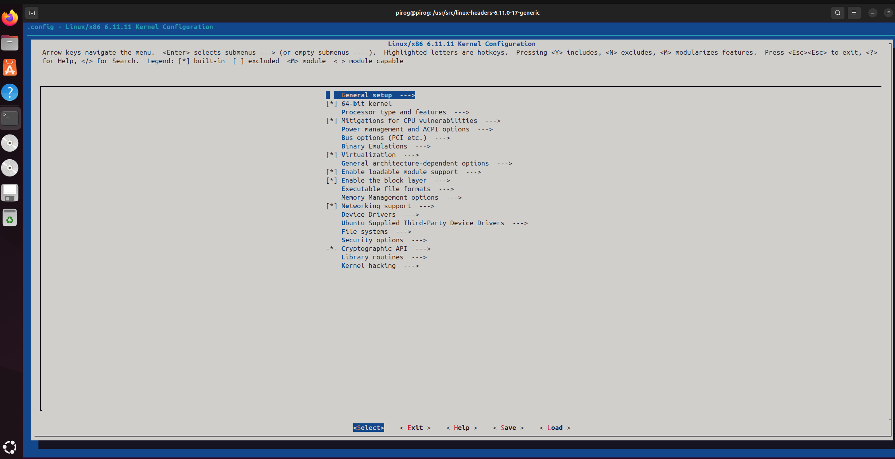
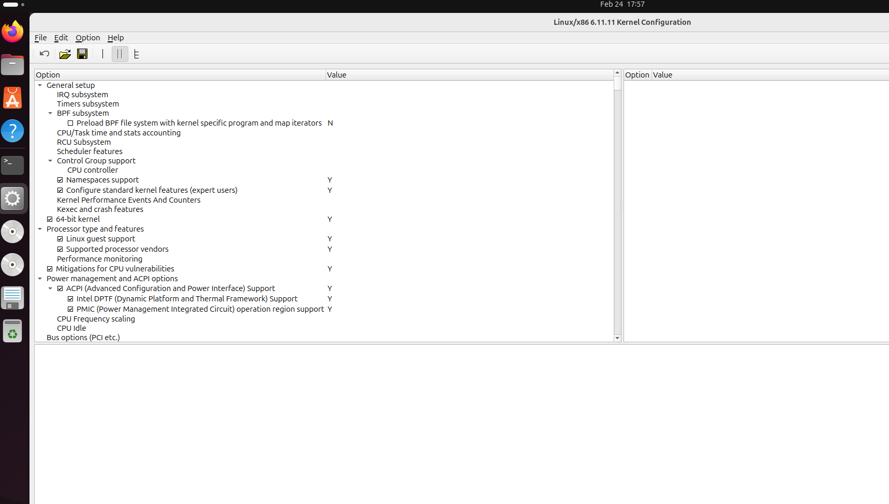
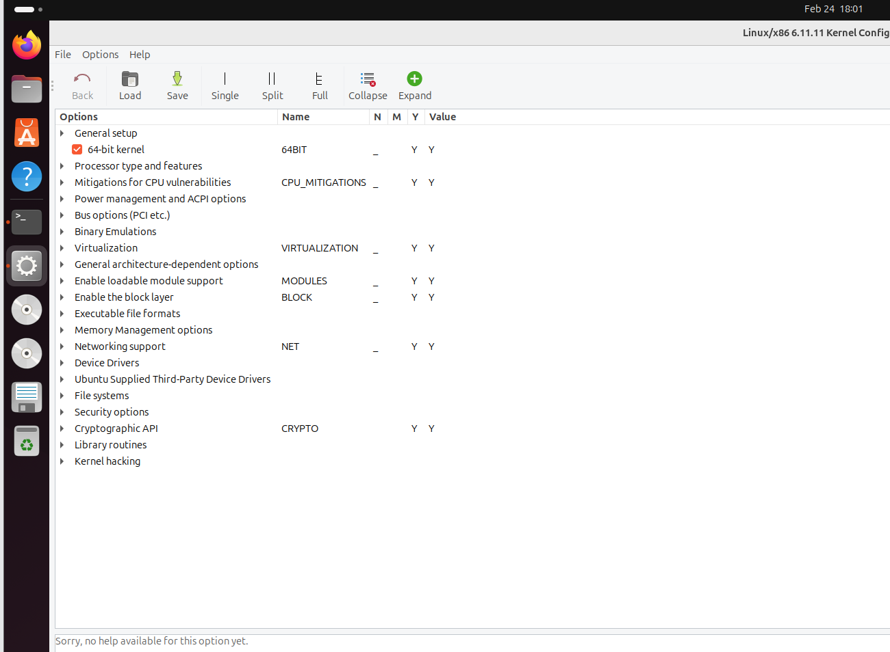

# 7.8 Создание конфигурационного  .config файла

Сначала вам нужно настроить ядро. Информация о конфигурации хранится в файле .config. В этом файле содержится более 500 параметров, например, для файловой системы, SCSI и сети. Большинство опций позволяют вам выбрать , будут ли они скомпилированы непосредственно в ядро или будут скомпилированы как модуль. Некоторые варианты просто представляют собой группу других вариантов. Например, когда вы указываете, что хотите включить поддержку SCSI, становятся доступны дополнительные опции для определенных драйверов и функций SCSI.

Некоторые опции поддержки ядра должны быть скомпилированы в виде модуля, некоторые могут быть скомпилированы только как постоянная часть ядра , а для некоторых опций вы сможете выбрать любую из этих возможностей.

Существует несколько способов настройки ядра, но независимо от того, какой из них вы используете, результаты вашего выбора всегда сохраняются в файле конфигурации ядра /usr/src/linux/.config . Это обычный текстовый файл, в котором перечислены все параметры в виде переменных оболочки.

```
#
# Automatically generated file; DO NOT EDIT.
# Linux/x86 6.11.11 Kernel Configuration
#
CONFIG_CC_VERSION_TEXT="x86_64-linux-gnu-gcc-13 (Ubuntu 13.3.0-6ubuntu2~24.04) 13.3.0"
CONFIG_CC_IS_GCC=y
CONFIG_GCC_VERSION=130300
CONFIG_CLANG_VERSION=0
CONFIG_AS_IS_GNU=y
CONFIG_AS_VERSION=24200
CONFIG_LD_IS_BFD=y
CONFIG_LD_VERSION=24200
CONFIG_LLD_VERSION=0
CONFIG_RUST_IS_AVAILABLE=y
CONFIG_CC_CAN_LINK=y
CONFIG_CC_CAN_LINK_STATIC=y
CONFIG_CC_HAS_ASM_GOTO_OUTPUT=y
CONFIG_CC_HAS_ASM_GOTO_TIED_OUTPUT=y
CONFIG_TOOLS_SUPPORT_RELR=y
CONFIG_CC_HAS_ASM_INLINE=y
CONFIG_CC_HAS_NO_PROFILE_FN_ATTR=y
CONFIG_PAHOLE_VERSION=125
CONFIG_IRQ_WORK=y
...
```

Как уже говорилось, существует несколько способов создать или изменить конфигурационный файл. Настоятельно не рекомендуется редактировать этот файл вручную. Вместо этого вам следует использовать команду make с одним из четырех подходящих целевых объектов для настройки вашего ядра.

Этими четырьмя целями являются:

* config&#x20;
* menuconfig&#x20;
* xconfig|gconfig&#x20;
* oldconfig

Эти цели будут более подробно описаны ниже.

## 7.8.1 make config

Запуск make config - это самый элементарный подход.

У этого есть явные преимущества и недостатки:

* Не зависит от возможностей полноэкранного отображения. Вы можете использовать его на очень медленных каналах связи или в системах с очень ограниченными возможностями отображения
* Вам придется проработать все возможные вопросы, касающиеся параметров ядра. Система будет задавать их последовательно и без исключений. Только после того, как вы ответите на все вопросы, вам будет разрешено сохранить файл конфигурации . Учитывая это, существует много сотен вариантов, которые нужно просмотреть, поэтому этот метод является утомительным. Поскольку вы не можете переходить от одного вопроса к другому, вам приходится все переделывать, если вы допустили ошибку.

Пример сеанса выглядит следующим образом:

```bash
pirog@pirog:/usr/src/linux-headers-6.11.0-17-generic$ sudo make config
  YACC    scripts/kconfig/parser.tab.[ch]
  HOSTCC  scripts/kconfig/lexer.lex.o
  HOSTCC  scripts/kconfig/menu.o
  HOSTCC  scripts/kconfig/parser.tab.o
  HOSTCC  scripts/kconfig/preprocess.o
  HOSTCC  scripts/kconfig/symbol.o
  HOSTCC  scripts/kconfig/util.o
  HOSTLD  scripts/kconfig/conf
*
* Linux/x86 6.11.11 Kernel Configuration
*
*
* General setup
*
Compile also drivers which will not load (COMPILE_TEST) [N/y/?] y
Compile the kernel with warnings as errors (WERROR) [N/y/?] y
Local version - append to kernel release (LOCALVERSION) [] y
Build ID Salt (BUILD_SALT) [] 
Kernel compression mode
  1. Gzip (KERNEL_GZIP)
  2. Bzip2 (KERNEL_BZIP2)
  3. LZMA (KERNEL_LZMA)
  4. XZ (KERNEL_XZ)
  5. LZO (KERNEL_LZO)
  6. LZ4 (KERNEL_LZ4)
> 7. ZSTD (KERNEL_ZSTD)
choice[1-7?]: 
Default init path (DEFAULT_INIT) [] 
Default hostname (DEFAULT_HOSTNAME) [(none)] 
Arbitrary version signature (VERSION_SIGNATURE) [Ubuntu 6.11.0-17.17~24.04.2-generic 6.11.11] 
System V IPC (SYSVIPC) [Y/n/?] 
POSIX Message Queues (POSIX_MQUEUE) [Y/n/?] 
General notification queue (WATCH_QUEUE) [Y/n/?] 
Enable process_vm_readv/writev syscalls (CROSS_MEMORY_ATTACH) [Y/n/?] 
uselib syscall (for libc5 and earlier) (USELIB) [Y/n/?] 

```

## 7.8.2 make menuconfig

Метод make menuconfig более интуитивно понятен и может использоваться в качестве альтернативы make config . Он создает оконную среду в текстовом режиме на основе библиотек ncurses. Вы можете переключаться между параметрами. Разделы представлены в виде меню, в котором легко ориентироваться, и вы можете сохранять и закрывать его, когда захотите. Если вы предпочитаете более темную цветовую гамму, используйте make config .&#x20;

Когда закончите, используйте клавиши со стрелками, чтобы выбрать опцию выхода в нижней части экрана. Если были внесены какие-либо изменения, вам будет предложено сохранить новую конфигурацию. Вы также можете сохранить конфигурацию, используя другое имя и/ или местоположение в файловой системе.


Если вы выберете другое имя или местоположение, вам необходимо переместить конфигурационный файл в каталог /usr/src/linux для компиляции ядра


<figure><figcaption></figcaption></figure>

## 7.8.3 make xconfig и make gconfig

Команда make xconfig представляет собой графическое меню для настройки ядра. Для работы требуется работающая система X Window и библиотеки разработки QT. Она предоставляет меню, по которому можно перемещаться с помощью мыши. Используйте make config, чтобы использовать Gnome вместо QT. Для этого необходимы библиотеки разработки GTK+ 2.x. Сначала мы покажем вам, как выглядит окно make xconfig верхнего уровня:

<figure><figcaption></figcaption></figure>

Как уже было сказано, команда make gconfig выполняет точно то же самое, но использует GTK вместо QT:

<figure><figcaption></figcaption></figure>

## 7.8.4 make oldconfig

make oldconfig можно использовать для сохранения параметров, выбранных вами во время более ранней сборки ядра.

Убедитесь, что конфигурационный файл, который был результатом предыдущей сборки, скопирован в /usr/src/linux/ . Когда вы запустите make oldconfig , исходный файл .config будет перемещен в .config.old и будет создан новый .config. Вам будет предложено указать ответы, которые не были найдены в предыдущем конфигурационном файле, например, когда появятся новые параметры для нового ядра.


Обязательно сделайте резервную копию файла .config перед обновлением исходного кода ядра, поскольку дистрибутив может содержать файл .config по умолчанию, который перезаписывает ваш старый файл



make xconfig , make config и make menuconfig автоматически используют старый файл .config (если он доступен) для создания нового, сохраняя как можно больше параметров и добавляя новые параметры, используя их значения по умолчанию.


