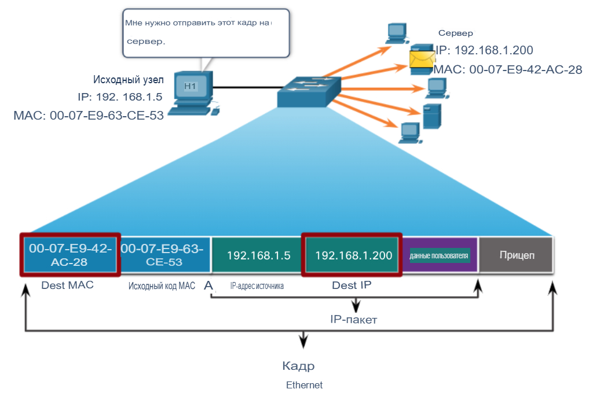

# Канальный уровень передачи данных L2

Канальный уровень отвечает за
&#x20;обмен данными между
&#x20;сетевыми интерфейсными платами конечных устройств.

Он позволяет протоколам верхнего уровня получать доступ
\
к носителям физического уровня и
&#x20;инкапсулирует пакеты уровня 3 (IPv4
&#x20;и IPv6) во фреймы уровня 2.
\

Он также выполняет обнаружение ошибок и
&#x20;отклоняет поврежденные кадры.

<figure><figcaption></figcaption></figure>

### **Подуровни канального уровня IEEE 802 LAN/MAN**

<figure><figcaption></figcaption></figure>

Стандарты IEEE 802 LAN/MAN зависят
&#x20;от типа сети (Ethernet, WLAN, WPAN и
&#x20;т.д.).

Канальный уровень передачи данных состоит из двух
&#x20;подуровней. Logical Link Control (LLC) и
&#x20;Media Access Control (MAC).

* Подуровень LLC обеспечивает взаимодействие
  &#x20;между сетевым программным обеспечением на
  &#x20;верхних уровнях и аппаратным обеспечением устройства на
  &#x20;нижних уровнях.
* Подуровень MAC отвечает за
  &#x20;инкапсуляцию данных и
  &#x20;управление доступом к мультимедиа.

**Предоставление доступа к среде передачи данных**
\
Пакеты, которыми обмениваются узлы, могут иметь множество
&#x20;уровней передачи данных и переходов между каналами передачи данных.
\

На каждом этапе прохождения маршрутизатор выполняет четыре основные
&#x20;функции уровня 2:

* Принимает кадр из сетевой среды.
* Деинкапсулирует кадр, чтобы предоставить доступ к инкапсулированному пакету.
* Повторно инкапсулирует пакет в новый кадр.
* Пересылает новый кадр на носитель следующего сегмента сети.

### **Физическая и логическая топологии**&#xD;

Топология сети - это расположение и взаимосвязь сетевых
&#x20;устройств, а также взаимосвязи между ними.
\
При описании сетей используются два типа топологий:

* Физическая топология показывает физические соединения и то, как устройства
  &#x20;связаны между собой.
* Логическая топология определяет виртуальные соединения между устройствами
  &#x20;с использованием интерфейсов устройств и схем IP-адресации.

### **WAN топологии**

Существуют три общие топологии физической глобальной сети (WAN):

* Топология "Точка-точка" - самая простая и распространенная топология глобальной сети. Состоит из
  &#x20;постоянного соединения между двумя конечными точками.
* Топология Hub и spoke похожа на топологию "звезда", в которой центральный узел
  &#x20;соединяет узлы-филиалы посредством двухточечных соединений.
* Mesh обеспечивает высокую доступность, но требует, чтобы каждая конечная система была
  &#x20;подключена к любой другой конечной системе.

### **LAN топологии**

Конечные устройства в локальных сетях обычно
&#x20;соединяются между собой с помощью топологии star или extended
&#x20;star. Топологии Star и extended star
&#x20;просты в установке, очень масштабируемы
&#x20;и легко поддаются устранению неполадок.
\
Ранние технологии Ethernet и устаревшие
&#x20;технологии Token Ring предоставляют две дополнительные
&#x20;топологии:

* Подключение к общей шине всех  конечных систем.
* Кольцо - Каждая конечная система соединена
  &#x20;со своими соответствующими соседями, образуя
  &#x20;кольцо.

<figure><figcaption></figcaption></figure>

### **Полудуплексная и полнодуплексная связь**

Полудуплексная связь
:&#x20;

* Позволяет только одному устройству одновременно отправлять или принимать данные на совместно используемом носителе.
* Используется в сетях WLAN и устаревших топологиях шин с концентраторами Ethernet.

Полнодуплексная связь:

* Позволяет обоим устройствам одновременно передавать и принимать данные на совместно используемом носителе.
* Коммутаторы Ethernet работают в полнодуплексном режиме.

### **Методы контроля доступа**

Доступ на основе конкуренции
\
Все узлы, работающие в
&#x20;полудуплексном режиме, конкурируют за использование среды передачи данных.&#x20;

Примерами являются:

* Множественный доступ Carrier sense с обнаружением коллизий (CSMA/CD), используемый в Ethernet с устаревшей
  &#x20;топологией шины.
* Множественный доступ Carrier sense с предотвращением коллизий (CSMA/CA), используемый в беспроводных сетях.
  \

Контролируемый доступ

* Детерминированный доступ, при котором каждый узел имеет свое собственное время на носителе.
* Используется в устаревших сетях, таких как Token Ring и ARCNET.

### **Contention Based Access CSMA/CD**

CSMA/CD:

* Используется в устаревших локальных сетях Ethernet.
* Работает в полудуплексном режиме, когда одновременно отправляет или принимает только одно устройство.
* Использует процесс обнаружения коллизий для определения того, когда устройство может отправлять и что
  &#x20;произойдет, если несколько устройств отправят одновременно.


\
Процесс обнаружения коллизий CSMA/CD:&#x20;

* Одновременная передача данных устройствами приведет к коллизии сигналов на совместно
  &#x20;используемом носителе.
* Устройства обнаруживают коллизию.
* Устройства ожидают случайный период времени и повторно передают данные.

### **Contention Based Access CSMA/CA**

CSMA/CA
:&#x20;

* Используется в сетях беспроводной связи стандарта IEEE 802.11.
* Работает в полудуплексном режиме, когда только одно устройство одновременно отправляет или принимает данные.
* Использует процесс предотвращения коллизий, чтобы определить, когда устройство может отправлять данные и что
  &#x20;произойдет, если несколько устройств отправят их одновременно.
  \

Процесс предотвращения коллизий CSMA/CA:

* При передаче устройства также указывают время, необходимое для
  \
  передачи.
* Другие устройства на общем носителе получают информацию о продолжительности использования и знают
  , как долго носитель будет недоступен.

### **Фрейм**

Данные инкапсулируются на канальном уровне с помощью заголовка и "концевика", образуя фрейм.
\
Фрейм канала передачи данных состоит из трех частей:

* Заголовок
* Данные
* "Концевик"

Поля заголовка и трейлера различаются в зависимости от протокола канального уровня передачи данных.
\

Объем управляющей информации, передаваемой в пределах кадра, варьируется в зависимости
&#x20;от информации управления доступом и логической топологии.

<figure><figcaption></figcaption></figure>

| Начало и конец фрейма |                                                                   |
| --------------------- | ----------------------------------------------------------------- |
| Адресация             | Адреса получателя и источника именно в таком порядке              |
| Тип                   | Протокол уровня L3                                                |
| Контроль              | Контроль потока                                                   |
| Данные                | Данные пользователя + инкапсулированные заголовки верхних уровней |
| Обнаружение ошибок    | Проверка на ошибки                                                |

<figure><figcaption></figcaption></figure>

Минимальный размер фрейма Ethernet составляет 64 байта, а максимальный - 1518 байт. Поле
&#x20;"преамбула" не используется при описании размера фрейма.

* Любой фрейм длиной менее 64 байт считается “фреймом коллизии” или “маленьким кадром”
  &#x20;и автоматически отбрасывается.&#x20;
* Кадры с объемом данных более 1500 байт считаются
  &#x20;“jumbo” или “baby giant".
* **Начало фрейма**: 7 байтов преамбулы (например, 10101010…), за которыми следует один байт "SFD" (Start Frame Delimiter), который равен 10101011.
* **Конец фрейма**: Последовательность FCS в 4 байта, которая позволяет проверять целостность данных фрейма.

Типичные метки в поле type для фрейма Ethernet:

1. **0x0800** - IPv4 (Internet Protocol version 4)
2. **0x86DD** - IPv6 (Internet Protocol version 6)
3. **0x0806** - ARP (Address Resolution Protocol)

### **MAC-адрес Ethernet**&#xD;

В локальной сети Ethernet каждое сетевое устройство подключено к одному и тому же совместно используемому носителю. MAC
&#x20;-адресация обеспечивает метод идентификации устройства на канальном уровне модели OSI

* MAC-адрес Ethernet - это 48-битный адрес, выраженный с помощью 12 шестнадцатеричных цифр.
* Поскольку байт равен 8 битам, мы также можем сказать, что длина MAC-адреса составляет 6 байт.
*
  MAC-адрес Ethernet состоит из 6 шестнадцатеричных кодов OUI поставщика, за которыми следует 6
  &#x20;шестнадцатеричных значений, присвоенных поставщику.

<figure><figcaption></figcaption></figure>

### **Процесс передачи Ethernet-фрейма**

**Передача**:

1. **Формирование данных**: Устройство, инициирующее передачу данных (например, компьютер), формирует Ethernet-фрейм, который включает в себя MAC-адрес источника, MAC-адрес назначения и полезную нагрузку (данные).
2. **Определение адреса назначения**: Устройство определяет, какой тип адреса использовать (unicast, multicast или broadcast) в зависимости от того, кому оно направляет данные.
3. **Отправка фрейма**: Устройство передает фрейм через сетевой интерфейс. Фрейм проходит вниз по стеку протоколов, достигая канального уровня, где данные инкапсулируются в Ethernet-фрейм.
4. **Передача по сети**: Когда фрейм отправляется по Ethernet, он может пройти через различные коммутаторы и маршрутизаторы, которые анализируют MAC-адрес назначения и принимают решение о том, куда отправить фрейм дальше.

**Прием**:

1. **Получение фрейма**: Когда Ethernet-фрейм достигает устройства, оно проверяет и обрабатывает входящий сигнал через сетевой интерфейс.
2. **Анализ адреса**: Устройство смотрит на MAC-адрес назначения в фрейме:
   * Если это unicast-адрес и совпадает с MAC-адресом устройства, фрейм будет обработан.
   * Если это multicast-адрес и устройство подписано на этот адрес, фрейм будет обработан.
   * Если это broadcast-адрес, устройство также обработает фрейм, так как он предназначен для всех устройств в сети.
3. **Передача на верхние уровни**: После обработки фрейма устройство передает данные вверх по стеку протоколов для дальнейшей обработки (например, для передачи на уровень IP и выше).

#### **Как работает CRC?**

1. **Передающая сторона** вычисляет **контрольную сумму** (CRC) для блока данных (например, Ethernet-фрейма).
2. **Добавляет эту сумму в конец кадра** (в поле **FCS, Frame Check Sequence**).
3. **Принимающая сторона** заново вычисляет CRC и сравнивает с полученным значением:
   * Если **совпадает** → кадр считается исправным.
   * Если **не совпадает** → кадр отбрасывается как поврежденный.

<figure><figcaption></figcaption></figure>

**Unicast MAC-адрес**: Это уникальный адрес, который предназначен для одного конкретного устройства в сети.&#x20;

Процесс, который исходный хост использует для
&#x20;определения MAC-адреса назначения
, связанного с IPv4-адресом, известен
&#x20;как протокол разрешения адресов (ARP).
&#x20;Процесс, который исходный узел использует для
&#x20;определения MAC-адреса назначения
, связанного с IPv6-адресом
, называется обнаружением соседей (Neighbor Discovery,ND).

<figure><figcaption></figcaption></figure>

**Multicast MAC-адрес**: Это адрес, который используется для отправки данных группе устройств. Устройства, которые хотят получать мультикаст-трафик, подписываются на определенный мультикаст-адрес.

* Существует MAC-адрес назначения, равный 01005E, когда
  \
  инкапсулированные данные представляют собой многоадресный пакет IPv4, и
  &#x20;MAC-адрес назначения, равный 3333, когда инкапсулированные
  \
  данные представляют собой многоадресный пакет IPv6.
* Существуют и другие зарезервированные MAC
  &#x20; -адреса назначения многоадресной рассылки, если инкапсулированные данные не являются IP-адресами, например
  (STP).
* Все порты коммутатора Ethernet, кроме входящего
  &#x20;порта, будут расфлуживать пакет, если только коммутатор не настроен на отслеживание многоадресной рассылки. Он
  &#x20;не пересылается маршрутизатором, если только маршрутизатор не настроен на
  &#x20;маршрутизацию многоадресных пакетов.
* Поскольку адреса многоадресной рассылки представляют собой группу адресов
  &#x20;(иногда называемую группой узлов), они могут использоваться только в качестве
  &#x20;места назначения пакета. Источником всегда будет unicast адрес.
* Как и в случае с одноадресными и широковещательными адресами, для многоадресного IP
  -адреса требуется соответствующий многоадресный MAC-адрес.

<figure><figcaption></figcaption></figure>

**Broadcast MAC-адрес**: Это специальный адрес (FF:FF:FF:FF:FF:FF), который отправляет данные всем устройствам в локальной сети. Когда устройство отправляет фрейм на этот адрес, все устройства в сети получают его.

* Он передается через все порты коммутатора Ethernet, за исключением
  \
  входящего порта. Маршрутизатор не перенаправляет его
  .
* Если инкапсулированные данные представляют собой широковещательный
  &#x20;пакет IPv4, это означает, что пакет содержит
  &#x20;адрес назначения IPv4, который содержит все единицы (1)
  &#x20;в основной части. Эта нумерация в
  &#x20;адресе означает, что все хосты в этой локальной
  &#x20;сети (широковещательный домен) получат и
  &#x20;обработают пакет.

<figure><figcaption></figcaption></figure>

###
