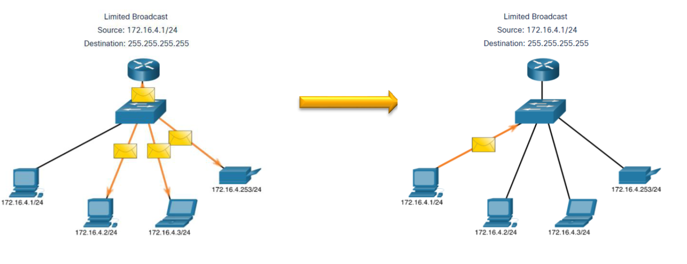
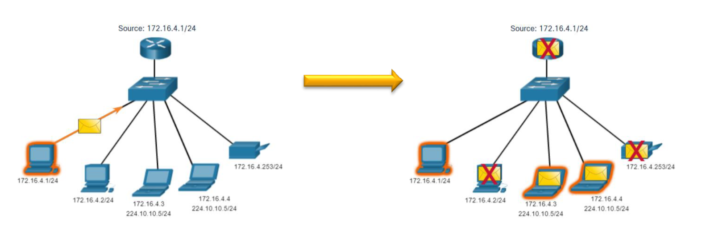
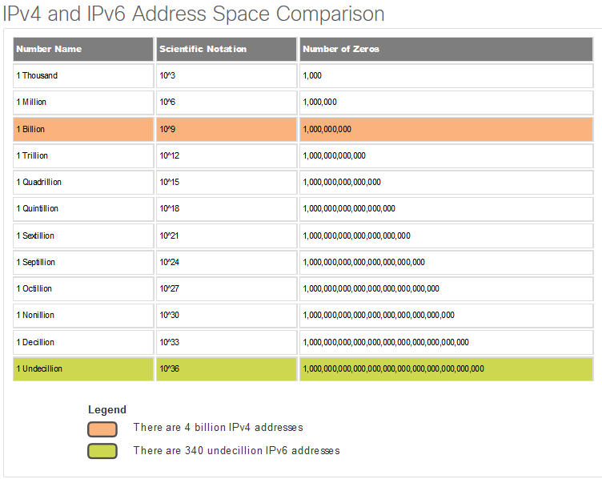

# Сетевой уровень L3

## **Сетевой уровень**

\
Предоставляет сервисы, позволяющие конечным устройствам обмениваться данными\
\
Основными протоколами связи сетевого уровня являются протоколы IP версии 4 (IPv4) и IP версии 6 (IPv6)

\
Сетевой уровень выполняет четыре основные операции:

* Адресация конечных устройств
* Инкапсуляция
* Маршрутизация
* Деинкапсуляция

<figure><figcaption></figcaption></figure>

<figure><figcaption></figcaption></figure>

## **Инкапсуляция IP**

<figure><figcaption></figcaption></figure>

IP-адрес инкапсулирует сегмент транспортного уровня

* IP-адрес может использовать либо IPv4, либо IPv6 пакет и не влиять на сегмент уровня 4.
* IP-пакет будет проверяться всеми устройствами уровня 3 по мере его прохождения по сети.
* IP-адресация не меняется от источника к получателю

## **Характеристики IP**

IP-адрес предназначен для использования с низкими накладными расходами и может быть описан как:

* Не требующий установки соединения(connectionless)
* Принцип максимальных усилий (best effort)
* Не зависящий от среды передачи

**Без установления соединения**\
IP-адрес не поддерживает соединение

* IP-адрес не устанавливает соединение с адресатом перед отправкой пакета.
* Управляющая информация (синхронизация, подтверждения и т.д.) не требуется.
* Получатель получит пакет, когда он прибудет, но предварительные уведомления по IP-адресу не отправляются.
* Если есть необходимость в трафике, ориентированном на подключение, то этим займется другой протокол (обычно TCP на транспортном уровне).

<figure><figcaption></figcaption></figure>

### **Best effort**

#### **Принцип Best Effort в IP-сетях**

**Best Effort** ("максимальное старание") — это фундаментальный принцип работы IP-сетей (особенно в IPv4), согласно которому сеть старается доставить пакеты адресату, **но не гарантирует**:

* Доставку пакетов,
* Порядок доставки,
* Отсутствие дублирования,
* Контроль перегрузок.

Это минималистичный подход, лежащий в основе стека TCP/IP.

<figure><figcaption></figcaption></figure>

## **Media Independence**

**Media Independence** (независимость от среды передачи) — это фундаментальный принцип стека TCP/IP, означающий, что протокол **IP** может работать поверх **любой физической или канальной технологии** (Ethernet, Wi-Fi, DSL, оптоволокно и даже голубиная почта\*), не требуя изменений в своей логике.

| Физическая среда           | Как передаётся IP?                                    |
| -------------------------- | ----------------------------------------------------- |
| **Ethernet (провода)**     | Инкапсуляция в кадры Ethernet (тип 0x0800 для IPv4).  |
| **Wi-Fi (беспроводной)**   | Аналогично Ethernet, но с добавлением радиомодуляции. |
| **DSL (телефонные линии)** | PPPoE (PPP over Ethernet) → затем IP.                 |
| **Сотовые сети (4G/5G)**   | GTP (GPRS Tunneling Protocol) поверх UDP/IP.          |
| **Оптоволокно (OTN)**      | Инкапсуляция в SONET/SDH кад                          |

Независимо от среды, IP-пакет имеет одинаковую структуру:

```
+---------------------+
| IP-заголовок (20+ байт) |
+---------------------+
| Данные (до 65 515 байт) |
+---------------------+
```

<figure><figcaption></figcaption></figure>

#### **Поля заголовка пакета IPv4**

<figure><figcaption></figcaption></figure>

| Поле                    | Размер (бит) | Описание                                                                                                                                              |
| ----------------------- | ------------ | ----------------------------------------------------------------------------------------------------------------------------------------------------- |
| **Version**             | 4            | Версия IP (`4`  0100 Для IPv4).                                                                                                                       |
| **IHL**                 | 4            | Длина заголовка (Internet Header Length) в 32-битных словах. Обычно `5` (20 байт).                                                                    |
| **Type of Service**     | 8            | Приоритет и тип трафика (QoS). Сейчас заменено на **DSCP** (Differentiated Services Code Point).                                                      |
| **Total Length**        | 16           | Общая длина пакета (заголовок + данные), максимум 65 535 байт.                                                                                        |
| **Identification**      | 16           | Уникальный ID пакета для сборки фрагментов.                                                                                                           |
| **Flags**               | 3            | <p>Управление фрагментацией:<br>• <code>0</code> — зарезервировано,<br>• <code>DF</code> (Don’t Fragment),<br>• <code>MF</code> (More Fragments).</p> |
| **Fragment Offset**     | 13           | Смещение фрагмента в исходном пакете (в 8-байтных блоках).                                                                                            |
| **Time to Live**        | 8            | TTL — максимальное число хопов перед отбрасыванием. Уменьшается на 1 при каждом переходе.                                                             |
| **Protocol**            | 8            | <p>Протокол верхнего уровня:<br>• <code>6</code> = TCP,<br>• <code>17</code> = UDP,<br>• <code>1</code> = ICMP.</p>                                   |
| **Header Checksum**     | 16           | Контрольная сумма заголовка (пересчитывается на каждом маршрутизаторе).                                                                               |
| **Source Address**      | 32           | IP-адрес отправителя.                                                                                                                                 |
| **Destination Address** | 32           | IP-адрес получателя.                                                                                                                                  |

**Options** (макс. 40 байт):\
Редко используется. Примеры:

* `Record Route` — запись маршрута,
* `Timestamp` — отметки времени,
* `Security` (устарело).

## **Адресация IPv4**

### **Структура IPv4-адреса**

IPv4-адрес (32 бита) состоит из двух частей:

* **Сетевая часть** (префикс) — определяет подсеть.
* **Хостовая часть** — идентифицирует устройство в подсети.

<figure><figcaption></figcaption></figure>

### **Маска подсети и длина префикса**

Маска подсети используется для отделения сетевой и хостовой части.

Чтобы идентифицировать сетевую и хостинговую части IPv4-адреса, маска подсети сравнивается с адресом IPv4 побитно, слева направо.\
.png>)

#### **Формы записи маски:**

1. **Точечно-десятичная нотация**:\
   `255.255.255.0` (24 бита сети).
2. **Длина префикса (CIDR)**:

`/24` (эквивалентно `255.255.255.0`).

Операция **логического И** (`AND`) выполняется побитово между IPv4-адресом и маской подсети:

* `1 AND 1 = 1`
* `1 AND 0 = 0`
* `0 AND 1 = 0`
* `0 AND 0 = 0`

### **Пошаговый процесс ANDing**

#### **Дано:**

* IPv4-адрес: `192.168.1.100`
* Маска подсети: `255.255.255.0` (`/24`)

#### **Шаг 1: Перевести в двоичный вид**

| Компонент     | Десятичный формат | Двоичный формат                       |
| ------------- | ----------------- | ------------------------------------- |
| IPv4-адрес    | `192.168.1.100`   | `11000000.10101000.00000001.01100100` |
| Маска подсети | `255.255.255.0`   | `11111111.11111111.11111111.00000000` |

#### **Вычислить адрес сети (ANDing)**

Применяем логическое **И** (AND) между IPv4 и маской:


```
IPv4:   11000000.10101000.00000001.01100100
Маска:  11111111.11111111.11111111.00000000
        ----------------------------------- (AND)
Сеть:   11000000.10101000.00000001.00000000 → 192.168.1.0
```

**Адрес сети** = `192.168.1.0`.

***

#### **Определить хостовую часть**

Инвертируем маску (`NOT`), затем применяем `AND` к IPv4:

Copy

```
Инвертированная маска: 00000000.00000000.00000000.11111111
IPv4:                 11000000.10101000.00000001.01100100
                       ----------------------------------- (AND)
Хостовая часть:       00000000.00000000.00000000.01100100 → 0.0.0.100
```

**Хостовая часть** = `.100`.

***

**Найти broadcast-адрес**

Заменяем **все биты хостовой части** на `1`:

```
Адрес сети:   11000000.10101000.00000001.00000000 (192.168.1.0)
Broadcast:    11000000.10101000.00000001.11111111 → 192.168.1.255
```

**Broadcast-адрес** = `192.168.1.255`.


**Unicast**


**Unicast** - это отправка пакета на один IP-адрес получателя.
\

\


<figure><figcaption></figcaption></figure>

## Broadcast

* **Адрес назначения**:
  * **Направленный broadcast**: `X.Y.Z.255` для подсети `/24` (например, `192.168.1.255`).
  * **Ограниченный broadcast**: `255.255.255.255` (доставляется только в пределах локального сегмента сети, не маршрутизируется).
* **Как работает**:\
  Пакет отправляется **всем устройствам в указанной подсети**. Маршрутизаторы по умолчанию блокируют такие пакеты (если не настроено перенаправление).

<figure><figcaption></figcaption></figure>

## **Multicast**

* **Адрес назначения**:\
  Диапазон `224.0.0.0` – `239.255.255.255`. Примеры:
  * `224.0.0.1` — все хосты в локальной сети.
  * `239.255.255.250` — SSDP (UPnP).
* **Как работает**:\
  Пакет отправляется **только устройствам, подписанным на multicast-группу**. Маршрутизаторы с поддержкой IGMP перенаправляют трафик.

<figure><figcaption></figcaption></figure>

#### **Сравнение Broadcast и Multicast**

| Параметр          | Broadcast (`X.Y.Z.255`)         | Multicast (`224.0.0.0/4`)     |
| ----------------- | ------------------------------- | ----------------------------- |
| **Охват**         | Вся подсеть                     | Только подписанные устройства |
| **Маршрутизация** | Обычно блокируется              | Поддерживается (IGMP/PIM)     |
| **Нагрузка**      | Высокая (все узлы обрабатывают) | Низкая (только подписчики)    |
| **Примеры**       | ARP, DHCP                       | IPTV, видеоконференции        |

## **Частные (Private) и Публичные (Public) IP-адреса**

### **Публичные IP-адреса**

**Назначение:**\
Используются для устройств, доступных в глобальном интернете.

**Особенности:**

* Уникальны во всем мире.
* Назначаются провайдерами (ISP) или региональными интернет-регистраторами (RIPE, ARIN).
* Примеры:
  * `8.8.8.8` (Google DNS),
  * `93.184.216.34` (example.com).

**Проблемы:**

* Ограниченное количество IPv4-адресов (4.3 млрд), что привело к переходу на IPv6 и внедрению NAT.

***

### **Частные IP-адреса**

**Назначение:**\
Для локальных сетей (LAN), не маршрутизируются в интернете.

**Диапазоны (RFC 1918):**

| Диапазон                          | Маска | Пример        | Количество адресов |
| --------------------------------- | ----- | ------------- | ------------------ |
| **10.0.0.0 – 10.255.255.255**     | `/8`  | `10.1.2.3`    | 16.7 млн           |
| **172.16.0.0 – 172.31.255.255**   | `/12` | `172.16.0.1`  | 1.05 млн           |
| **192.168.0.0 – 192.168.255.255** | `/16` | `192.168.1.1` | 65 536             |

**Применение:**

* Домашние роутеры (`192.168.1.1`),
* Корпоративные сети (`10.0.0.0/8`),
* Виртуальные машины и Docker.

***

### **Классы IP-адресов (устаревшая система)**

Исторически IPv4 делился на классы (A, B, C, D, E), но эта система **устарела** из-за CIDR (Classless Inter-Domain Routing).

| Класс | Диапазон                      | Маска по умолчанию | Примечание                          |
| ----- | ----------------------------- | ------------------ | ----------------------------------- |
| **A** | `1.0.0.0 – 126.255.255.255`   | `/8`               | Для крупных организаций (IBM, MIT). |
| **B** | `128.0.0.0 – 191.255.255.255` | `/16`              | Средние сети (университеты).        |
| **C** | `192.0.0.0 – 223.255.255.255` | `/24`              | Малые сети (домашние LAN).          |
| **D** | `224.0.0.0 – 239.255.255.255` | —                  | Multicast (видеотрансляции).        |
| **E** | `240.0.0.0 – 255.255.255.255` | —                  | Зарезервировано (эксперименты).     |

**Почему классы устарели?**

* Неэффективное использование адресов (например, класс A давал 16 млн адресов, даже если нужно 1000).
* Заменены на **CIDR** (гибкие маски, например, `/28` или `/19`).

### **NAT (Network Address Translation)**

Позволяет множеству устройств с частными IP использовать один публичный IP для выхода в интернет.

**Типы NAT:**

| Тип                    | Описание                                              | Пример использования     |
| ---------------------- | ----------------------------------------------------- | ------------------------ |
| **Static NAT**         | 1 частный IP → 1 публичный IP.                        | Сервер в локальной сети. |
| **Dynamic NAT**        | Пулы частных IP → пулы публичных IP.                  | Корпоративные сети.      |
| **PAT (NAT Overload)** | Множество частных IP → 1 публичный IP + разные порты. | Домашние роутеры.        |

#### **Таблица зарезервированных IPv4-адресов**

В IPv4 существуют специальные диапазоны адресов, которые **не используются для публичной маршрутизации** и имеют особое назначение. Вот полная структурированная таблица:

***

#### **Localhost (Loopback)**

| Диапазон/Адрес  | Назначение                     | Пример использования                |
| --------------- | ------------------------------ | ----------------------------------- |
| **127.0.0.0/8** | Тестирование сетевого стека    | `ping 127.0.0.1`                    |
| **127.0.0.1**   | Локальный интерфейс (loopback) | Веб-сервер на `http://127.0.0.1:80` |

***

#### **Частные сети (RFC 1918)**

| Диапазон           | Маска       | Количество адресов | Пример использования             |
| ------------------ | ----------- | ------------------ | -------------------------------- |
| **10.0.0.0/8**     | 255.0.0.0   | 16.7 млн           | Крупные корпоративные сети       |
| **172.16.0.0/12**  | 255.240.0.0 | 1.05 млн           | Средние сети (VPN, офисы)        |
| **192.168.0.0/16** | 255.255.0.0 | 65 536             | Домашние роутеры (`192.168.1.1`) |

***

#### **Автоконфигурация (APIPA)**

| Диапазон           | Назначение                               | Пример сценария                        |
| ------------------ | ---------------------------------------- | -------------------------------------- |
| **169.254.0.0/16** | Автоматический IP при недоступности DHCP | Windows: `169.254.x.x` при ошибке сети |

***

#### **Multicast (Групповая рассылка)**

| Диапазон/Адрес      | Назначение                                    | Пример протокола              |
| ------------------- | --------------------------------------------- | ----------------------------- |
| **224.0.0.0/4**     | Multicast-трафик (видео, сервисные сообщения) |                               |
| **224.0.0.1**       | Все хосты в локальной сети                    | `ping 224.0.0.1`              |
| **224.0.0.2**       | Все маршрутизаторы                            | OSPF, RIP                     |
| **239.255.255.250** | SSDP (UPnP)                                   | Обнаружение сетевых устройств |

***

#### **Служебные и документационные**

| Диапазон/Адрес      | Назначение                                  | Пример использования                |
| ------------------- | ------------------------------------------- | ----------------------------------- |
| **0.0.0.0**         | "Любой адрес" (default route, DHCP-запросы) | `0.0.0.0/0` в таблице маршрутизации |
| **192.0.2.0/24**    | Документация (TEST-NET-1)                   | Примеры в мануалах (`192.0.2.1`)    |
| **198.51.100.0/24** | Документация (TEST-NET-2)                   |                                     |
| **203.0.113.0/24**  | Документация (TEST-NET-3)                   |                                     |

***

#### **Широковещательные (Broadcast)**

| Адрес               | Назначение                                 | Пример                    |
| ------------------- | ------------------------------------------ | ------------------------- |
| **255.255.255.255** | Ограниченный broadcast (только в LAN)      | ARP-запросы               |
| **<сеть>.255**      | Направленный broadcast (для своей подсети) | `192.168.1.255` для `/24` |

***

#### **Зарезервировано IANA**

| Диапазон          | Назначение                                 |
| ----------------- | ------------------------------------------ |
| **240.0.0.0/4**   | Зарезервировано для будущего использования |
| **100.64.0.0/10** | CGNAT (Carrier-Grade NAT)                  |

## **Широковещательные домены и сегментация**

* Многие протоколы используют широковещательную или многоадресную рассылку (например, пользователи приложений передают широковещательные сообщения для определения местоположения\
  других устройств, хосты отправляют широковещательные сообщения DHCP discover для определения местоположения DHCP-сервера.)
* Коммутаторы распространяют широковещательные сообщения по всем интерфейсам, кроме интерфейса, на котором они были получены.

**Избыточный трафик**:

* Каждый broadcast (например, ARP-запрос) обрабатывается **всеми устройствами**, даже если он им не нужен.
* Это снижает производительность сети.

**Уязвимость к штормам**:

* Ошибки в сети (например, broadcast-петли) могут вызвать **шторм пакетов**, полностью парализующий сеть.

**Проблемы безопасности**:

* Злоумышленник может анализировать broadcast-трафик (например, ARP-таблицы).

#### **Методы сегментации**

| Метод                       | Уровень OSI | Как работает                                    | Пример                                            |
| --------------------------- | ----------- | ----------------------------------------------- | ------------------------------------------------- |
| **Маршрутизаторы (Router)** | L3          | Разделяет широковещательные домены.             | Две подсети: `192.168.1.0/24` и `192.168.2.0/24`. |
| **VLAN (Virtual LAN)**      | L2          | Логически делит коммутатор на независимые сети. | VLAN 10 (отдел продаж) и VLAN 20 (бухгалтерия).   |
| **Туннели (GRE, VXLAN)**    | L2/L3       | Объединяет удалённые сегменты через интернет.   | Ветка офиса в другом городе.                      |
| **Физическое разделение**   | L1          | Разные коммутаторы для разных сетей.            | Серверная сеть и офисная сеть.                    |

## **VLSM (Variable Length Subnet Mask)**

**VLSM (Variable Length Subnet Mask)** — технология, позволяющая делить IP-пространство на подсети **разного размера**, что повышает эффективность использования адресов.

#### **Ключевые особенности:**

* Позволяет создавать подсети с масками разной длины (например, `/26`, `/28`, `/30`).
* Решает проблему **неэффективного распределения адресов** при использовании фиксированных масок (как в классической схеме классов A/B/C).
* Широко применяется в современных сетях вместе с **бесклассовой маршрутизацией (CIDR)**.

<figure><figcaption></figcaption></figure>

## **Пример разбиения сети с VLSM**

Рассмотрим сеть **192.168.1.0/24** и разобьем ее на подсети для:

1. Отдела продаж (60 хостов)
2. IT-отдела (30 хостов)
3. P2P-линка (2 хоста)

***

**Исходная сеть: 192.168.1.0/24**

**Двоичный вид:**

```
11000000.10101000.00000001. 00000000  /24
\_________________________/ \______/
       Сетевая часть        Хостовая часть
```

* Доступно 256 адресов (8 бит хостовой части).
* Нужно выделить подсети **разного размера**, сохранив непрерывность.

***

**Шаг 1: Выделение подсети для 60 хостов (продажи)**

**Требования:**

* Нужно **60 хостов**.
* Формула: `2ⁿ – 2 ≥ 60` → ближайшее `n = 6` (62 хоста).
* Новая маска: `/26` (заимствуем 2 бита из хостовой части).

**Расчет:**

```
Исходная сеть:  11000000.10101000.00000001. 00000000  /24
Новая маска:    11111111.11111111.11111111. 11000000  /26
                   (26 бит сети)          (6 бит хостов)
```

**Подсеть 1:**

```
Сеть:      11000000.10101000.00000001. 00 000000  /26 (192.168.1.0/26)
Broadcast: 11000000.10101000.00000001. 00 111111  /26 (192.168.1.63)
Доступные адреса: 192.168.1.1 – 192.168.1.62 (62 хоста).
```

***

**Шаг 2: Выделение подсети для 30 хостов (IT)**

**Требования:**

* Нужно **30 хостов**.
* Формула: `2ⁿ – 2 ≥ 30` → `n = 5` (30 хостов).
* Маска: `/27` .

**Следующая свободная подсеть:**


```
Начало:    11000000.10101000.00000001. 01 000000   (192.168.1.64)
```

**Расчет:**

```
Маска:     11111111.11111111.11111111. 111 00000  /27 (27 бит сети)
Подсеть 2: 11000000.10101000.00000001. 010 00000  /27 (192.168.1.64/27)
Broadcast: 11000000.10101000.00000001. 010 11111  /27 (192.168.1.95)
Доступные адреса: 192.168.1.65 – 192.168.1.94 (30 хостов).
```

***

**Шаг 3: Выделение подсети для P2P-линка (2 хоста)**

**Требования:**

* Нужно **2 хоста** (маршрутизаторы).
* Формула: `2ⁿ – 2 ≥ 2` → `n = 2` (2 хоста).
* Маска: `/30`.

**Следующая свободная подсеть:**

Copy

```
Начало:    11000000.10101000.00000001. 011 00000 (192.168.1.96)
```

**Расчет:**

```
Маска:     11111111.11111111.11111111. 111111 00  /30 (30 бит сети)
Подсеть 3: 11000000.10101000.00000001. 011000 00  /30 (192.168.1.96/30)
Broadcast: 11000000.10101000.00000001. 011000 11  /30 (192.168.1.99)
Доступные адреса: 192.168.1.97 – 192.168.1.98 (2 хоста).
```

**Остаток адресного пространства**

**Неиспользованный диапазон:**

```
Начало:    11000000.10101000.00000001. 011001 00  /30 (192.168.1.100)
Конец:     11000000.10101000.00000001. 11111111  /24 (192.168.1.255)
```

Можно использовать для будущих подсетей (например, `/28` для Wi-Fi гостей).

## **IPv6**&#x20;

У IPv4 есть три основных ограничения:

* Нехватка адресов IPv4 У нас практически закончилась адресация IPv4.
* Отсутствие сквозного подключения, чтобы IPv4 продержался так долго, были созданы частная адресация и
  &#x20;NAT. Это привело к прекращению прямой связи с публичной адресацией.
* Повышенная сложность сети NAT была задумана как временное решение и создает
  &#x20;проблемы в сети как побочный эффект манипулирования адресацией сетевых заголовков.
  &#x20;NAT вызывает задержки и проблемы с устранением неполадок.

**Обзор IPv6**


Протокол IPv6 был разработан компанией Internet
&#x20;Engineering Task Force (IETF).

Протокол IPv6 преодолевает ограничения, присущие протоколу IPv4.
\

\
Усовершенствования, которые обеспечивает протокол IPv6:

* Увеличенное адресное пространство на основе
  &#x20;128-битного адреса, а не 32-битного
* Улучшенная обработка пакетов
  , упрощенный заголовок с меньшим количеством полей
* Отпадает необходимость в NAT, поскольку
  &#x20;существует огромное количество адресаций,
  &#x20;нет необходимости использовать
  &#x20;внутреннюю частную адресацию и сопоставлять ее с
  &#x20;общим публичным адресом

<figure><figcaption></figcaption></figure>

## **Заголовок IPv6**

<figure><figcaption></figcaption></figure>

Заголовок IPv6 упрощен,
&#x20;но не уменьшен в размерах.
\

\
Длина заголовка составляет 40 байт
&#x20;или октетов.


Некоторые поля IPv4 были удалены
&#x20;для повышения производительности:

* Флаг
* Смещение фрагмента
* Контрольная сумма заголовка

| Поле                                         | Размер (биты) | Описание                                                                                                                     |
| -------------------------------------------- | ------------- | ---------------------------------------------------------------------------------------------------------------------------- |
| **Version (Версия)**                         | 4             | Версия протокола IP (для IPv6 значение **6 >** 0110)                                                                         |
| **Traffic Class (Класс трафика)**            | 8             | Определяет приоритет трафика (аналогично полю **ToS в IPv4**).                                                               |
| **Flow Label (Метка потока)**                | 20            | Используется для идентификации потоков данных с одинаковыми требованиями QoS.                                                |
| **Payload Length (Длина полезной нагрузки)** | 16            | Размер данных после заголовка IPv6 (в байтах). Макс. значение: **65535**. Если больше, используется расширенный заголовок.   |
| **Next Header (Следующий заголовок)**        | 8             | Указывает тип следующего заголовка (например, **6 = TCP, 17 = UDP, 58 = ICMPv6**). Может указывать на расширенный заголовок. |
| **Hop Limit (Предел переадресации)**         | 8             | Аналог **TTL в IPv4**. Уменьшается на 1 при прохождении каждого маршрутизатора. При достижении 0 пакет отбрасывается.        |
| **Source Address (Адрес отправителя)**       | 128           | IPv6-адрес источника.                                                                                                        |
| **Destination Address (Адрес получателя)**   | 128           | IPv6-адрес назначения.                                                                                                       |

## **IPv6 адресация**

Зачем  IPv6?

* В IPv4 заканчиваются адреса. IPv6
  &#x20;является преемником IPv4. Адресное пространство IPv6 значительно
  &#x20;больше, оно составляет 128 бит.
*
  Разработка IPv6 также включала
  &#x20;исправления ограничений IPv4 и другие
  &#x20;усовершенствования.
* В связи с ростом числа пользователей Интернета,
  &#x20;ограниченным адресным пространством IPv4, проблемами
  &#x20;с NAT и IoT
  &#x20;пришло время начать переход на IPv6.

## **Сосуществование IPv4 и IPv6**

В ближайшем будущем IPv4 и IPv6 будут сосуществовать, и переход займет несколько
&#x20;лет.
\
IETF разработала различные протоколы и инструменты, которые помогут сетевым администраторам
&#x20;перенести свои сети на IPv6. Эти методы миграции можно разделить на три
&#x20;категории:
\
•
\
**Двойной стек Dual stack**. Устройства используют оба стека протоколов IPv4 и IPv6 одновременно.

* Туннелирование - это метод передачи пакета IPv6 по сети IPv4. Пакет IPv6 инкапсулируется
  внутри пакета IPv4.
* Преобразование сетевых адресов 64 (NAT64) (идёт совместно с DNS64)позволяет устройствам с поддержкой IPv6 получать
  &#x20;обменивайтесь данными с устройствами с поддержкой IPv4, используя метод трансляции, аналогичный NAT для
  &#x20;IPv4.


Туннелирование и трансляция предназначены для перехода на собственный IPv6 и должны использоваться только там, где
&#x20;это необходимо. Целью должна быть передача данных по стандарту IPv6 от источника к получателю.


**Форматы IPv6-адресации**


* Адреса IPv6 имеют длину 128 бит и записываются в шестнадцатеричном формате.
* Адреса IPv6 не чувствительны к регистру и могут быть записаны как строчными, так и
  &#x20;прописными буквами.
* Предпочтительным форматом для записи IPv6-адреса является x:x:x:x:x:x:x:x где каждое “x”
  &#x20;состоит из четырех шестнадцатеричных значений.
* В IPv6 гекстет - это неофициальный термин, используемый для обозначения сегмента из 16 бит или четырех
  &#x20;шестнадцатеричных значений.
* Пример IPv6-адреса в предпочтительном формате: 2001:0db8:0000:0000:0000:8a2e:0370:7334


\


## **Сокращение IPv6-адресов: двойное двоеточие (`::`) и пропуск ведущих нулей**

В IPv6-адресах **допускается сокращение** для удобства записи. Основные правила:

&#x20;**Пропуск ведущих нулей в каждом блоке (сегменте из 4 hex-символов)**

Каждый блок `0000`–`ffff` можно сокращать, убирая ведущие нули.

**Пример:**\
Полный адрес: `2001:0db8:0000:0000:0000:8a2e:0370:7334`\
&#x20;Сокращённый: `2001:db8:0:0:0:8a2e:370:7334`\
(Убраны ведущие `0` в `0db8`, `0370` и т.д.)

***

**Замена последовательности из одного или нескольких блоков на `::`**

Можно **один раз** в адресе заменить **подряд идущие нулевые блоки** на `::`.

**Примеры:**\
Полный адрес: `2001:0db8:0000:0000:0000:8a2e:0370:7334`\
Сокращение:

* `2001:db8::8a2e:370:7334` (лучший вариант)
* `2001:db8:0:0:0:8a2e:370:7334` (только пропуск нулей, без `::`)

Loopback (`::1`):

* Полный: `0000:0000:0000:0000:0000:0000:0000:0001`
* Сокращённый: `::1`

Неопределённый адрес (`::`):

* Полный: `0000:0000:0000:0000:0000:0000:0000:0000`
* Сокращённый: `::`

***

* ❌ Неправильно: `2001::db8::1`
* ✅ Правильно: `2001:db8::1`

**Двойное двоеточие (`::`) можно использовать только один раз в адресе.**

* ❌ Неправильно: `2001::db8::1`
* ✅ Правильно: `2001:db8::1`

**Если есть несколько последовательностей нулей, заменяется самая длинная.**

* Адрес: `2001:0db8:0000:0000:1234:0000:0000:5678`
* Сокращение: `2001:db8::1234:0:0:5678` (лучше)
* Или: `2001:db8:0:0:1234::5678` (тоже правильно, но менее предпочтительно)

**Сокращение `::` можно использовать и для одного нулевого блока, но это не всегда имеет смысл.**

* `2001:db8:0:8a2e::1` – допустимо, но лучше `2001:db8:0:8a2e:0:0:0:1`.

## **Типы IPv6 адресов**

Unicast, Multicast, Anycast
\
Существуют три основные категории IPv6-адресов:

* Unicast однозначно идентифицирует интерфейс устройства с поддержкой IPv6.
* Multicast используется для отправки одного пакета IPv6 нескольким адресатам.
  \
  •
  \
  Anycast - **технически тот же Unicast-адрес**, но назначенный **нескольким устройствам**.
  * Маршрутизатор доставляет пакет **ближайшему** узлу с этим адресом (по метрике маршрутизации).
  * Примеры использования:
    * DNS-серверы (`2001:4860:4860::8888` – Google DNS, может быть Anycast).
    * CDN-узлы для ускорения доставки контента.


В отличие от IPv4, IPv6 не имеет широковещательного адреса. Однако существует многоадресный адрес IPv6
&#x20;all nodes, который, по сути, дает тот же результат.


## **Длина префикса IPv6**

Длина префикса представлена в виде косой черты и используется для обозначения сетевой части
&#x20;IPv6-адреса.
\
Длина префикса IPv6 может варьироваться от 0 до 128. Рекомендуемая длина префикса IPv6 для
&#x20;локальных сетей и большинства других типов сетей - это /64.


Настоятельно рекомендуется использовать 64-разрядный идентификатор интерфейса для большинства сетей. Это связано
&#x20;с тем, что при автоматической настройке адреса без учета состояния (SLAAC) для идентификатора интерфейса используется 64 бита. Это также упрощает
\
создание подсетей и управление ими


## **Типы IPv6 Unicast**

В отличие от устройств IPv4, которые имеют только один
&#x20;адрес, адреса IPv6 обычно имеют два
&#x20;Unicast адреса:

* Глобальный unicast адрес (GUA)
  &#x20;Аналогичен общедоступному IPv4-адресу. Это
  &#x20;глобально уникальные маршрутизируемые адреса в Интернете.
* Link local Address (LLA) Требуется для
  &#x20;каждого устройства с поддержкой IPv6 и используется для
  &#x20;связи с другими устройствами в той же подсети.
  &#x20; LLA не являются маршрутизируемыми и
  &#x20;ограничены одним каналом связи.

## **IPv6 GUA**

<figure><figcaption></figcaption></figure>

&#x20;**Назначение:**\
Аналог публичных IPv4-адресов. Используется для **глобальной маршрутизации** в интернете.

**Диапазон:**\
`2000::/3` (все адреса, начинающиеся с `2` или `3` в первом полубайте).

**Структура (на примере `2001:db8:1234:abcd::1/64`):**

| Поле                      | Длина (бит) | Описание                                                          |
| ------------------------- | ----------- | ----------------------------------------------------------------- |
| **Global Routing Prefix** | 48          | Выдается провайдером (например, `2001:db8:1234`).                 |
| **Subnet ID**             | 16          | Идентификатор подсети внутри сети организации (например, `abcd`). |
| **Interface ID**          | 64          | Идентификатор интерфейса (может быть EUI-64/SLAAC или случайным). |


* **`::0`** — технический anycast-адрес для маршрутизаторов (нельзя назначить вручную).
* **`::1`** — обычный адрес, но традиционно используется для шлюзов (как `.1` в IPv4).


### &#x20;**Link-Local Address (LLA)**

**Назначение:**\
Используется **только в пределах одного сегмента сети** (как `169.254.0.0/16` в IPv4).

* Для обмена служебными протоколами (NDP, DHCPv6).
* Для связи между соседними устройствами без маршрутизатора.

**Диапазон:**\
`fe80::/10` (фактически всегда `fe80::/64`, так как остальные биты зарезервированы).

**Структура:**

| Поле             | Длина (бит) | Описание                                          |
| ---------------- | ----------- | ------------------------------------------------- |
| **Префикс**      | 10          | Всегда `fe80::`.                                  |
| **Нули**         | 54          | Заполняются нулями (`::`).                        |
| **Interface ID** | 64          | Генерируется из MAC-адреса (EUI-64) или случайно. |

<figure><figcaption></figcaption></figure>

## **Динамическая адресация GUA**

### **RA (Router Advertisement) и RS (Router Solicitation)**

Это сообщения **ICMPv6**, используемые для автоматического обнаружения маршрутизаторов и настройки сети.

#### **Router Solicitation (RS)**

* Отправляется **хостом**, когда он подключается к сети (аналог DHCP Discover в IPv4).
* Назначение: запросить у маршрутизатора информацию о префиксе сети.
* Отправляется на **мультикаст-адрес всех маршрутизаторов (`ff02::2`)**.

#### **Router Advertisement (RA)**

* Отправляется **маршрутизатором** в ответ на RS или периодически.
* Содержит:
  * **Префикс подсети** (например, `2001:db8:1234::/64`).
  * **Флаги**:
    * **`A` (Autonomous)**: Разрешает SLAAC.
    * **`M` (Managed)**: Требует использования DHCPv6.
    * **`O` (Other)**: DHCPv6 используется для другой информации (DNS, NTP).
  * **Lifetime** (время жизни префикса).
  * **Адрес шлюза по умолчанию**.

&#x20;**Пример флагов в RA:**

* **`A=1, M=0`** → Используется только SLAAC.
* **`A=0, M=1`** → Требуется DHCPv6.
* **`A=1, M=1`** → Комбинированный режим (SLAAC + DHCPv6).

***

### **SLAAC (Stateless Address Autoconfiguration)**

Механизм, позволяющий узлу **самостоятельно сгенерировать GUA** на основе:

1. **Префикса из RA** (например, `2001:db8:1234::/64`).
2. **Interface ID** (EUI-64 или случайный).

#### **Как работает SLAAC?**

1. Хост получает RA от маршрутизатора.
2. Берет **префикс подсети** (например, `2001:db8:1234::/64`).
3. Генерирует **Interface ID** (EUI-64 или случайный).
4. Объединяет их → **GUA = `2001:db8:1234::[Interface ID]`**.

***

### **Генерация Interface ID: EUI-64 vs Рандомная**

#### **EUI-64 (на основе MAC-адреса)**

1. Берется **MAC-адрес** (48 бит), например: `00:1A:2B:3C:4D:5E`.
2. Вставляется `FFFE` в середину:
   * `00:1A:2B` + `FF:FE` + `3C:4D:5E` → `021A:2BFF:FE3C:4D5E`.
3. Инвертируется **7-й бит** (U/L бит):
   * `00` → `02` (в hex).
4. Итоговый Interface ID: `021A:2BFF:FE3C:4D5E`.

**Пример GUA:**\
`2001:db8:1234::021a:2bff:fe3c:4d5e`

#### **Рандомная генерация (Privacy Extensions, RFC 4941)**

* **Проблема EUI-64**: MAC-адрес "просвечивает" в IPv6 → угроза приватности.
* **Решение**: Случайный Interface ID (изменяется периодически).
* Пример: `2001:db8:1234::a1b2:c3d4:e5f6`.

&#x20;**Настройка в Linux/Windows:**

```
# Linux
sysctl -w net.ipv6.conf.all.use_tempaddr=2
```

```
# Windows
netsh interface ipv6 set global randomizeidentifiers=enabled
```

### **Итог**

1. **Хост** отправляет **RS** (`ff02::2`).
2. **Маршрутизатор** отвечает **RA** (префикс + флаги `A/M/O`).
3. **Хост генерирует GUA**:
   * Через **SLAAC** (если `A=1`).
   * Через **DHCPv6** (если `M=1`).
4. **Interface ID** создается:
   * **EUI-64** (по умолчанию, но не приватно).
   * **Случайный** (лучше для безопасности).

