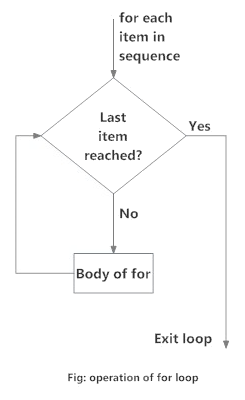

# Начало работы с Python

## &#x20;Интерпретатор Python

**Python** - это интерпретируемый язык. В нем есть интерактивная консоль, называемая интерпретатором Python или оболочкой **Python shell**. Эта оболочка позволяет выполнять вашу программу построчно, не создавая скрипт.

Вы можете получить доступ ко всем встроенным функциям и библиотекам Python, установленным модулям и истории команд в интерактивной консоли Python. Эта консоль дает вам возможность изучить Python. Вы можете вставлять код в скрипты, когда будете готовы.

## &#x20;Разница между сценариями на Python и Bash

Различия заключаются в следующем:

Python - это язык сценариев, в то время как Bash - это оболочка, используемая для ввода и выполнения команд

&#x20;С Python проще работать с большими программами&#x20;

В Python вы можете выполнять большинство задач, просто вызывая однострочную функцию из импортированных модулей

## &#x20;Запуск интерактивной консоли

Мы можем получить доступ к интерактивной консоли Python с любого компьютера, на котором уже установлен Python. Запустите следующую команду, чтобы запустить интерактивную консоль Python:

```
$ python

```

Это запустит интерактивную консоль Python по умолчанию.

В Linux, если мы пишем Python в терминале, запускается консоль python2.7. Если вы хотите запустить консоль python3, введите python3 в терминале и нажмите Enter.

В Windows, когда вы вводите Python в командной строке, запускается консоль загруженной версии Python.

## &#x20;Написание скриптов с помощью интерактивной консоли Python

Интерактивная консоль Python запускается с >>> . Эта консоль будет принимать команды Python, которые вы будете вводить после >>> . Смотрите следующий снимок экрана:

<figure><figcaption></figcaption></figure>

Теперь мы увидим, как присваивать значения переменной, как в следующем примере:

```
>>> name = John
```

Здесь мы присвоили переменной name строковое значение John. Мы нажали Enter и получили новую строку с  >>>

Теперь мы увидим пример присвоения значений переменным, а затем выполним математическую операцию, чтобы получить эти значения:

```
>>> num1 = 5000
>>> num2 = 3500
>>> num3 = num1 + num2
>>> print (num3)
8500
>>> num4 = num3 - 2575
>>> print (num4)
5925
>>>
```

Здесь мы присвоили значения переменным, добавили две переменные, сохранили результат в третьей переменной и распечатали результат на терминале. Затем мы вычли одну переменную из переменной результата, и выходные данные будут сохранены в четвертой переменной. Затем мы напечатали результат на терминале. Таким образом, это говорит нам о том, что мы также можем использовать интерпретатор Python в качестве калькулятора:

```
>>> 509 / 22
23.136363636363637
>>>
```

Здесь мы выполнили операцию деления. Мы разделили 509 на 22 и получили результат 23,136363636363637.

## &#x20;Несколько строк

Когда мы пишем несколько строк кода в интерпретаторе Python (например, оператор If и циклические функции for и while), интерпретатор использует три точки (...) в качестве дополнительного запроса для продолжения строки. Чтобы выйти из этих строк, вам нужно дважды нажать клавишу Enter. Теперь мы рассмотрим следующий пример:

<pre><code>>>> val1 = 2500
>>> val2 = 2400
>>> if val1 > val2:
... print("val1 is greater than val2")
... else:
... print("val2 is greater than val1")
...
<strong>al1 is greater than val2
</strong>>>>
</code></pre>

В этом примере мы присвоили целочисленные значения двум переменным, val1 и val2, и проверяем, больше ли значение val1, чем значение val2. В данном случае значение val1 больше значения val2, поэтому выводится оператор в блоке if. Помните, что операторы в блоках if и else имеют отступы. Если вы не используете отступ, то получите следующую ошибку:

```
>>> if val1 > val2:
... print("val1 is greater than val2")
File "<stdin>", line 2
print("val1 is greater than val2")
^
IndentationError: expected an indented block
>>>
```

## &#x20;Импорт модулей через интерпретатор Python

Если вы импортируете какой-либо модуль, интерпретатор Python проверяет, доступен этот модуль или нет. Вы можете сделать это с помощью инструкции **import**. Если этот модуль доступен, то после нажатия клавиши Enter вы увидите префикс >>>. Это означает, что выполнение было успешным. Если этот модуль не существует, интерпретатор Python выдаст сообщение об ошибке:

```
>>> import time
>>>
```

После импорта модуля time мы получаем префикс >>>. Это означает, что модуль существует и данная команда успешно выполнена:

Если модуль не существует, то вы получите сообщение об ошибке обратной трассировки:

```
File "<stdin>", line 1, in <module>
ImportError: No module named 'matplotlib'
```

Итак, здесь matplotlib недоступен, поэтому он выдает ошибку: ImportError: Нет модуля с именем 'matplotlib'.

Чтобы устранить эту ошибку, нам нужно будет установить matplotlib, а затем снова попытаться импортировать matplotlib. После установки matplotlib вы сможете импортировать модуль следующим образом:

```
>>> import matplotlib
>>>
```

## &#x20;Выход из консоли Python

Мы можем выйти из консоли Python двумя способами:

Сочетание клавиш: **Ctrl + D**

Используя функции **quit() или exit()**

Сочетание клавиш Ctrl+ D выдаст вам следующий код:

```
>>> val1 = 5000
>>> val2 = 2500
>>>
>>> val3 = val1 - val2
>>> print (val3)
2500
>>>
student@ubuntu:~$
```

функция quit() выведет вас из интерактивной консоли Python. Она также приведет вас к исходному терминалу, в котором вы находились ранее:

```
>>> Lion = 'Simba'
>>> quit()
student@ubuntu$
```

## &#x20;Отступы и табуляции

Отступы обязательны при написании блочного кода на Python. Отступы нужны при написании функций, логических операторов, циклических инструкций и классов. Это упрощает чтение ваших программ на Python.

Мы используем отступы для обозначения блоков кода в программах на Python. Чтобы сделать отступ в блоке кода, вы можете использовать пробелы или символы табуляции. Обратитесь к следующему примеру:

```
if val1 > val2:
    print ("val1 is greater than val2")
print("This part is not indented")
```

В предыдущем примере мы сделали отступ для инструкции print, потому что она находится под блоком if. Следующая инструкция print не находится под блоком if, и именно поэтому мы не сделали отступ для нее.

